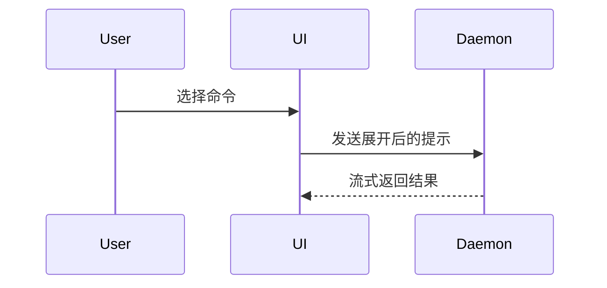

使用以下模板编写 PR 正文：

```markdown
## 摘要

<图示、diff 草图或树形结构>

## 证据

- **修改前：** <截图、输出或失败的测试运行>
  **修改后：** <截图、输出或通过的测试运行>

## 合并风险

**门的类型：** <单向门或双向门>

<可选：说明>

**影响范围：** <用一个词概括>

<可选：合并可能带来的影响>
```

## 各部分

省略开场白，保持文字简短。使用 `GLOSSARY.md` 中用户的领域语言。

### 摘要

选择能把关键点表达清楚的最小视图。

- 用伪代码展示逻辑或算法：

```text
on(save)
  if content is unchanged
    return cached result
  write new content
  return fresh result
```

- 用调用树展示运行时控制流：

```text
submitForm
  createSession
    persistPrompt
    launchAgent
  navigateToSession
```

- 用组件树展示 UI 结构，包括相关的状态和模块边界：

```text
<SessionPage> (apps/example/src/routes/session.tsx)
  useSessionEvents()
  <SessionToolbar>
    <RunSkillButton> (packages/ui)
```

- 用浅层文件树展示文件职责或范围较大的重构：

```text
src/
├── commands/       # 解析用户动作
├── sessions/       # 管理会话状态
└── transport/      # 发送 API 请求
```

- 用 Mermaid 展示组件交互、控制流或数据流：



- 重点是哪些内容发生变化，而周围结构已经存在时，使用 `diff`。让 diff 的结构与主题匹配。

组件变更：

```diff
 <SessionPage>
   useSessionEvents()
   <SessionToolbar>
+    <RunSkillButton />
   <SessionTimeline>
+    <SkillResultCard />
```

文件布局变更：

```diff
 src/
 ├── commands/
+│   └── show-me.ts       # 展开斜杠命令
 ├── sessions/
-└── transport.ts
+└── transport/
+    ├── client.ts
+    └── stream.ts
```

调用树或调用栈变更：

```diff
 submitForm
   createSession
     persistPrompt
+    expandSkillMention
     launchAgent
-  navigateToSession
+  navigateToSession
+    subscribeToEvents
```

状态或控制流变更：

```diff
 on(save)
-  write content
+  if content is unchanged
+    return cached result
+  write new content
+  invalidate cache
```

- 大部分内容是新增的、省略上下文会隐藏归属或顺序，或用户需要可复制的目标结构时，展示完整代码块：

```ts
function expandSkill(command: string): string {
  const skillName = command.slice(1);
  return `use the ${skillName} skill`;
}
```

#### 使用建议

把每个视觉表达放在它所支持的简短文字旁边。只保留回答用户当前问题或讨论当前选项所需的调用、文件、props、状态和边界。

可以用其中一种，也可以用几种，通常不需要全部使用。自行判断，避免让用户承担过多信息。

### 证据

提供变更有效的具体证据，展示修改前后。

环境支持且变更涉及视觉效果时，截图是 S 级证据。

基于执行的证据是 A 级，例如测试结果和控制台输出。用伪代码展示那个先失败、后通过的具体测试。

### 合并风险

说明这是单向门还是双向门。双向门可以退回，单向门则不能。回滚成本低的 PR 风险较小；涉及破坏性操作或难以逆转决策的变更属于单向门。

影响范围是该 PR 所引入变更的潜在影响或作用范围。考虑所有可能性，例如布局偏移、对使用方的破坏、移动端响应式表现等。
