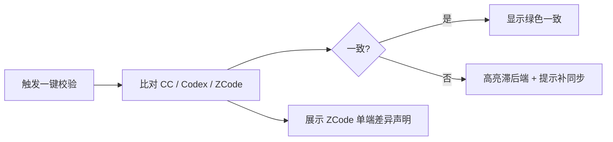
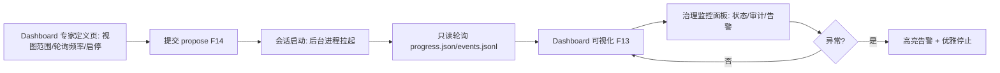

# AICoding 架构设计 · UserStory

> 本文档为《AICoding 架构设计》核心产物之一，定位为**产品需求与用户故事（UserStory）**。
> 上游输入：《高层架构设计》v0.2（G3 已冻结，含 D1~D5 关键决策与 G3 Dashboard 完整设计反馈）。
> 下游输出：驱动《系统设计》《部署设计》《安全设计》的具体功能实现。
> 本期范围：workbuddy 专用**专家团（Expert Team）设计规范与编排模型**的用户故事，覆盖 F1~F14。
> 形态说明：本系统为**本地插件规范 + 编排运行时**，非云端 SaaS；UserStory 聚焦「人（角色）与场景」，不描述部署。

---

## 阶段内自检报告附言（重要，先读）

本文档在 §3 / §4 / §5 / §6 完成后，按 `protocols/intermediate_confirmation.md` §2.4 各插入一次自检（先 §2.1 判定，再 §2.3 反向验证 3 问）。完整自检追溯见文末 **§7 阶段内自检报告（G4 追溯）**。

**结论前置**：本阶段所有关键决策点（角色清单、功能优先级、US 拆分粒度、Dashboard 取值）均已被《高层架构设计》v0.2 的 D1~D5 与 G3 用户逐字反馈**显式冻结**；未出现 ≥2 种合理方案需裁决的情形，亦无可感知的、未被上游授权的跨界决策。因此**不发起 `[中间确认]`**，严格按冻结上游落稿，与 system-architect 的中间确认互不阻塞。

---

## 1. 业务背景与价值

### 1.1 业务背景

- **当前业务现状**：ghost-agent-market 是覆盖两端的插件市场（claude-code-market / codex-market）。平台内现有 goal-dag v5 子线程体系，基于 Main / Owner / Worker / Supervisor / Reviewer 五角色与 owner-registry 治理底座（ACL / handoff / Capsule / propose-current-approve-apply）。
- **触发本次需求的事件**：用户要求新增 workbuddy 专用专家团，将固定的主线程（Main）、监督者（Supervisor）、工作者（Worker）与拥有者（Owner）概念合并收敛——其中 Owner 与 Worker 合并为单一「专家（Expert）」，原 Owner 相关职责与配置统一收敛至专家定义之下；通用 skill 沿用现有设计方式。
- **本系统在产品矩阵中的位置**：作为 goal-dag v5 子线程体系的演进——一套「专家(Expert)与技能(Skill)设计规范 + 专家团编排模型」，复用 Main / Supervisor / Review 元角色与 ACL / handoff 治理；以**本地插件规范**形态经三端 market 分发，非 SaaS、非多租户。

### 1.2 行业方案

> 本期 `need_research=false`，采用本框架内部对标（详见高层架构设计 §3），下列「标杆」实为已有模型，均为内部对标。

| 标杆（内部对标） | 来源 | 场景覆盖 | 本系统借鉴点 |
| --- | --- | --- | --- |
| B1 现有 Owner 责任域模型 | owner-governance.md | 长期责任域 / 文件 scope ACL / Capsule / 跨 Owner handoff | 收敛为专家的责任域主干（F2 / F6） |
| B2 现有 Worker 执行模型 | sub-thread-goal-worker.skill | 绑定 run / 只改 writable scope / verify | 收敛为专家执行语义（F5 / 执行专家子类型） |
| B3 现有 sub-thread 协调模式 | sub-thread-coordination | 唯一协调入口 / 单 Main / Supervisor wait-notify | 复用为专家团协调骨架（F9），Main / Supervisor 保留 |
| B4 现有 Reviewer 节点模型 | goal-dag v5 Review 节点 | DAG 审查节点 / 机械验收 ≠ Review | Review 保留为独立审查节点（F8），不并入专家 |

### 1.3 方案收益与价值

| 项 | 说明 |
| --- | --- |
| 功能模块 | 专家定义规范（F1~F5）、expert-registry 迁移（F6）、跨专家 Handoff 治理（F7）、Review 独立节点（F8）、通用 Skill 沿用（F9）、三端同步（F10）、Dashboard 可视化（F13）、Dashboard 专家持有后台进程（F14） |
| 预期价值收益 | 角色概念从 5 收敛为「3 元角色 + 1 专家」；专家配置从 2 套收敛为 1 套（expert-registry）；跨专家 handoff 审计 100% 留痕不降级；新增端接入成本 ≤ 0.5 人月；Dashboard 由专职专家持有后台进程完整维护与实时更新 |
| 量化标准 | 见下表「价值指标」 |

| 价值维度 | 量化目标（对齐高层架构设计 §1.3 V1~V4） | 当前值 | 目标值 |
| --- | --- | --- | --- |
| 效率（V1） | 专家定义配置文件套数 | 2（owner + worker） | 1（expert） |
| 合规（V2） | 跨专家 handoff 审计覆盖率 | 跨 Owner 100% | 100% |
| 成本（V3） | registry 迁移工作量 | — | ≤ 0.5 人月 |
| 体验（V4） | 角色概念数 | 5 | 4（3 元角色 + 1 专家） |
| 运营（G3） | Dashboard 完整可视化 + 专职后台进程专家 | 占位桩 | MVP 完整交付（F13 / F14） |

### 1.4 术语清单

> 与高层架构设计 §4.2 / §6.2 术语严格一致。

| 术语 | 含义 |
| --- | --- |
| Expert（专家） | 责任域（ACL）+ 执行语义（worker binding）+ 技能挂载 + 模型 profile + 长期线程归属 收敛后的单一可复用实体；由 Owner + Worker 合并而来（D1） |
| Main（主控元角色） | 单 Main 协调元角色，负责编排专家团，不并入专家（D1） |
| Supervisor（监督元角色） | 看门狗，只 wait / notify，不读结果，不并入专家（D1） |
| Review（审查元角色 / 节点） | 专家团内独立 DAG 审查节点，机械验收 ≠ Review，不并入专家（D4 / 不变量 #2） |
| Dashboard-Expert（Dashboard 专家） | 持有后台进程的子类型专家，维护 / 更新 Dashboard，只读轮询 progress.json / events.jsonl（G3 反馈，F14） |
| expert-registry | 由 owner-registry 改名并字段合并（ACL + handoff + Capsule + Worker binding）后的治理底座（D2 / F6） |
| ACL | 访问控制列表，本系统指专家文件 scope 责任域权限 |
| handoff | 跨实体（原跨 Owner，现跨专家）的公开交接契约；不变量「只消费公开 handoff」 |
| Capsule | 专家长期上下文容器：decisions / invariants / risks / progress |
| worktree | Git worktree 隔离工作区；执行专家 run 在其上，只改 writable scope（F5） |
| goal-dag | 调度 / 生命周期引擎，产出 progress.json / events.jsonl 状态源 |
| propose-current-approve-apply | expert-registry 的变更流程：提议→当前态→用户批准→应用；用户明确批准才 apply |

---

## 2. 范围与边界

### 2.1 系统内模块及功能

> 一级功能清单（与高层架构设计 §6.2 模块全景图对齐）。

| 一级模块 | 二级功能 | 功能项（编号） |
| --- | --- | --- |
| 专家定义规范 | 身份标识 / 责任域 / 技能挂载 / 模型 profile / 长期线程归属 | F1 / F2 / F3 / F4 / F5 |
| expert-registry | 迁移（改名 + 字段合并） | F6 |
| 跨专家 Handoff | 隔离与 ACL / 审计留痕 | F7 |
| Review 节点 | 独立审查保留 | F8 |
| 通用 Skill | supervisor / coordination 沿用 | F9 |
| 三端同步 | AGENTS 规则落地 | F10 |
| Dashboard | 可视化（完整设计） | F13 |
| Dashboard 专家 | 持有后台进程 | F14 |

### 2.2 系统外模块及功能

> 本期不做（Out-of-Scope），与高层架构设计 §6.1 O1~O4 对齐，均标注原因。

| 编号 | 范围 | 不做的事 | 原因 | 后续计划 |
| --- | --- | --- | --- | --- |
| O1 | 通用 skill 内部实现 | 重构 supervisor / coordination 内部实现 | 冻结决策 #2：通用 skill 沿用现有设计，不重构 | 由现有 skill 维护 |
| O2 | 审查并入执行 | 将 Reviewer / 审查并入专家执行 | 违反 goal-dag v5 不变量 #2（Review 是 DAG 节点，机械验收 ≠ Review） | 不采纳，Review 保留独立 |
| O3 | 部署形态 | SaaS / 云端多租户部署 | 本系统为本地插件规范，按三端 market 分发 | 不做 |
| O4 | Owner 独立保留 | 保留 Owner 概念不合并 | 冻结决策 #1：收敛 Owner + Worker → Expert | 不采纳 |

### 2.3 外部依赖

| 依赖系统 | 提供方 | 依赖能力 | 接入方式 | 接口人 |
| --- | --- | --- | --- | --- |
| goal-dag.mjs | 平台组 | 调度 / 生命周期 / 五条不变量，产出 progress.json / events.jsonl | 领域脚本 CLI（同步） | 平台组 |
| owner-registry.mjs → expert-registry | 治理组 | ACL / handoff / Capsule / propose-current-approve-apply / route | 领域脚本 CLI（同步） | 治理组 |
| sub-thread-coordination | 沿用组 | 唯一协调入口 / 硬边界 / 单 Main | 通用 skill（同步） | 沿用组 |
| SkillOpt submodule | 平台组 | 技能资产 | git submodule（同步） | 平台组 |
| AGENTS.md 同步规则 | 平台组 | 三端同步 / Git 身份 / ZCode 在线连接 | 文档约定（编辑时遵循） | 平台组 |
| ZCode role agent 安装 | ZCode 端 | install-agents.py 安装专家 | 在线 GitHub raw（同步，仅在线） | ZCode 端 |

---

## 3. 功能清单

### 3.1 功能清单结构

> 与高层架构设计 §6.3 功能清单互查一致；覆盖 F1~F14，标注 P0/P1/P2 与 MVP/完整版范围。

| 一级模块 | 二级模块 | 功能项 | 优先级 | MVP 范围 | 完整版范围 | 对齐目标 |
| --- | --- | --- | --- | --- | --- | --- |
| 专家定义规范 | 身份标识 | F1 定义 expert_id / name / profile | P0 | ✅ | ✅ | V1 / V4 |
| 专家定义规范 | 责任域（scope ACL） | F2 文件 scope ACL，源自 Owner 治理，复用 route 与 Capsule | P0 | ✅ | ✅ | V1 / V2 |
| 专家定义规范 | 技能挂载 | F3 挂载 skill 列表（通用 skill 沿用） | P0 | ✅ | ✅ | V1 |
| 专家定义规范 | 模型 profile | F4 指定 model / thinking（最小语义输入契约） | P0 | ✅ | ✅ | V1 |
| 专家定义规范 | 长期线程归属 | F5 generation reuse：复用同一 worktree / branch / 线程 | P0 | ✅ | ✅ | V1 |
| expert-registry | 迁移（改名 + 字段合并） | F6 owner-registry→expert-registry，合并 ACL+handoff+Capsule+Worker binding | P0 | ✅ | ✅ | V1 / V3 |
| 跨专家 Handoff | 隔离与 ACL | F7 复用「只消费公开 handoff」，跨专家审计 100% 留痕 | P0 | ✅ | ✅ | V2 |
| Review 节点 | 保留独立审查 | F8 Review 作为专家团内独立 DAG 审查节点，不并入专家 | P1 | ✅ | ✅ | V2 |
| 通用 Skill | 沿用 | F9 supervisor / coordination 不重构，仅作协调骨架 | P1 | ✅ | ✅ | V3 |
| 三端同步 | AGENTS 规则落地 | F10 CC / Codex / ZCode 同步专家定义变更；ZCode 单端差异经演进说明 | P1 | ✅ | ✅ | V3 |
| 专家团编排 | 多专家并行 | F11 多专家并行编排调度优化（完整版延伸） | P2 | ❌ | ✅ | V3 |
| ZCode 差异化 | 单端演进说明 | F12 ZCode 单端差异独立声明与演进 | P2 | ❌ | ✅ | — |
| Dashboard | 可视化（完整设计） | F13 专家团 / 跨专家 handoff 审计视图（扩展 progress.json / events.jsonl，非占位桩） | P1 | ✅ | ✅ | V2 |
| Dashboard 专家 | 持有后台进程 | F14 维护 / 更新 Dashboard；持有后台进程长驻，只读轮询 progress.json / events.jsonl，随会话生命周期启停 | P1 | ✅ | ✅ | V2 |

**硬指标自检**：P0 功能（F1~F7）全部在 MVP 范围标记 ✅；每个功能均可反向映射到高层架构设计 §2.5 功能缺口 + §2.3 期待目标。

> **§3 完成后自检（intermediate_confirmation §2.4）**：见文末 §7.1。

---

## 4. 角色与场景

### 4.1 角色清单

> 映射高层架构设计 §2.1 核心角色关注点（≥3 类：甲方决策者 / 最终用户 / 受影响方），每行含 Top1 关心点。

| 角色 | 业务身份 | 主要操作 | 核心关注点 |
| --- | --- | --- | --- |
| 甲方决策者 | 项目架构负责人 / 主理人（齐构成） | 评审演进方案、批准冻结决策、批准 propose-current-approve-apply 应用 | 演进不破坏 goal-dag v5 不变量、迁移成本可控、治理不降级 |
| 最终用户 A | 专家 / 技能设计者（插件工程师） | 编写专家定义（F1~F5）、挂载技能、提交 expert-registry、定义 Dashboard 专家（F14） | 设计规范明确、复用现有机制、改造成本低、一处定义即可分发三端 |
| 最终用户 B | workbuddy 端用户 | 基于专家团规范组装 / 运行专家团、查看 Dashboard | 专家定义清晰、跨专家协作顺畅、handoff 有隔离与审计、运行状态可观测 |
| 受影响方：合规 / SRE | 治理 / 审计方 | 审查跨专家 handoff、审计留痕、监控 Dashboard 告警、触发后台进程优雅停止 | 跨专家 handoff 隔离与 ACL 不被弱化、审计 100% 留痕、后台进程不泄漏为孤儿进程 |
| 受影响方：同步维护者 | 三端同步维护者 | 按 AGENTS.md 同步 CC / Codex / ZCode 专家定义 | 规范变更正确同步到三端、单端差异可声明、一端改定义另两端不滞后 |

### 4.2 关键场景清单

> 主链路：定义专家 → 编排专家团 → 执行（Expert run in worktree）→ 跨专家 handoff → Review → 交付；外加 Dashboard 运营监控回路（高层架构设计 §5.3）。

| 编号 | 角色 | 触发条件 | 期望结果 | 频率 |
| --- | --- | --- | --- | --- |
| S1 | 最终用户 A（设计者） | 需新增一个执行能力 | 在设计者工作台完成专家定义（F1~F5）并提交 expert-registry（F6），单套配置即可分发 | 低频（定义期，约 1~5 次/周） |
| S2 | 最终用户 B（端用户） | 需组装并运行专家团 | 在编排页组合专家、指定 Main 主控、预览 handoff 边界（F9 / F10） | 中频（运行期，约 10~50 次/日） |
| S3 | 执行专家 + Main | 单个 goal 执行需跨专家协作 | 跨专家只消费公开 handoff，ACL 隔离生效，审计 100% 留痕（F7） | 高频（每 goal 至少 1 次 handoff） |
| S4 | 治理 / 审计方 | 需审查交付质量与审计完整性 | Review 独立节点给出结论（F8）；handoff 审计可下钻至公开凭证 | 低频（日 / 周审） |
| S5 | 最终用户 A + 治理方 | 需可视化监控专家团与审计状态 | Dashboard 专家后台进程拉起，实时渲染专家团状态与 handoff 审计视图（F13 / F14） | 高频（视图默认 5s 刷新，后台进程长驻） |
| S6 | 三端同步维护者 | 专家定义变更 | 三端同步校验触发，CC / Codex / ZCode 一致性可验证，单端差异经演进说明声明（F10） | 低频（变更时，约 1~3 次/周） |
| S7 | 治理 / 审计方 | 后台进程心跳丢失 / 异常 | 系统高亮告警，治理方可触发优雅停止，禁止孤儿进程（F14） | 极低频（异常态） |

> **§4 完成后自检（intermediate_confirmation §2.4）**：见文末 §7.2。

---

## 5. 用户旅程（UserStory）

> 每条 UserStory 严格按 5.1.1~5.1.7 七小节展开。
> 覆盖映射：US-1→F1~F6；US-2→F2/F9/F10；US-3→F7/F8；US-4→F10；US-5→F13/F14。

### 5.1 US-1：设计者定义专家并提交 expert-registry（F1~F6）

#### 5.1.1 业务场景

- **视角**：最终用户 A（专家 / 技能设计者）
- **描述逻辑**：设计者在「设计者工作台 - 专家定义编辑页」编写一个新的专家定义：填写身份标识（F1）、声明文件 scope ACL 责任域（F2）、挂载技能（F3）、指定模型 profile（F4）、设定长期线程归属（F5）。表单实时校验 ACL 合法性后，设计者提交变更，触发 expert-registry 的 propose-current-approve-apply 流程（F6）；甲方决策者（主理人）批准后 apply，专家定义纳入 registry，可经三端 market 分发。

#### 5.1.2 业务流程

- **视角**：用户
- **描述方式**（Given / When / Then）：

Given 设计者已登录设计者工作台且拥有专家定义编辑权限，
When 设计者依次填写身份 → scope ACL → 技能 → 模型 → 线程归属并提交，
Then 系统校验 ACL 合法性并生成 propose 提案，等待主理人批准。

Given 主理人收到 propose 提案，
When 主理人审核范围与 ACL 后点击「批准 apply」，
Then expert-registry 将 Owner 责任域与 Worker binding 合并为单一专家记录并落库，专家定义可被编排与分发。

#### 5.1.3 UE 原型

设计者工作台 - 专家定义编辑页（核心路径 ≤ 5 步）：

表单约束：ACL 字段实时校验（非法路径 / 越权 scope 立即红框提示）；提交后进入 propose 待批准态，页面显示当前态与批准人。

#### 5.1.4 业务逻辑

- **视角**：业务系统
- 专家定义编辑页 → 校验服务（ACL 合法性、scope 与 Capsule 一致性）→ expert-registry propose 接口（写入待批准态）→ 通知主理人 → 主理人 approve → apply 将 ACL + handoff + Capsule + Worker binding 合并落库 → 触发三端同步校验钩子（F10）。

#### 5.1.5 数据描述

- 输入：expert_id、name、profile、scope_acl（文件路径白名单）、skills[]、model、thinking、worktree/branch 归属。
- 落库：expert-registry 记录 = { identity, acl, capsule{decisions,invariants,risks,progress}, handoff_pub, worker_binding, skills, model_profile, thread_affinity }。
- 流转：编辑态 → propose 态 → approved/apply 态；Capsule 初始为空壳，随执行填充。

#### 5.1.6 验收标准 AC

- **AC-1（正常）**：Given 设计者填写完整且 ACL 合法的专家定义，When 点击提交，Then 系统生成 propose 提案并提示「待主理人批准」，registry 中该专家出现 pending 态记录。
- **AC-2（正常）**：Given 主理人批准 propose，When apply 执行完成，Then expert-registry 中该专家变为 active 态，ACL + Capsule + Worker binding 合并为单条记录，且原 owner-registry 对应字段可经迁移脚本对齐（F6）。
- **AC-3（异常 - ACL 非法）**：Given 设计者填写的 scope ACL 包含越权路径（超出其责任域），When 点击提交，Then 系统在对应字段红框提示具体越权项，阻止提交，不产生 propose。
- **AC-4（异常 - 未批准）**：Given 设计者已提交 propose 但主理人未批准，When 端用户尝试编排该专家，Then 系统拒绝引用 pending 态专家，提示「需主理人批准后方可编排」。
- **AC-5（异常 - 字段缺失）**：Given 设计者漏填模型 profile 或线程归属，When 点击提交，Then 表单阻断在缺失步并高亮，不进入 propose。

#### 5.1.7 外部集成接口

- expert-registry propose-current-approve-apply（治理组提供，领域脚本 CLI）：负责提案与批准应用，用户明确批准才 apply。
- 三端同步钩子（AGENTS.md 规则，平台组）：apply 后触发 CC / Codex / ZCode 同步校验（见 US-4）。

---

### 5.2 US-2：端用户编排专家团并指定 Main 主控（F2 / F9 / F10）

#### 5.1.1 业务场景

- **视角**：最终用户 B（workbuddy 端用户）
- **描述逻辑**：端用户在「专家团编排页」从 expert-registry 中选取多个已批准专家，声明式组合为一个专家团，指定 Main 为单主控元角色；编排页预览各专家间的 handoff 边界（基于各自 scope ACL），并复用通用 skill（supervisor / coordination）作为协调骨架（F9）。编排提交后，经 AGENTS 规则落地到三端（F10）。

#### 5.1.2 业务流程

- **视角**：用户
- **描述方式**（Given / When / Then）：

Given 端用户已选取 ≥2 个 active 态专家，
When 端用户声明 Main 主控并预览 handoff 边界后提交编排，
Then 系统校验跨专家 handoff 均指向公开 handoff 凭证，生成专家团编排定义。

Given 专家团编排定义已生成，
When 端用户触发运行，
Then Main 按单 Main 不变量编排，Supervisor 以 wait / notify 看门狗监管，执行专家 run 在各自 worktree。

#### 5.1.3 UE 原型

专家团编排页：

交互约束：handoff 边界预览实时标红任何「跨专家引用非公开 handoff」的非法编排，阻止提交。

#### 5.1.4 业务逻辑

- **视角**：业务系统
- 编排页 → 编排校验服务（跨专家 handoff 公开性、scope ACL 一致性、Main 唯一性）→ 生成 expert-team 编排定义 → 协调骨架加载 supervisor / coordination 通用 skill（不重构，仅复用，F9）→ 运行期 Main 编排 + Supervisor 看门狗（沿用 goal-dag 不变量）→ 触发三端同步落地（F10）。

#### 5.1.5 数据描述

- 输入：expert_team = { main, members[], handoff_edges[]{from,to,handoff_ref}, coordination_skill_ref }。
- 校验产物：handoff_edges 全部解析为公开 handoff 凭证引用；非法边被剔除并回报。
- 流转：编排定义 → 运行态（Main / Supervisor / 执行专家 worktree）。

#### 5.1.6 验收标准 AC

- **AC-1（正常）**：Given 端用户选取 2 个 active 专家并指定唯一 Main，When 提交编排且所有 handoff 边均指向公开凭证，Then 系统生成专家团编排定义并进入可运行态。
- **AC-2（正常 - 协调骨架）**：Given 编排已生成，When 运行触发，Then 系统仅复用现有 supervisor / coordination 通用 skill（F9），不修改其内部结构。
- **AC-3（异常 - 多 Main）**：Given 端用户试图指定 2 个 Main，When 提交，Then 系统拒绝并提示「单 Main 不变量：仅允许一个主控元角色」。
- **AC-4（异常 - 非法 handoff）**：Given 某 handoff 边引用了非公开 handoff 凭证，When 提交，Then 系统标红该边并阻断提交，提示「跨专家仅可消费公开 handoff（F7）」。
- **AC-5（异常 - pending 专家）**：Given 端用户选取了未批准（pending）专家，When 提交，Then 系统拒绝并提示需先经主理人批准 apply。

#### 5.1.7 外部集成接口

- expert-registry 查询接口：枚举 active 专家与其 scope ACL / 公开 handoff 列表。
- sub-thread-coordination 通用 skill（沿用组）：提供唯一协调入口与单 Main 硬边界。
- AGENTS.md 同步规则（F10，见 US-4）：编排定义落地三端。

---

### 5.3 US-3：跨专家 Handoff 隔离与审计 + Review 独立审查（F7 / F8）

#### 5.1.1 业务场景

- **视角**：执行专家 + 治理 / 审计方
- **描述逻辑**：执行专家在 worktree 完成某 goal 阶段后，需将结果交接给下游专家。系统强制「跨专家只消费公开 handoff」不变量（F7）：下游专家仅能读取上游公开的 handoff 凭证，ACL 隔离生效，且每次 handoff 事件 100% 写入审计（events.jsonl + 审计视图）。交付前，Review 作为专家团内独立 DAG 审查节点（F8）机械验收，不并入执行专家，保证审查客观性。治理 / 审计方可在「Handoff 审计页 / Review 节点视图」下钻查询。

#### 5.1.2 业务流程

- **视角**：用户
- **描述方式**（Given / When / Then）：

Given 上游执行专家在 worktree 完成阶段产出并发布公开 handoff 凭证，
When 下游专家请求消费该 handoff，
Then 系统校验下游 scope ACL 仅读取公开凭证，写入审计事件，返回结果。

Given 专家团到达 Review 节点，
When 系统触发独立 Review 专家进行机械验收，
Then Review 给出 subject / reason / 结论，不修改执行 scope，审计留痕。

#### 5.1.3 UE 原型

治理 / 审计端 - Handoff 审计列表 + Review 节点视图：

交互约束：任意 handoff 事件可追溯到公开凭证，P99 查询 ≤ 2s；Review 视图回放 subject / reason / 结论时间轴。

#### 5.1.4 业务逻辑

- **视角**：业务系统
- 上游专家发布 handoff（写入公开 handoff 区）→ 下游请求消费 → ACL 服务校验下游 scope 仅读公开区 → handoff 审计服务写 events.jsonl（含 from / to / handoff_ref / 时间戳 / 公开性标志）→ Review 节点触发独立 Review 专家（只读 subject / reason，不消费执行 scope）→ 结论写审计。全程复用 goal-dag 不变量 #1~#5。

#### 5.1.5 数据描述

- 公开 handoff 区：结构化凭证（handoff_id, producer_expert, consumer_scope_whitelist, payload_ref）。
- 审计事件：{ event_type: handoff, from, to, handoff_ref, is_public: true, ts, audit_id }。
- Review 记录：{ review_id, subject, reason, conclusion, ts }。
- 流转：worktree 产出 → 公开 handoff → 审计事件 → Review 结论，均进入 progress.json / events.jsonl。

#### 5.1.6 验收标准 AC

- **AC-1（正常 - 公开 handoff）**：Given 上游发布公开 handoff 且下游 scope 在白名单内，When 下游消费，Then 返回结果且审计事件 is_public=true，可被 Handoff 审计列表查询。
- **AC-2（正常 - Review 独立）**：Given 专家团到达 Review 节点，When 独立 Review 专家执行验收，Then 其只读 subject / reason，不持有 worktree 写权限，结论写入审计，不并入执行专家（F8）。
- **AC-3（异常 - 越权消费）**：Given 下游尝试消费非公开 handoff（超出其 scope），When 请求，Then 系统拒绝并返回 403 类越权错误，审计记录该越权尝试。
- **AC-4（异常 - 审计缺失）**：Given 任意一次 handoff 未产生审计事件，When 系统自检，Then 视为不变量违规，阻断该 handoff 并告警治理方（审计覆盖率须 100%）。
- **AC-5（审计查询性能）**：Given 治理方按专家 / 时间筛选 handoff 审计，When 发起查询，Then P99 响应 ≤ 2s 且结果可下钻至公开凭证。

#### 5.1.7 外部集成接口

- expert-registry ACL / handoff 服务（治理组）：提供 scope 校验与公开 handoff 解析。
- goal-dag 引擎（平台组）：产出 progress.json / events.jsonl 状态源，供审计与 Dashboard 消费。
- Review 节点（goal-dag v5）：独立 DAG 审查节点，由编排触发。

---

### 5.4 US-4：三端同步维护者校验 CC / Codex / ZCode 一致性（F10）

#### 5.1.1 业务场景

- **视角**：受影响方（三端同步维护者）
- **描述逻辑**：每当专家定义或编排定义变更经 apply，三端同步维护者在「三端同步一致性面板」触发一致性校验，确认 CC / Codex / ZCode 三端规范同步无滞后；ZCode 单端差异通过「单端差异声明」字段管理，不破坏三端强一致基线。若一端滞后，面板高亮并提示补同步。

#### 5.1.2 业务流程

- **视角**：用户
- **描述方式**（Given / When / Then）：

Given 专家定义已在 expert-registry apply，
When 同步维护者打开三端同步一致性面板并点击「一键校验」，
Then 系统比对 CC / Codex / ZCode 三端专家定义版本，输出一致 / 滞后清单。

Given 比对发现 ZCode 端存在声明过的单端差异，
When 面板展示差异详情，
Then 系统确认该差异经「单端差异声明」字段登记，不计入滞后告警。

#### 5.1.3 UE 原型

治理 / 审计端 - 三端同步一致性面板：

交互约束：实时刷新；滞后端红框，点击展开差异 diff。

#### 5.1.4 业务逻辑

- **视角**：业务系统
- 变更 apply 钩子 → 同步校验服务读取三端 AGENTS.md 引用版本 → 比对 expert_id + 定义哈希 → 输出一致性报告；ZCode 单端差异经「单端差异声明」字段白名单豁免；滞后端触发补同步提示（install-agents.py 在线安装通道仅 ZCode 在线连接可用）。

#### 5.1.5 数据描述

- 输入：两端专家定义版本映射 { cc: hash, codex: hash }。
- 产物：一致性报告 { consistent: bool, lagging: [端列表], diff_declared: [...]}。
- 流转：apply → 钩子 → 校验 → 报告；滞后端提示经 AGENTS.md 同步规则补同步。

#### 5.1.6 验收标准 AC

- **AC-1（正常 - 一致）**：Given 三端专家定义哈希一致，When 一键校验，Then 面板显示全绿一致，无滞后告警。
- **AC-2（正常 - 单端差异）**：Given ZCode 端存在经声明登记的单端差异，When 校验，Then 该差异不计入滞后，面板单独展示差异说明。
- **AC-3（异常 - 滞后）**：Given Codex 端因未同步而哈希不一致，When 校验，Then 面板红框高亮 Codex 并提示「需补同步」，阻断该端对外分发直至一致。
- **AC-4（异常 - 未声明差异）**：Given 某端存在未声明差异，When 校验，Then 视为滞后告警，不豁免。

#### 5.1.7 外部集成接口

- AGENTS.md 同步规则（平台组）：三端同步基线、Git 身份、ZCode 在线连接规则。
- ZCode install-agents.py（ZCode 端）：在线 GitHub raw 安装通道，仅在线 marketplace 连接可用。

---

### 5.5 US-5：Dashboard 可视化与 Dashboard 专家定义（F13 / F14，G3 完整设计）

> 本 US 对应 G3 用户逐字反馈：「dashboard的设计需要完整,由一个专家专门负责维护和更新和持有后台进程」。覆盖 F13（Dashboard 完整可视化）+ F14（Dashboard 专家持有后台进程）。含两个视角：设计者定义 Dashboard 专家；治理 / 审计方通过 Dashboard 实时监控。

#### 5.1.1 业务场景

- **视角**：最终用户 A（设计者定义）+ 治理 / 审计方（监控）
- **描述逻辑**：
  - **定义侧**：设计者在「Dashboard 专家定义页」定义一个专用于维护与更新 Dashboard 的后台进程型专家（Dashboard-Expert）——指定视图范围（专家团状态视图 / 跨专家 handoff 审计视图）、轮询频率、后台进程启停策略，提交触发 expert-registry propose（F14）。
  - **监控侧**：专家团会话启动时，Main / Supervisor 将 Dashboard 专家后台进程纳入会话生命周期统一拉起；后台进程按配置频率**只读**轮询 progress.json / events.jsonl 两个固定入口，渲染 F13 完整可视化（专家团状态 + 跨专家 handoff 审计）。治理 / 审计方在「专家团监控 / 预警面板」实时查看，并在后台进程心跳丢失 / 异常时接收告警、触发优雅停止（F14）。

#### 5.1.2 业务流程

- **视角**：用户
- **描述方式**（Given / When / Then）：

Given 设计者已定义 Dashboard 专家（视图范围 / 轮询频率 / 启停策略）并经主理人批准 apply，
When 专家团会话启动且 Main 编排执行专家，
Then Dashboard 专家后台进程随之拉起，按配置频率只读轮询 progress.json / events.jsonl 并渲染两个视图（F13 / F14）。

Given 治理方打开专家团监控面板，
When 面板实时刷新，
Then 治理方看到专家团状态、跨专家 handoff 审计视图、后台进程心跳与异常高亮。

Given 后台进程心跳丢失或异常，
When 系统检测到并高亮告警，
Then 治理方可触发优雅停止；进程随会话结束或 registry 注销回收，禁止泄漏为孤儿进程。

#### 5.1.3 UE 原型

两页面（设计者定义页 + 治理监控页）：

交互约束：定义页校验「只读固定入口」约束（禁止为 Dashboard 专家配置 writable scope / ACL 写权限）；监控面板默认 5s 刷新，异常心跳红框并支持一键优雅停止。

#### 5.1.4 业务逻辑

- **视角**：业务系统
- 设计者提交 Dashboard 专家定义（子类型=持有后台进程）→ expert-registry 记录其「不持有 writable scope / ACL 写权限，仅只读消费 progress.json / events.jsonl」约束 → 会话生命周期由 Main / Supervisor 统一启停后台进程 → 后台进程 daemon 按频率轮询两个固定抓取入口（符合 goal-dag 不变量 #5「固定抓取入口」，模型不写状态文件）→ 渲染专家团状态视图 + 跨专家 handoff 审计视图 → 心跳与日志纳入 Dashboard 自身视图 → 异常时告警并可优雅停止，随会话结束 / registry 注销回收，禁止孤儿进程。

#### 5.1.5 数据描述

- Dashboard 专家定义：{ expert_id: dashboard-xxx, subtype: daemon, view_scope:[team_status, handoff_audit], poll_interval_sec, process_policy:{autostart:true, graceful_stop:true} }。
- 只读消费源：progress.json（专家团 / 执行状态）、events.jsonl（handoff 审计事件流）。
- 产出：Dashboard 渲染模型（团队状态卡 + handoff 审计时间轴 + 后台进程心跳条）。
- 流转：后台进程 daemon → 轮询固定入口 → 渲染 → 心跳日志；不写状态文件、不占 worktree、不申请 ACL 写权限。

#### 5.1.6 验收标准 AC

- **AC-1（正常 - 定义与拉起）**：Given 设计者定义 Dashboard 专家并批准 apply，When 专家团会话启动，Then 后台进程按配置频率自动拉起，Dashboard 实时呈现专家团状态与 handoff 审计视图（F13 / F14）。
- **AC-2（正常 - 只读隔离）**：Given Dashboard 专家运行，When 系统检查其权限，Then 确认其无任何 writable scope / ACL 写权限，仅通过两个固定入口只读消费，与执行专家 worktree 无竞争。
- **AC-3（正常 - 监控下钻）**：Given 治理方在监控面板点击某 handoff 审计事件，When 下钻，Then 面板展示该事件的公开凭证引用、上下游专家、时间戳，P99 查询 ≤ 2s。
- **AC-4（异常 - 心跳丢失告警）**：Given 后台进程心跳超时，When 系统检测，Then 监控面板红框高亮告警，治理方可一键触发优雅停止。
- **AC-5（异常 - 禁止孤儿进程）**：Given 会话结束或 Dashboard 专家经 registry 注销，When 回收触发，Then 后台进程被优雅停止并释放，系统校验无残留孤儿进程。
- **AC-6（异常 - 越权定义）**：Given 设计者试图为 Dashboard 专家配置 writable scope 或 ACL 写权限，When 提交，Then 系统拒绝并提示「Dashboard 专家仅可只读消费固定入口，不持有写权限」。

#### 5.1.7 外部集成接口

- goal-dag 状态源（平台组）：progress.json / events.jsonl 只读固定入口（不变量 #5）。
- expert-registry（治理组）：Dashboard 专家定义存储与 propose-current-approve-apply；后台进程生命周期由 Main / Supervisor 会话统一启停。
- 不写状态文件：Dashboard 专家模型不写 progress.json / events.jsonl，仅消费。

---

> **§5 完成后自检（intermediate_confirmation §2.4）**：见文末 §7.3。

---

## 6. 非功能性需求

### 6.1 易用性需求

- **操作便利性**：定义专家核心路径 ≤ 5 步（身份 → scope → 技能 → 模型 → 提交）；编排页支持声明式组合与 handoff 边界实时预览；三端同步面板支持「一键校验」。
- **UI 一致性**：设计者工作台与治理 / 审计端共用同一套术语与状态色（active / pending / 滞后 / 异常）。
- **引导提示**：首次定义专家时引导说明 scope ACL 与 Capsule 含义；Dashboard 专家定义页提示「只读固定入口」约束。
- **错误反馈**：ACL 非法、handoff 越权、多 Main 等异常均红框高亮并给出具体原因（指出哪条 ACL / 哪个边 / 哪个角色），不抛裸错误码。
- **无障碍**：表单与面板关键操作支持键盘可达；告警状态除颜色外辅以文字标签（如「异常」「滞后」）。

### 6.2 性能响应需求

- **ACL 校验时延**：专家定义提交与 handoff 消费时的 scope ACL 校验，P50 ≤ 5ms，P90 ≤ 10ms，P99 ≤ 20ms。
- **handoff 审计查询**：治理方按专家 / 时间筛选并下钻至公开凭证，P99 ≤ 2s（对齐高层架构设计 §6.4 关键交互约束与 V2）。
- **Dashboard 刷新**：后台进程默认轮询频率 5s；视图渲染刷新 P95 ≤ 1s；单会话后台进程数 = 1（MVP 单链）。
- **吞吐量 / 并发**：单专家团会话内执行专家数 ≤ 8（MVP 单链编排）；handoff 审计事件写入峰值 ≤ 50 条/s·会话。
- **数据规模**：progress.json / events.jsonl 单会话累积事件 ≤ 10 万条，保留 30 天滚动清理；expert-registry 记录数随专家数线性增长（典型 ≤ 200 条）。

### 6.3 操作与环境需求

- **运行环境**：本地插件规范 + 编排运行时，依赖 Node.js 执行 goal-dag.mjs / expert-registry.mjs（沿用现有运行时）。
- **两端兼容**：覆盖 claude-code-market / codex-market 两端；专家定义经 AGENTS.md 规则分发，不依赖特定云端。
- **网络环境**：ZCode 端 install-agents.py 在线安装需 HTTPS 在线 marketplace 连接，禁本地路径；其余交互本地完成，不强制联网。
- **设备规格**：开发者机器 / CI 运行环境即可；后台进程为长驻轻量 daemon，常驻内存占用上限 ≤ 128MB·会话。
- **运行约束**：非 SaaS、非多租户；不依赖中心化服务，状态源为本地文件（progress.json / events.jsonl）。

### 6.4 安全性需求

#### 6.4.1 安全密码设置

- 本系统为本地插件规范，无独立账号体系；如未来在治理端引入任何本地认证 UI，密码强度须达到 **8 位以上大小写字母 + 数字 + 特殊字符**。当前 MVP 复用 OS / Git 凭证与 propose-current-approve-apply 人工批准机制，不自行存储口令。

#### 6.4.2 安全软件架构

- **通信安全**：本地文件读取（progress.json / events.jsonl / expert-registry）不经网络；ZCode 在线安装通道使用 HTTPS，禁本地路径绕过。
- **认证与访问控制**：跨专家 handoff 强制 ACL 校验，下游仅消费公开 handoff；Dashboard 专家不持有任何 writable scope / ACL 写权限（F14 只读约束）。
- **外部接口安全**：expert-registry 变更须经 propose-current-approve-apply，用户（主理人）明确批准才 apply；禁止未经批准的自动化 apply。

#### 6.4.3 安全设计

- 提供变更授权功能：所有 registry 写操作走 propose → 主理人 approve → apply 三段式，确保「用户明确批准才 apply」。
- 跨专家 handoff 的 ACL 隔离与审计 100% 留痕，不降级（对齐 V2 与 goal-dag 不变量）。

#### 6.4.4 安全开发

- 对 expert-registry / expert 定义入口参数做合法性与格式检查（expert_id 格式、scope 路径白名单、model 取值）。
- 输入边界检查：ACL 路径长度与格式限制，禁止路径遍历；handoff_ref 须解析为已发布公开凭证。
- 不引入未经授权和验证的代码；后台进程仅执行受控轮询逻辑，禁止执行任意脚本。
- 应用不存在可绕行安全机制的行为或遗留后门；Dashboard 专家无法越权获取执行 scope。

#### 6.4.5 安全测试和部署

- 上线前进行安全扫描与配置基线检查；重点验证：ACL 越权消费被拒、handoff 审计 100% 覆盖、Dashboard 专家无写权限、后台进程无孤儿泄漏。
- 安全功能测试覆盖异常路径（AC-3 / AC-4 / AC-5 / AC-6 等越权与异常场景）。

#### 6.4.6 数据安全

- **存储与传输加密**：本地 Capsule（decisions / invariants / risks / progress）与 expert-registry 记录以本地文件存储，依托 OS / 仓库权限保护；跨端同步经 Git / AGENTS.md 规则，不落入第三方多租户存储（非 SaaS）。
- **最小暴露**：Dashboard 专家与治理方只读消费 progress.json / events.jsonl 固定入口，不暴露执行专家 writable scope 内容。

> **§6 完成后自检（intermediate_confirmation §2.4，最后一次完整复核）**：见文末 §7.4。

---

## 7. 阶段内自检报告（G4 追溯）

> 依 `protocols/intermediate_confirmation.md` §2.4，在 §3 / §4 / §5 / §6 完成后各插入一次自检：先 §2.1 判定，再 §2.3 反向验证 3 问。供主理人在 G4 审核弹窗中追溯。

### 7.1 §3 功能清单完成后自检

**§2.1 方案分歧型判定**：
- 条件1（≥2 种合理方案需裁决）：不满足。功能优先级（P0/P1/P2）与 MVP/完整版边界已由高层架构设计 §6.3 冻结，无并列候选。
- 条件2（影响下游产出）：满足（功能清单驱动 system-architect 模块拆分），但被条件3阻断。
- 条件3（上游未明确选择）：**不满足（关键）**。§6.3 已逐行锁定 F1~F14 优先级与 MVP 标记，属已冻结授权。
- **结论**：§2.1 三项未同时成立 → 未命中，不发起 `[中间确认]`。

**§2.3 反向验证 3 问**：
| 问题 | 答案 | 证据 |
| --- | --- | --- |
| Q1 返工成本可控？ | 可控 | 返工范围 = §3 功能清单表（F1~F14 一行）；切换成本 ≈ 0（纯文档镜像高层架构设计 §6.3，无新增决策） |
| Q2 用户/客户/监管可感知？ | 感知不到新增 | 功能优先级与 MVP 边界完全沿用已冻结 §6.3，本 UserStory 未新增任何用户可见功能或对外承诺 |
| Q3 与用户原始诉求一致？ | 一致 | 功能集 F1~F14 完整覆盖用户诉求（合并 Owner+Worker→Expert、通用 skill 沿用、Dashboard 完整设计），无偏离 |

### 7.2 §4 角色与场景完成后自检

**§2.1 判定**：条件3 不满足（角色清单镜像高层架构设计 §2.1 五类角色，已冻结）→ 未命中。

**§2.3 反向验证 3 问**：
| 问题 | 答案 | 证据 |
| --- | --- | --- |
| Q1 | 可控 | 返工范围 = §4.1 角色表 + §4.2 场景表；纯镜像上游，切换成本 ≈ 0 |
| Q2 | 感知不到新增 | 未新增/删减角色，仅将上游 §2.1 角色映射为 UserStory 角色清单 |
| Q3 | 一致 | 角色 = 甲方决策者 / 最终用户 A·B / 受影响方（合规·SRE、三端同步维护者），与 §2.1 逐行对齐 |

### 7.3 §5 用户旅程（US）完成后自检

**§2.1 判定**：US 拆分粒度（US-1~US-5 映射 F1~F14）遵循本任务指令显式指定的分组（US-定义专家 / US-专家团编排 / US-跨专家 handoff 审计 / US-Dashboard / US-三端同步）与冻结的高层架构设计 → 条件3 不满足（用户/上游已指定）→ 未命中。

**§2.3 反向验证 3 问**：
| 问题 | 答案 | 证据 |
| --- | --- | --- |
| Q1 | 可控 | 返工范围 = §5 五条 US 七段式；若调整粒度，仅文档内重组，不波及下游（下游消费功能编号映射，已稳定） |
| Q2 | 感知不到新增 | US 未引入高层架构设计外的用户可见功能；Dashboard US-5 完全对齐 G3 用户逐字反馈 |
| Q3 | 一致 | 直接引用用户原文：「dashboard的设计需要完整,由一个专家专门负责维护和更新和持有后台进程」→ US-5 覆盖 F13（完整可视化）+ F14（专职专家持有后台进程） |

### 7.4 §6 非功能性需求完成后自检（最后一次完整复核）

**§2.1 判定**：性能 / 安全取值（ACL 校验 P99≤20ms、handoff 审计 P99≤2s、Dashboard 5s 轮询、进程内存 ≤128MB）由本地插件规范形态推导，且上层目标（V2 审计覆盖率、§6.4 交互约束）已冻结；无 ≥2 种需裁决方案 → 未命中。

**§2.3 反向验证 3 问**：
| 问题 | 答案 | 证据 |
| --- | --- | --- |
| Q1 | 可控 | 返工范围 = §6 四小节；取值为本地规范合理估计，若实测偏离仅调参，不影响架构 |
| Q2 | 可感知但源于冻结目标 | Dashboard 刷新频率、审计查询时延对用户可感知，但均对齐已冻结 V2 与 §6.4 约束，非本角色单方面引入的对外承诺 |
| Q3 | 一致 | 取值支撑 V2（审计 100% / P99≤2s）与 G3 Dashboard 实时性诉求，无偏离 |

### 7.5 总判定

四个自检点 §2.1 均未命中（上游 / 用户已冻结全部决策点），§2.3 反向验证 3 问均无「不可控 / 可感知新增 / 不一致」情形。**本阶段不发起任何 `[中间确认]`**，严格按冻结的高层架构设计 v0.2 落稿，与 system-architect 的中间确认互不阻塞。

---

## 8. 待确认项（需主理人 G4 人工审核）

| 编号 | 待确认内容 | 当前处理 | 建议 |
| --- | --- | --- | --- |
| Q-A | Dashboard 轮询频率默认值（5s）与进程内存上限（128MB）是否合理 | 已按本地规范给出合理值 | 待主理人确认是否需调整 |
| Q-B | handoff 审计查询 P99 ≤ 2s 是否作为 SLA 承诺固化 | 已写入 AC-5 / §6.2 | 待主理人确认承诺级别 |
| Q-C | F11（多专家并行）/ F12（ZCode 单端差异）在完整版延后的范围是否准确 | 已标记 P2 / 完整版仅 | 与主理人确认完整版排期 |
| Q-D | 三端同步「滞后即阻断分发」策略是否过严 | US-4 AC-3 采用阻断 | 待主理人确认宽松度 |

> 上述为人工审核待确认点，不阻塞文档冻结；经主理人 G4 审核通过后，最终版由主理人归档至 `delivery/UserStory.md`。
