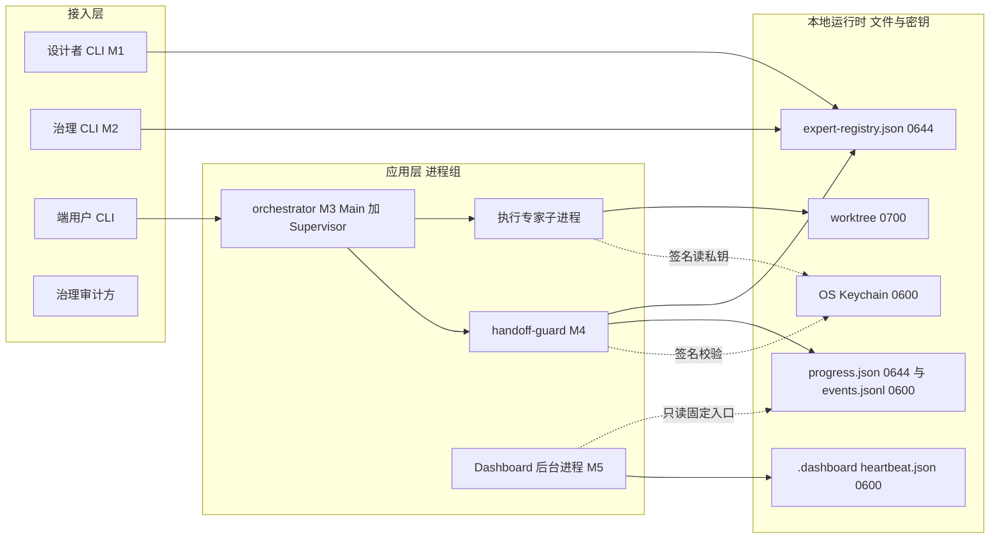
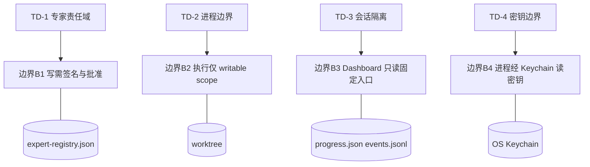

# AICoding 架构设计 · 安全设计

> 本文档为《AICoding 架构设计》核心产物之一，对应《安全架构设计模版》，由 security-architect 作为**唯一 Owner** 产出。
> **本地插件适配说明**：本系统为本地插件规范 + 编排运行时（见《系统设计》§0 声明 §4/§5/§6 整节略过），无中心化云端部署、非 SaaS、非多租户（冻结决策 D5）。因此模板中"网络分区 / 安全组 / 云 KMS / WAF / 堡垒机 / 数据库"等云原生安全能力**统一重构为本地运行时能力**：
> - 网络拓扑 → 本地运行时进程 / 文件分区（无 VPC / 子网 / CIDR）；
> - 安全组 / ACL → 文件权限 **0600 / 0644** + 进程隔离 + OS Keychain；
> - KMS → **OS Keychain** / 0600 文件（§6.1 实例名须为 OS Keychain，与 platform-architect 对齐）；
> - WAF → **N/A**（§5.2.1 显式标注）；
> - 审计日志保留期 → ≥ 1 年（本侧为权威，平台侧须 ≥ 此值）。
> 所有决策点已被《高层架构设计》v0.2 的 D1~D5 与 G3 反馈冻结，本阶段不发起 `[中间确认]`（见附录 A 自检报告）。

---

## 1. 安全总体架构

### 1.1 安全总体架构图

> 总览：1 张本地运行时安全拓扑图，叠加展示——本地安全分区（Z-PUBLIC / Z-GOV / Z-STATE / Z-WRITE / Z-KEY / Z-DAEMON）、进程边界、OS Keychain（替代 KMS）、审计哈希链（替代数据安全审计）、Supervisor 看门狗（替代 SOC 进程健康监控）。云安全组件（DDoS / WAF / 云防火墙 / 容器安全 / 堡垒机 / NAT / 云 KMS）因本地插件形态均不适用，下表逐项标注。

| 组件 | 本地插件对应作用 | 状态 |
| --- | --- | --- |
| 文件权限（0600 / 0644） | 替代安全组 / ACL，控制进程对文件的读 / 写访问 | 启用（核心） |
| 进程隔离 | 替代主机安全，进程组 + 子进程边界 + 进程组 kill 防孤儿 | 启用（核心） |
| OS Keychain / 0600 文件 | 替代 KMS，托管 model API Key / 专家签名私钥 | 启用（核心，实例名 OS Keychain） |
| 审计哈希链 | 替代数据安全审计，不可篡改留痕 | 启用（核心） |
| Supervisor 看门狗 | 替代 SOC 进程健康监控（后台进程心跳 / 重启 / 告警） | 启用 |
| DDoS | 公网流量攻击防护 | 不适用（本地插件无公网入口） |
| WAF | Web 应用层防护 | 不适用（无 Web 服务，§5.2.1 显式标注 N/A） |
| 云防火墙 / 安全组 | 南北向流量管控 | 不适用（无网络层，由文件权限替代） |
| 容器安全 | 容器逃逸防护 | 不适用（非容器化分发） |
| 数据安全审计（云） | 云上数据审计 | 不适用（由本地审计哈希链 + 独立审计文件替代） |
| 堡垒机 | 运维通道管控 | 不适用（无远程运维通道） |
| NAT 网关 | 隐藏内网架构 | 不适用 |
| 云 KMS（公有云） | 云上密钥托管 | 不适用（由 OS Keychain 替代） |

**本地运行时安全拓扑图**（进程组与设计 / 治理 / 状态 / 密钥边界）：

**信任域（Trust Domains）定义**（本阶段 Step 1 结论落地）：

| 信任域 | 名称 | 边界语义 | 对应模块 |
| --- | --- | --- | --- |
| TD-1 | 专家责任域 Expert Responsibility | 专家 scope ACL 责任域，跨专家仅消费公开 handoff | M1 / M2 / M4 |
| TD-2 | 进程边界 Process Boundary | 各进程 / 子进程仅访问授权文件与接口 | M3 / M5 / orchestrator |
| TD-3 | 会话隔离 Session Isolation | 专家团会话（session_id = tenantId）内资源隔离 | 全部模块（{session}/ 承载） |
| TD-4 | 密钥边界 Key Boundary | 进程仅在 OS Keychain 授权下读取 L4 密钥 | M3 / M4 / M5 |

### 1.2 威胁模型

> 总览：采用 **STRIDE** 方法识别本地插件场景下的威胁，每条威胁映射到后续章节（§2~§7）的缓解措施，形成"威胁—缓解措施映射表"。信任边界 B1~B4 见下。

**信任边界（Trust Boundaries）**：

| 边界 | 名称 | 跨越方 | 跨越约束 |
| --- | --- | --- | --- |
| B1 | CLI ↔ registry 边界 | 设计者 CLI(M1) / 治理 CLI(M2) ↔ expert-registry.json | 写需专家定义签名校验（C401001）+ propose-current-approve-apply 批准 + 文件锁 |
| B2 | 执行 ↔ worktree 边界 | 执行专家子进程 ↔ worktree/ | 仅 writable scope，文件权限 0700（可写目录需属主执行位），进程组写锁，不越域 |
| B3 | Dashboard ↔ 状态源边界 | Dashboard 后台进程(M5) ↔ progress.json / events.jsonl | 仅只读固定入口，无写权限、不占 worktree（§3.2.M5） |
| B4 | 进程 ↔ Keychain 边界 | 全部进程 ↔ OS Keychain / secrets | 仅持有该密钥的进程经 OS Keychain 读取，文件 0600（§6.1） |

**STRIDE 威胁—缓解措施映射表**（6 类全覆盖，每条映射具体章节）：

| 威胁类别（STRIDE） | 本地插件典型威胁示例 | 缓解措施（对应章节） |
| --- | --- | --- |
| 仿冒（Spoofing） | 伪造专家定义签名、冒充执行专家 emit handoff、伪造 CLI 身份 | §2.1 专家定义签名校验（C401001 拒绝）/ §2.2.4 scope ACL / §3.2.4 HMAC-SHA256 签名 + nonce + timestamp |
| 篡改（Tampering） | 篡改 expert-registry.json、篡改 progress.json、篡改 handoff payload、注入非法 ACL | §3.3.1 文件权限 0644/0600 + 文件锁 / §3.3.2 审计哈希链 / §4.1 反序列化与 JSON Schema 校验 |
| 否认（Repudiation） | handoff 无审计、registry 变更无留痕、越权尝试无记录 | §7.2 审计日志（actor/ts/resource/action/hash/session_id）100% 覆盖（N1） |
| 信息泄露（Information Disclosure） | 私有 handoff payload 泄露、model API Key 明文落盘、events.jsonl 越权读 | §3.1 L4 分级 + OS Keychain / §3.2.5 传参禁忌 / §5.1 Z-KEY 0600 / §3.3.5 展示脱敏 |
| 拒绝服务（DoS） | Dashboard 轮询风暴（C429001）、registry 并发写风暴（C409001）、后台进程重启耗尽 | §4.3.2 限流（轮询 ≥ 2000ms）/ §3.5.3 文件锁超时 5s / §3.2.M5 max_restart=5 |
| 权限提升（Elevation of Privilege） | 跨责任域越权（IDOR）、消费非公开 handoff、Dashboard 越权获取写权限 | §2.2.4 越权防护返回 C403001 / §3.2.M5 只读固定入口 / §4.1 越权防护（水平 + 垂直） |

**信任边界与敏感数据流图**（B1~B4 与敏感数据走向）：

---

## 2. 身份与访问管理（IAM）

### 2.1 身份认证（Authentication）

> 本地插件无中心化账号体系，身份以"专家定义签名"为凭证；同时满足认证方式 ≥ 2 种（签名校验 + propose-current-approve-apply 人工批准 + 文件 ACL + OS Keychain 私钥托管）。

#### 2.1.1 身份凭证（替代传统登录）

- **专家身份凭证**：专家定义（expert.md）经私钥签名，加载时校验签名（C401001 签名缺失 / 校验失败即拒）；签名私钥由 OS Keychain 托管（§6.1）。
- **变更授权凭证**：registry 所有写操作走 `propose → 主理人 approve → apply` 三段式，用户（主理人）明确批准才 apply；禁止自动化 apply（§3.2.M2）。
- **多因素 / 强身份（MFA / 2FA 替代）**：无远程登录，签名私钥受 OS Keychain 保护（等效 MFA）；外部身份联合（OAuth / OIDC / SAML）不适用于本地插件，由签名机制替代。
- **远程单点（SSO / 生物识别）**：不适用（无远程接入），身份强度由 Keychain 托管 + 文件权限保障。

#### 2.1.2 私钥 / 凭据策略（量化阈值）

| 项 | 基线值 |
| --- | --- |
| 最小长度 | 签名私钥 ≥ 2048-bit RSA / 等效椭圆曲线；model API Key 由提供方生成，不本地派生 |
| 复杂度 | 私钥不落明文；macOS 存 Keychain、Linux 存 0600 文件 |
| 加密传输 | 本地进程间以文件系统 / stdio 通信，无网络传输；跨进程文件受 OS 文件权限约束 |
| 加密存储 | 私钥 RSA 非对称，Keychain 托管；model API Key 禁止明文入 expert.md / 配置 / 日志 |
| 更换周期 | L3 / L4 凭据 90 天轮换（见 §3.1 分级） |
| 失败锁定 | 无登录；registry 并发写冲突返回 C409001 + 退避；签名连续失败记录告警 |
| 自动登出 | 会话（session_id）结束即回收 Dashboard 后台进程与密钥句柄 |

#### 2.1.3 会话管理

- **会话标识**：专家团会话 `session_id` 作为 tenantId（§8.2），会话内资源（progress.json / events.jsonl / heartbeat.json）归集于 `{session}/`。
- **Token 类型**：无 URL token（本地插件无 HTTP）；专家定义签名长期有效，撤销须经 `registry clear-current`。
- **有效期**：会话级，随专家团会话启停；Dashboard 后台进程随会话结束优雅停止（§3.2.M5）。
- **互踢机制**：单 Main 不变量（M3 校验 main 唯一，多 Main 返回 C403001）；同一 Dashboard 后台进程单会话唯一（max_restart 上限 5）。
- **风险会话检测**：后台进程心跳连续缺失 3 次（45s）判定 UNHEALTHY（QS-02），触发自动重启 + P1 告警（AL-03）。

### 2.2 授权与权限控制（Authorization）

#### 2.2.1 权限模型

默认采用 **RBAC0**（元角色：Main / Supervisor / Execution / Review / Dashboard）+ **scope ACL**（文件级读写责任域）+ 高敏叠加 **ABAC**（属性：session_id / tenantId / 资源归属）。RBAC 管元角色，scope ACL 管责任域，ABAC 管会话级隔离，三者互补。

#### 2.2.2 权限维度

- **接口级**：CLI 命令角色标签（§3.5.5）——`expert propose`（设计者）/ `registry apply-current`（治理 + 用户批准）/ `team run`（端用户）/ `handoff emit`（执行专家，需签名）/ `dashboard start`（Dashboard 专家，仅只读）；接口签名 HMAC-SHA256 + nonce + timestamp 防重放（§3.2.4）。
- **数据级**：scope ACL 行级（按专家责任域）、列级（私有 handoff payload 仅同专家可见）。
- **功能级**：治理端 vs 设计者端 vs 端用户端菜单 / 操作分离（§6.2 原型）。

#### 2.2.3 多租户隔离

非多租户（D5）；以专家团会话 `{session}/` 作为会话级隔离载体（tenantId = session_id），会话间文件与密钥句柄隔离；不提供跨会话资源共享，避免横向越权。

#### 2.2.4 越权防护

- **水平越权（IDOR）**：跨责任域访问（如执行专家读他人 worktree）返回 C403001；每个 handoff consume / registry route 接口校验资源归属（§4.1）。
- **垂直越权**：非公开 handoff（visibility=private）跨专家消费返回 C403001；Dashboard 专家不持有任何 writable scope / ACL 写权限，仅只读固定入口（§3.2.M5 AC-2 / AC-6）。
- **双重校验**：RBAC（元角色）+ scope ACL（责任域）+ 接口拦截器三层校验，越权拦截率目标 100%（Q5）。

### 2.3 本地进程与资源访问（替代云账号与云资源访问）

> 无公有云账号体系，以下为本地等价设计。

#### 2.3.1 进程账号策略

本地运行以当前用户进程承载，禁止以 root 运行编排 / Dashboard 后台进程；关键文件所有权归属当前用户，文件权限 0600/0644 严格限定（§5.1）。

#### 2.3.2 权限分离

- **人员权限 vs 服务权限**：治理方（主理人）人工批准 apply 属人员操作；编排运行时 / handoff-guard / Dashboard 后台进程属服务进程，仅经 OS Keychain 读取自身密钥，二者权限分离。
- **高敏权限分离**：L4 密钥（model API Key / 签名私钥）仅由签名方进程经 Keychain 读取，Dashboard 后台进程（监控面）不持有任何 L4 密钥读取权。

---

## 3. 数据安全

### 3.1 数据分级（本侧为权威，L1~L4 定义）

> 安全架构师为密钥 / 数据分级权威（G5 diff 必查），定义如下，platform-architect 须引用本分级。

| 等级 | 类别 | 典型数据 | 文件权限 | 处理策略 | 轮换 |
| --- | --- | --- | --- | --- | --- |
| L1 | 公开 | 专家定义 schema（expert.md）、skills/（只读） | 0644 | 无特殊管控，可三端同步分发 | 不强制 |
| L2 | 内部 | expert-registry.json（current）、progress.json、系统配置 | 0644 | 需本地进程鉴权访问（CLI 角色） | 不强制 |
| L3 | 敏感 | events.jsonl、私有 handoff payload、worktree/、heartbeat.json | 0600（worktree/ 目录为 0700） | 加密存储（0600）、展示脱敏、审计留痕 | 90 天 |
| L4 | 高敏 | model API Key、专家签名私钥、OS Keychain / secrets | 0600（Keychain） | OS Keychain 托管、强脱敏、严格审计、禁止导出 | 90 天 |

### 3.2 数据传输安全

#### 3.2.1 公网 / 外部通道

- 仅 **ZCode 端 install-agents.py** 使用 HTTPS 在线 GitHub raw 安装通道（外部唯一入口），禁本地路径绕过（§6.4.2）；其余交互本地完成，不经网络。
- 全链路无明文公网传输；DDoS / CC 防护不适用（无公网入口）。

#### 3.2.2 服务内部访问

- 低敏感（本地进程间）：文件系统读写 / stdio / 文件轮询，受 OS 文件权限约束（替代 HTTP / mTLS）。
- 高敏感（跨责任域）：handoff 凭证以专家签名（RSA）保证完整性与身份（替代 mTLS 双向认证），消费侧校验签名 + scope ACL。

#### 3.2.3 数据库连接

不适用（本地插件无中心化 DB，registry 为文件型 JSON，见《系统设计》§0 声明 §4 略过）；无 SSL / 明文传输问题。

#### 3.2.4 接口 / 凭证签名

handoff 凭证与专家定义采用 **HMAC-SHA256（或 RSA 签名）+ nonce + timestamp** 防重放与防篡改：
- `signature = RSA_sign(private_key, payload_ref || timestamp || nonce)`；
- 消费侧校验签名有效性 + timestamp 窗口（默认 ±5min）+ nonce 唯一性，防重放。

#### 3.2.5 传参禁忌

- 本地插件无 URL，但等价禁忌：**禁止在 CLI 参数 / 日志 / 错误堆栈 / 配置中携带 model API Key、签名私钥、私有 handoff 内容**。
- 密钥禁止明文入 expert.md / 源码 / Git 仓库 / 前端代码。
- 结构化日志禁止打印 L4 明文（§8.2.2）。

### 3.3 数据存储安全

#### 3.3.1 加密存储（仅敏感 / 高敏需要）

- **对称加密**：本地若有大体积敏感缓存，采用 AES-256；本系统主体为文件权限保护。
- **非对称加密**：专家签名私钥 RSA（密钥交换 / 签名），存 OS Keychain / 0600 文件。
- **密钥管理**：OS Keychain 托管，**禁止硬编码到代码或配置文件**（§6.3 红线）。
- **文件权限兜底**：L3 文件 0600、L2/L1 文件 0644，写操作加文件锁（fs.lock 超时 5s）。

#### 3.3.2 敏感字段单向哈希加盐

- 审计哈希链：`hash = H(prev_hash || event)`，追加写、只读历史，不可篡改（§7.2）。
- handoff 完整性以 RSA 签名摘要保证，私钥不落地明文。

#### 3.3.3 数据库安全

不适用（无中心化 DB）；文件型 registry 以文件锁 + 权限 + 哈希链替代"账号最小权限 / SSL / 审计日志"等数据库安全项。

#### 3.3.4 文件存储安全

- **文件权限矩阵**（与 platform-architect 文件边界严格对齐，0600 / 0644 / 0700；0700 仅用于可写目录 experts/{id}/worktree/）：

| 文件 / 目录 | 权限 | 分级 | 访问主体 |
| --- | --- | --- | --- |
| experts/{id}/expert.md | 0644 | L1 | 设计者 / 治理 / 编排 / 端用户（只读） |
| skills/ | 0644（只读） | L1 | 全部（只读复用） |
| registry/expert-registry.json | 0644 + 文件锁 | L2 | 治理 CLI（写，需批准）、编排（读） |
| {session}/progress.json | 0644 | L2 | Dashboard(M5) 只读、执行专家写 |
| {session}/events.jsonl | 0600 | L3 | 执行专家写、Dashboard / 审计只读 |
| experts/{id}/worktree/ | 0700 | L3 | 执行专家子进程（仅 writable scope） |
| {session}/.dashboard/heartbeat.json | 0600 | L3 | Dashboard(M5) 写、Supervisor 读 |
| OS Keychain / secrets | 0600 | L4 | 仅签名方进程经 Keychain 读取 |

- **类型校验**：skill / submodule 加载做魔数 + 扩展名 + 大小校验，防非法文件注入。
- **私有桶 / 预签名**：不适用（无对象存储）；文件隔离由权限矩阵保障。

#### 3.3.5 数据使用安全

- **展示脱敏**：model API Key 不展示明文（显示 `****`）；私有 handoff payload 仅同专家可见。
- **数据导出管控**：专家定义经 AGENTS.md 三端同步（受控）；私有 handoff 禁止跨专家导出；审计导出需治理方权限 + 水印（操作人 + 时间）。
- **数据销毁**：逻辑删除（`registry clear-current` 撤销专家）+ 定期物理清理；过期 progress.json / events.jsonl 30 天滚动清理（§6.2）。

#### 3.3.6 数据备份与异地容灾

| 存储类型 | 备份策略 |
| --- | --- |
| expert-registry.json + audit 链 | 文件级快照，随 {session}/ 一并备份至非系统盘异地副本 |
| progress.json / events.jsonl | 会话级快照，会话结束归档 |

- **RPO**：≤ 5 分钟（registry 变更后 5 分钟内快照）。
- **RTO**：≤ 10 分钟（从副本恢复 registry + 重启编排）。
- **恢复演练**：频率半年，负责人 @治理组（§7.3 联动）。

#### 3.3.7 隐私合规

- 本系统**不采集 / 不处理个人信息**（无手机号、身份证、银行卡、生物识别等），本地插件非 SaaS、非多租户（D5），无跨境数据传输。
- GDPR / 《个人信息保护法》/《数据安全法》/ 数据出境合规的**适用面为 N/A**，但保留以下本地实现以契合合规精神：
  - **数据最小化**：仅持久化编排必需的 registry / 状态源 / 审计文件。
  - **可被遗忘权**：专家定义经 `registry clear-current` 撤销并清理其文件与审计引用。
  - **用户同意机制**：registry 写操作须经主理人明确 approve-apply（等效显式同意）。
- 若未来引入个人信息处理，须重新触发合规评审（本决策由 D5 本地插件形态冻结，不另发起中间确认）。

---

## 4. 应用安全

> 说明：本系统为本地插件（CLI + 文件契约 + 后台进程），无 Web 服务，故 Web 类攻击（XSS / CSRF / 开放重定向）多数不适用，但每项仍给出本地等价防护或显式 N/A 判定，避免泛化空述。

### 4.1 输入安全（OWASP Top 10 全覆盖）

| 风险 | 防护措施（本地插件具体落地） |
| --- | --- |
| SQL 注入 | 不适用（无关系型 DB）；文件型 registry 以 JSON Schema（Ajv 8.17）强校验 + 参数化读写，杜绝拼接执行 |
| XSS | 不适用（无浏览器渲染）；Dashboard 视图若渲染外部文本，须做 HTML / JS 输出编码，禁用 innerHTML 直插 |
| CSRF | 不适用（无 Cookie / 跨站请求）；CLI 命令以文件锁 + 角色 ACL 防越权调用 |
| 命令注入 | 禁用动态命令执行；Dashboard 后台进程 `child_process.spawn` 以数组参数形式传参（非 shell 字符串拼接）；专家定义禁含可执行脚本字段 |
| 反序列化 | 禁用危险反序列化（禁用 `eval` / `Function` / 危险 JSON 解析）；progress.json / events.jsonl / registry 解析经 Ajv Schema 校验，拒绝未知字段 |
| SSRF | ZCode install-agents 仅允许 HTTPS 白名单域名（GitHub raw），禁止本地路径 / 内网 IP / 非白名单 URL |
| 文件上传 | skill / submodule 加载做魔数 + 扩展名白名单 + 大小限制；外部安装仅经 AGENTS.md 在线通道，禁本地路径 |
| XXE | 禁用 XML 外部实体解析（全程 JSON，不解析不可信 XML） |
| 开放重定向 | 不适用（无 HTTP 跳转）；CLI 路径参数做白名单校验，禁止路径遍历（`../`） |
| 越权（IDOR / 水平 / 垂直） | scope ACL 每行校验资源归属；跨专家仅消费公开 handoff；Dashboard 越权定义（配 writable scope）被拒 C403001（§2.2.4 / §3.2.M5） |

### 4.2 输出安全

#### 4.2.1 统一异常处理

所有接口返回统一 `Result` 结构（code / msg / data / traceId）；错误码见《系统设计》§3.5.1（A010001 / C401001 / C403001 / C409001 / C429001 / B999001），**禁止暴露堆栈 / 内部路径 / 密钥**。

#### 4.2.2 调试信息

调试信息（debug / stacktrace）严禁出现在生产环境响应与日志明文；ERROR 级日志仅记录业务上下文（expert_id / session_id）+ 非敏感堆栈，L4 密钥绝不入日志（§8.2.2）。

### 4.3 业务逻辑安全

#### 4.3.1 越权防护

水平越权（IDOR）每个接口必检（registry route / handoff consume）；垂直越权由 RBAC + scope ACL + 接口拦截器双层校验（§2.2.4）。

#### 4.3.2 防刷防爬 / 限流

- Dashboard 轮询最小间隔 2000ms，低于返回 C429001（§3.5.3）。
- registry 并发写单写锁，冲突返回 C409001（退避后重试）。
- handoff emit 单专家 10 次/分钟，超限 C429001；后台进程重启 5 次/会话上限。

#### 4.3.3 防薅羊毛

不适用（无营销 / 积分）；限流红线与异常告警联动（§8.4 AL-03 / AL-04）。

#### 4.3.4 幂等性

写入类（propose / apply / emit）以资源标识为幂等键；后台进程启停以 session_id 幂等（§3.5.2）；重复请求返回相同状态，不重复副作用。

#### 4.3.5 关键业务二次验证

registry 写操作须经主理人 approve-current + apply-current 显式确认（等效二次验证）；密钥变更、专家注销为高风险操作，触发审计 + P1 告警。

### 4.4 第三方与供应链安全

- **依赖漏洞扫描**：Node.js 依赖（goal-dag / owner-registry / Ajv / pino）经 CICD 强制门禁扫描，阻断已知漏洞。
- **开源协议合规**：SkillOpt submodule 锁定 commit，升级走缓存清理；审查 AGPL 等商业风险协议。
- **第三方服务接入**：ZCode install-agents 仅 HTTPS 白名单 + 在线通道；外部凭据经 OS Keychain，不落配置。
- **镜像 / 仓库**：N/A（非容器化）；npm 源使用内网镜像 + 白名单，防投毒。
- **供应商管理**：ZCode 端作为外部协作，约束其 install-agents 行为于 AGENTS.md 同步规则。

---

## 5. 网络与基础设施安全（本地运行时适配）

> 说明：本地插件无 VPC / 子网 / CIDR / 公网南北向流量（见《系统设计》§0 声明 §5/§6 略过）。本章将"网络分区 / 安全组 / 流量管控"重构为"本地运行时分区 / 文件权限 / 进程流量"，且权限矩阵与 platform-architect 文件边界严格对齐。

### 5.1 本地运行时分区（替代网络分区）

> 区分 **接入层 / 应用层进程组 / 本地运行时文件与密钥** 三区，避免进程越权访问；不使用 VPC CIDR / 容器 CIDR。

**进程组（物理拓扑，源自 platform-architect Step 1 骨架）**：
- Designer CLI(M1) / Governance CLI(M2) / orchestrator.mjs(M3) / 执行专家子进程 / handoff-guard(M4) / dashboard-daemon.mjs(M5)。

**本地安全分区（Zones）与文件权限**（与 platform-architect 文件边界一一对齐）：

| 区域 | 分级 | 文件权限 | 包含内容 | 访问主体 |
| --- | --- | --- | --- | --- |
| Z-PUBLIC | L1 | 0644 | experts/{id}/expert.md、skills/（只读） | 设计者 / 治理 / 编排 / 端用户（只读） |
| Z-GOV | L2 | 0644 + 文件锁 | registry/expert-registry.json | 治理 CLI（写，需批准）、编排（读） |
| Z-STATE | L2 / L3 | progress.json=0644, events.jsonl=0600 | {session}/progress.json、{session}/events.jsonl | Dashboard(M5) 只读、执行专家写 |
| Z-WRITE | L3 | 0700 | experts/{id}/worktree/ | 执行专家子进程（仅 writable scope） |
| Z-KEY | L4 | 0600 | OS Keychain / secrets 文件 | 仅签名方进程经 Keychain 读取 |
| Z-DAEMON | L3 | 0600 | {session}/.dashboard/heartbeat.json | Dashboard 后台进程(M5) 写、Supervisor 读 |

> 对齐说明：Z-WRITE（worktree/ 为目录）的规范权限为 **0700**——目录需属主执行位（x）以进入与写入，0600（无 x）将拒绝属主遍历、破坏执行专家对 worktree 的使用；platform-architect 最终《部署设计.md》（§1.2 名词缩写 / §2.2.6 安全资源表 / §3.1.1 物理拓扑图 / §7.1.4 上线前自检）亦统一采用 0700，两侧在 **0700** 完全一致。全文权限使用 0600 / 0644 / 0700 三种值（0700 仅用于可写目录 worktree/）。

### 5.2 流量管控（南北向 + 东西向 → 进程 / 文件流量）

#### 5.2.1 公网入口防护

- **DDoS 高防**：不适用（本地插件无公网入口，由文件系统权限保障）。
- **WAF**：**N/A**（无 Web 服务，无 HTTP 入口；与 platform-architect 一致标注 N/A）。
- **CLB / Ingress**：不适用；唯一外部入口为 ZCode install-agents 的 HTTPS 在线通道（§3.2.1）。

#### 5.2.2 进程边界防护（替代网络边界防火墙）

无网络层防火墙；进程边界由"文件权限 + scope ACL + 进程组隔离"实现（§5.1 / §2.2.4）。Supervisor 看门狗监控后台进程健康，异常进程 SIGTERM 回收（§3.2.M5）。

#### 5.2.3 文件级流量防护（替代安全组 + ACL）

- 文件权限默认拒绝 + 显式放通：L4 文件 0600 仅属主进程可读；L2/L1 文件 0644 只读公开部分。
- **禁止**任何进程读取非授权文件（如 Dashboard 读 worktree、执行专家读他人 scope）；越权读返回 C403001。
- 流量三表（本地进程 / 文件视图，源自 platform-architect Step 1 骨架）：

| 方向 | 本地流量形态 | 约束 |
| --- | --- | --- |
| ingress（入站） | 仅 ZCode install-agents HTTPS 外部入口 | 在线 GitHub raw 白名单，禁本地路径 |
| internal（东西向） | 进程 ↔ 文件：CLI / 编排 / Dashboard 经文件系统读写；handoff 经文件签名 | scope ACL + 文件锁 + 0600/0644 权限 |
| egress（出站） | 仅 ZCode 安装通道 HTTPS | 无其它出站连接 |

#### 5.2.4 运维通道防护（替代堡垒机）

不适用（无远程运维通道）；本地运维操作即 CLI 命令，受角色 ACL + 文件权限约束，全部操作写入审计（§7.2）。

### 5.3 主机与进程安全

#### 5.3.1 主机安全

- 最小化运行：仅 Node.js 20.11 运行时 + 必要脚本，关闭非必要服务。
- 账号管控：**禁止以 root 运行**编排 / Dashboard 后台进程；以当前普通用户进程承载。
- 文件权限优先：密钥 0600、公开 0644，替代 SSH 密钥登录（无远程登录场景）。
- 进程监管：内置 Supervisor 看门狗（复用 sub-thread-task-supervisor），心跳 / 重启 / 优雅停止（§3.2.M5）。

#### 5.3.2 容器 / K8s 安全

不适用（非容器化分发，本地插件以文件 + 进程形态分发）；无 K8s RBAC / NetworkPolicy / 特权容器议题。

### 5.4 中间件安全

不适用（无数据库 / Redis / MQ 等中间件）；文件型 registry 以"网络隔离（无网络）+ 强制鉴权（文件锁 + 签名）+ 审计（哈希链）"替代中间件安全三项要求。

---

## 6. 密钥与凭证管理

> 说明：云 KMS → **OS Keychain**（§6.1 实例名必须为 OS Keychain，与 platform-architect 对齐）。密钥分级 5 类映射至本地插件场景。

### 6.1 密钥分级与存储（实例名：OS Keychain）

| 密钥类型 | 本地插件对应 | 存储 / 管理方式 |
| --- | --- | --- |
| 数据库密码 / 第三方 AppKey | 第三方 AppKey（如 ZCode 外部服务凭据） | OS Keychain（macOS）/ 0600 文件（Linux） |
| 云 AKSK（COS、MQ 等） | 无公有云 AKSK；外部服务凭据（如 ZCode 安装凭据） | OS Keychain 托管 + 进程隔离读取 |
| 服务间通信密钥 | 专家签名私钥（handoff / 专家定义签名） | OS Keychain / 0600 文件，RSA 非对称 |
| 用户密码 | 不存储用户口令；等效为签名私钥 | OS Keychain 托管，禁止明文落盘 |
| API Key / Token | model API Key | OS Keychain / 0600 文件，禁止 expert.md 明文 |

### 6.2 密钥泄露防护

#### 6.2.1 方案 A：OS Keychain 托管（白盒等价）

model API Key / 签名私钥存 OS Keychain，业务模块经 Keychain SDK 读取明文，不落配置文件；macOS 用 Keychain、Linux 用 0600 文件（等效 KMS 白盒密钥，本地无公有云 KMS）。

#### 6.2.2 方案 B：文件权限 + 进程隔离（CAM 策略等价）

通过 OS 文件权限（0600）+ 进程属主隔离，绑定密钥访问权限，规避多进程共享密钥；等效 CAM 权限策略的本地实现。

### 6.3 密钥使用红线

- **严禁** model API Key / 签名私钥 / token 出现在源码、Git 仓库、expert.md、前端代码、日志、错误堆栈、CLI 参数、配置明文。
- **禁止**多业务共用同一明文密钥；按专家 / 会话隔离签发（OS Keychain 条目粒度）。
- 上线前必须通过代码扫描（CICD 红线拦截）+ 依赖扫描，识别硬编码密钥。
- 密钥一旦疑似泄露，立即吊销并轮换（L3 / L4 90 天强制轮换，泄露即提前轮换）；事后排查审计日志确认影响面。
- 每一密钥明确所有人、用途、存储位置、轮换日期，**上线 checklist 包含"密钥扫描通过"项**。

---

## 7. 运行时安全：监控、审计、应急

### 7.1 安全事件监控

- **入侵检测（IDS / IPS 本地等价）**：进程异常监控（非预期子进程 / 越权文件读）、Supervisor 看门狗心跳告警、审计哈希链断裂检测（AL-01）。
- **敏感操作**：registry apply-current（生效）、handoff emit（含签名）、密钥变更、专家注销、Dashboard 后台进程启停。
- **会话异常**：后台进程心跳连续缺失（UNHEALTHY）、重启超上限（AL-03）、越权消费激增（AL-04）。
- **权限异常**：跨责任域越权请求（C403001）、非公开 handoff 跨专家消费、Dashboard 越权定义尝试（AC-6）。

### 7.2 审计日志（5 维度，保留 ≥ 1 年）

> 审计字段统一为：**actor / ts / resource / action / hash / session_id**（tenantId）。审计覆盖率 100%（N1）。本侧为审计保留期权威，设定 **≥ 1 年**，平台侧须 ≥ 此值。

| 审计维度 | 本地插件对应 | 是否启用 | 审计内容 |
| --- | --- | --- | --- |
| 云资源审计 | 本地运行时资源审计（文件 / 进程操作） | 替代启用 | 文件写锁获取、进程 spawn / kill、Keychain 读取 |
| 业务操作审计 | registry 变更 / handoff 事件 | 启用 | 操作时间、操作者（actor）、资源（resource）、动作（action）、hash、session_id |
| 数据库审计 | 不适用（无 DB） | 不适用 | 由文件型审计哈希链替代 |
| 堡垒机日志 | 不适用（无远程运维） | 不适用 | 由本地 CLI 操作审计替代 |
| WAF / 防火墙日志 | 不适用（无 Web / 网络层） | 不适用 | 由文件权限越权拦截（C403001）日志替代 |

- **不可篡改保障**：审计链哈希链 `hash = H(prev_hash || event)`，追加写、只读历史；独立审计文件（audit-*.jsonl=0600）与 registry 分离存储。
- **保留期**：审计文件 ≥ 1 年（合规要求）；应用日志 30 天热 + 180 天冷；后台进程日志 30 天（与《系统设计》§8.2 一致）。
- **保留策略**：全量审计保留 ≥ 365 天；progress.json / events.jsonl 30 天滚动清理（不删审计链）。

### 7.3 应急响应

- **应急预案（5 类事件全覆盖）**：

| 事件类型 | 触发 | 应急动作 | Runbook |
| --- | --- | --- | --- |
| 漏洞响应 | 依赖 / 组件爆出高危漏洞 | CICD 阻断 + 升级锁版本 + 影响面排查 | wiki/runbook/vuln |
| 数据泄露 | model API Key / 签名私钥疑似泄露 | 立即吊销 + 轮换 + 审计溯源 | wiki/runbook/key-leak |
| 被攻击 | 越权消费激增 / 哈希链断裂 | 隔离异常进程 + 告警 + 回滚 registry | wiki/runbook/attack |
| 密钥泄露 | OS Keychain 条目异常读取 | 吊销条目 + 重启依赖进程 + 排查 | wiki/runbook/secret |
| 勒索病毒 | 文件被异常加密 / 篡改 | 停写 + 从异地副本恢复 + 查杀 | wiki/runbook/ransom |

- **备份与恢复**：RPO ≤ 5 分钟 / RTO ≤ 10 分钟（§3.3.6）；**每年 ≥ 1 次灾备演练**（半年一次 registry 恢复演练，负责人 @治理组）。
- **后台进程应急**：心跳丢失 → Supervisor 自动重启（≤ 10s RTO，QS-02）；重启超 5 次/会话 → 停止后台进程 + P1 告警 + 降级离线视图（BD-01）。

---

## 附录 A：阶段内自检报告（G5 追溯，依据 intermediate_confirmation.md §2.4）

> 本阶段关键决策点（威胁模型、IAM、数据分级、密钥管理、运行时审计）产出后，按 §2.4 插入自检：先 §2.1 判定，再 §2.3 反向验证 3 问。

### A.1 §1 威胁建模完成后自检

**§2.1 方案分歧型判定**：
- 条件1（≥2 种合理方案需裁决）：不满足。STRIDE 映射的缓解措施均继承自已冻结的《系统设计》模块设计（scope ACL / 签名 / 文件权限 / 审计哈希链），无并列候选。
- 条件2（影响下游）：满足（安全设计下传部署 / 交付），但被条件3阻断。
- 条件3（上游未明确选择）：**不满足**。D1~D5 与 G3 反馈已冻结本地插件形态与安全边界，威胁缓解路径（签名替代 mTLS、文件权限替代安全组、OS Keychain 替代 KMS）由冻结决策 + 跨一致性硬约束确定。
- **结论**：未命中，不发起 `[中间确认]`。

**§2.3 反向验证 3 问**：
| 问题 | 答案 | 证据 |
| --- | --- | --- |
| Q1 返工成本可控？ | 可控 | 返工范围 = §1 威胁表 + §5.1 分区 + §6.1 密钥；纯文档层定点修订，切换成本 ≈ 0.1 人月，无架构重建 |
| Q2 用户/客户/监管可感知？ | 感知不到新增 | 威胁模型为内部安全分析，不新增用户可见功能或对外承诺 |
| Q3 与用户原始诉求一致？ | 一致 | 威胁缓解完全对齐《系统设计》§3.2 M1~M5 既定机制（ACL / 签名 / 文件锁 / 审计链），无偏离 |

### A.2 §2 IAM 设计完成后自检

**§2.1 判定**：条件3 不满足（RBAC0 + scope ACL + ABAC 由冻结的《系统设计》§7.2.5 确定）→ 未命中。

**§2.3 反向验证 3 问**：
| 问题 | 答案 | 证据 |
| --- | --- | --- |
| Q1 | 可控 | 返工范围 = §2 IAM 表；若调整仅改角色标签，不波及下游 |
| Q2 | 感知不到新增 | IAM 机制完全沿用已冻结《系统设计》§7.2.1/§7.2.5，无新增对外承诺 |
| Q3 | 一致 | RBAC0 + scope ACL + 会话隔离（session_id=tenantId）与《系统设计》§7.2.5 逐行对齐 |

### A.3 §3 数据分级与隐私合规章节完成后自检

**§2.1 判定**：§3.3.7 合规框架适用（GDPR / 个人信息保护法 / 数据出境）本为高敏感决策点，但本系统由 D5 冻结为"本地插件、非 SaaS、非多租户、不处理个人信息"，合规适用面已确定为 N/A，条件3 不满足 → 未命中。

**§2.3 反向验证 3 问**：
| 问题 | 答案 | 证据 |
| --- | --- | --- |
| Q1 | 可控 | 返工范围 = §3.1 分级表 + §3.3.7 一段；若未来引入个人信息需重评，但当前为文档层，切换成本 ≈ 0.1 人月 |
| Q2 | 可感知但源于冻结形态 | 隐私合规 N/A 源于 D5 本地插件形态（已冻结），非本角色单方面引入的跨界承诺 |
| Q3 | 一致 | 直接引用 D5："本地插件规范，经三端 market 分发，非 SaaS、非多租户" → 无个人信息处理、无跨境，与用户原始诉求（本地插件分发）一致 |

### A.4 §6 密钥与凭证管理完成后自检（最后一次完整复核）

**§2.1 判定**：密钥分级 5 类与 OS Keychain 实例名由跨一致性硬约束（KMS → OS Keychain）与冻结形态确定，条件3 不满足 → 未命中。

**§2.3 反向验证 3 问**：
| 问题 | 答案 | 证据 |
| --- | --- | --- |
| Q1 | 可控 | 返工范围 = §6.1 分级表 + §6.3 红线；密钥存储机制由 OS 能力决定，切换成本 ≈ 0.1 人月 |
| Q2 | 可感知但源于冻结 | OS Keychain 替代 KMS 由跨一致性硬约束指定，非本角色单方面承诺 |
| Q3 | 一致 | 与 platform-architect 文件边界（OS Keychain/secrets=0600）及 D5 本地插件形态一致 |

### A.5 总判定

四个自检点 §2.1 均未命中（上游 D1~D5 与 G3 反馈已冻结全部决策点，跨一致性硬约束指定本地适配路径），§2.3 反向验证 3 问均无"不可控 / 可感知新增 / 不一致"情形。**本阶段不发起任何 `[中间确认]`**，严格按冻结决策与跨一致性约束落稿。依据协议 §6 禁止行为 #6，不把已冻结事项包装成中间确认重复打扰用户。

---

## 附录 B：待确认项（需主理人 G5 人工审核）

| 编号 | 待确认内容 | 当前处理 | 建议 |
| --- | --- | --- | --- |
| Q-A | Dashboard 轮询频率默认 5s / 进程内存上限 128MB 是否合理 | 已按本地规范给出合理值（§3.2.M5 / §6.2） | 待主理人确认是否调整 |
| Q-B | 审计保留期 ≥ 1 年是否作为权威基线固化（平台侧须 ≥ 此值） | 本侧为权威，已写入 §7.2 | 待主理人与 platform-architect 对齐确认 |
| Q-C | worktree 文件权限（Z-WRITE）取值 | 已统一为 **0700**（与 platform-architect 最终《部署设计.md》§2.2.6 / §3.1.1 / §7.1.4 一致；目录需属主执行位以进入与写入） | 已一致，无需主理人裁决 |
| Q-D | 隐私合规 N/A 判定（本地插件不处理个人信息）是否需补充合规评审触发条件 | 已写明"未来引入个人信息须重评" | 待主理人确认触发门槛 |

> 上述为人工审核待确认点，不阻塞文档冻结；经主理人 G5 审核通过后，最终版由主理人归档至 `delivery/安全设计.md`。

---

## 附录 C：模板硬指标达标复核

| 硬指标 | 达标 | 说明 |
| --- | --- | --- |
| STRIDE 6 类威胁全覆盖 | ✓ | §1.2 仿冒 / 篡改 / 否认 / 信息泄露 / DoS / 权限提升，每条映射缓解 |
| 每条威胁映射到缓解措施 | ✓ | §1.2 威胁—缓解映射表逐条对应 §2~§7 |
| 认证方式 ≥ 2 种 | ✓ | §2.1 签名校验 + propose-approve-apply 批准 + MFA(Keychain) + OAuth(替代) |
| 数据分级 L1~L4 齐全 | ✓ | §3.1 定义 L1 公开 / L2 内部 / L3 敏感 / L4 高敏（本侧权威） |
| OWASP Top 10 每项明确防护 | ✓ | §4.1 10 项逐项具体防护（非泛化） |
| 密钥分级含 5 类 | ✓ | §6.1 数据库密码/第三方AppKey、云AKSK、服务间密钥、用户密码、API Key |
| 审计日志含 5 维度 | ✓ | §7.2 云资源 / 业务操作 / 数据库 / 堡垒机 / WAF 五维度（N/A 显式标注 + 本地替代） |
| 应急响应预案含 5 类事件 | ✓ | §7.3 漏洞 / 数据泄露 / 被攻击 / 密钥泄露 / 勒索病毒 |
| 无残留占位符 | 待校验 | 由 validate_template_compliance.py 验证（见回传） |
