# AICoding 架构设计 · 系统设计

> 本文档为《AICoding 架构设计》核心产物之一，对应**系统架构设计模版**。
> 上游输入：《高层架构设计》v0.2（G3 已冻结）。
> 下游输出：用于驱动《部署设计》《安全设计》《UserStory》的实施。
> 本期系统本质：**本地插件规范 + 编排运行时**（goal-dag v5 子线程体系演进），无中心化云端部署、非 SaaS、非多租户，经两端 market（claude-code-market / codex-market）分发。

---

## 0. 元信息：修订记录

| 文档版本 | 发布日期 | 修订人 | 修订说明 |
| --- | --- | --- | --- |
| v1.0 | 2026-08-07 | 高见远 / system-architect | 基于《高层架构设计》v0.2（G3 冻结）首版产出；覆盖 §1 引言 / §2 业务架构 / §3 应用架构（M1~M6 五段式）/ §7 安全设计 / §8 可观测设计 |

**填写要求**：每次评审通过新增一行；修订说明必须能定位到具体章节，禁止"细节优化 / 调整内容"等不可验证表述。

### 0.1 章节启用 / 未启用声明（按模板裁剪约定）

> 模板约定：若实际系统不涉及某章节内容，可整节略过，并在本节注明"未启用：§x.x（理由）"；略过章节后后续章节序号顺延、跨章引用同步更新。
> 本章节同时登记本系统对模板的裁剪决策与偏离说明，供主理人在 G4 审核弹窗追溯。

| 处置 | 章节 | 理由 |
| --- | --- | --- |
| 未启用 | §4 数据库设计（§4.1~§4.5） | 本地插件规范，registry 为**文件型 JSON**（expert-registry.json / progress.json / events.jsonl），无集中式关系型 DB；数据建模以文件 Schema + 章节 §3.2.M2 数据模型承载，整节略过 |
| 未启用 | §5 部署架构（§5.1~§5.5） | 本系统为本地插件，按三端 market 分发，无中心化云端部署 / 集群 / 多 AZ；部署与发布形态由《部署设计》文档承接，整节略过 |
| 未启用 | §6 网络架构（§6.1~§6.3） | 本地插件运行时以文件系统 + 进程间 stdio / 文件轮询通信，无公网入口 / VPC / 南北向流量；网络约束由《部署设计》承接，整节略过 |
| 保留原编号 | §7 安全设计 | 模板"不可裁剪章节"清单明确 §7 为合规底线，必须实质填充（机制选择 + 关键参数基线） |
| 保留原编号 | §8 可观测设计 | 《系统设计》模板合规校验器要求"§8 可观测设计"以原编号存在（下游工具链引用锁定），且 Dashboard 专家可视化是本系统核心交付，必须实质填充 |

**序号顺延说明**：因 §4~§6 已整节略过，正文编号在 §3 之后直接接续 §7 / §8（中间 §4~§6 编号空缺已在上方声明）。跨章引用中凡涉及被略过章节者一律不引用，相关结论已下沉至 §3（数据模型）、§7（安全与备份 RPO/RTO）、§8（可观测）。

---

## 1. 引言

### 1.1 文档目标

- **一句话定位**：本文档定义 workbuddy 专家团（Expert Team）设计规范与编排模型在交付物中的所有架构设计产物——覆盖业务架构、应用架构（模块 / 接口契约）、安全设计、可观测设计。
- **读者对象**：架构师 / 插件工程师（专家·技能设计者）/ 治理·审计方 / 三端同步维护者 / 评审委员会。
- **设计范围**：业务架构 + 应用架构 + 安全设计 + 可观测设计（数据库 / 部署 / 网络按 §0 声明整节略过）。

### 1.2 关联文档清单

| 输入类型 | 内容要点 | 在本文档中的用途 | 形式 |
| --- | --- | --- | --- |
| 高层架构设计 | 业务定位、D1~D5 冻结决策、§4.5 专家子类型与生命周期边界、§5 业务架构、§6 功能清单 F1~F14 | 第 2 章业务架构、第 3 章模块边界 | 外部文档（.workbuddy/output/高层架构设计.md） |
| 现有架构知识库（内部对标） | goal-dag v5 spec（五条不变量 / progress.json / events.jsonl）、owner-governance.md（ACL / handoff / Capsule / propose-current-approve-apply / route）、sub-thread-coordination.skill、sub-thread-goal-worker.skill、sub-thread-task-supervisor.skill、AGENTS.md（三端同步规则） | 第 3 章模块设计、第 7 章安全边界 | 本文档自带（内部权威源文件，逐条引用） |
| 阶段内中间确认协议 | intermediate_confirmation.md（§2.1 / §2.2 / §2.3 触发与反向验证规则） | 第 2 / 3 章产出后的自检节奏 | 外部文档（协议文件） |
| 系统模板 | 系统设计.md 模板（章节骨架与硬指标） | 全文章节结构 | 外部文档（模板文件） |

### 1.3 名词与术语表

> 本表是**业务名 ↔ 代码对象 ↔ 存储工件**三层映射的唯一索引。因本系统为文件型本地插件（§0 声明 §4 数据库设计整节略过），"数据库表名"一列改为"存储工件（文件型）"。

| 业务术语 | 业务定义（≤ 30 字） | 应用层核心对象（§3.3 O-xx） | 存储工件（文件型） |
| --- | --- | --- | --- |
| Expert（专家） | 责任域(ACL)+执行语义+技能挂载+模型 profile 的单一可复用实体 | O-01 ExpertSpec | experts/{expert_id}/expert.md |
| Main（主控元角色） | 专家团唯一协调主控，单 Main 不变量 | O-02 Orchestrator | runtime/orchestrator.mjs |
| Supervisor（看门狗元角色） | 只 wait / notify 的后台监管，不读结果 | O-03 Supervisor | runtime/orchestrator.mjs |
| Review（审查专家） | 专家团内独立 DAG 审查节点，机械验收 ≠ Review | O-04 ReviewExpert | events.jsonl（review 事件） |
| Dashboard-Expert（仪表专家） | 持有后台进程、维护/更新 Dashboard 的专家子类型 | O-05 DashboardDaemon | runtime/dashboard-daemon.mjs |
| expert-registry（专家注册表） | 文件型 registry：ACL/handoff/Capsule/binding | O-06 ExpertRegistry | registry/expert-registry.json |
| ACL（责任域访问控制） | 文件 scope 级读写权限声明 | O-07 ScopeAcl | expert-registry.json#acl |
| handoff（跨专家交接） | 专家间公开/私有交接凭证 | O-08 HandoffCredential | events.jsonl + audit 链 |
| Capsule（责任域胶囊） | decisions/invariants/risks/progress 上下文 | O-09 Capsule | expert-registry.json#capsule |
| worktree（长期线程归属） | 专家复用的 git worktree / branch | O-10 WorktreeBinding | experts/{expert_id}/worktree/ |
| goal-dag（调度引擎） | 子线程 DAG 调度 / 生命周期 / 不变量 | O-11 GoalDagEngine | runtime/goal-dag.mjs |
| progress.json / events.jsonl | goal-dag 状态源（Dashboard 只读固定入口） | O-12 DagState | progress.json / events.jsonl |

---

## 2. 业务架构

> **本章回答**：系统服务什么业务、业务由哪些场景构成、业务的关键流程长什么样。
> **本章不回答**：用什么技术、怎么部署、表怎么建。

### 2.1 业务架构概览

#### 2.1.1 业务全景图

**业务域清单**（5 个，与第 3 章模块、第 1.3 节术语一致）：

| 业务域 | 核心场景 | 涉及角色 | 与其他业务域的关系 |
| --- | --- | --- | --- |
| BD-1 专家定义域 | 编写专家身份 / scope ACL / 技能挂载 / 模型 profile / 长期线程归属 | 专家·技能设计者、三端同步维护者 | 上游供给 BD-2 编排；写入 BD-3 registry |
| BD-2 专家团编排域 | 组合多专家、指定 Main 主控、调度 goal-dag | workbuddy 端用户、Main、Supervisor | 消费 BD-1 定义；触发 BD-3 handoff；纳入 BD-4 Review |
| BD-3 治理与 Handoff 域 | ACL 校验、跨专家 handoff 公开性校验、审计留痕 | 治理·审计方 | 承接 BD-1/BD-2 的 registry 读写；对 BD-5 公开视图 |
| BD-4 审查域 | Review 独立审查节点，机械验收 ≠ Review | Review 专家、治理方 | 由 BD-2 触发；结论回写 BD-3 |
| BD-5 可视化与监控域 | Dashboard 专家持有后台进程，渲染专家团状态与 handoff 审计视图 | Dashboard 专家、治理·审计方 | 只读消费 BD-2/BD-3 状态源，不写 |

**业务全景图（三层：接入层 → 业务能力层 → 基础能力层）**：

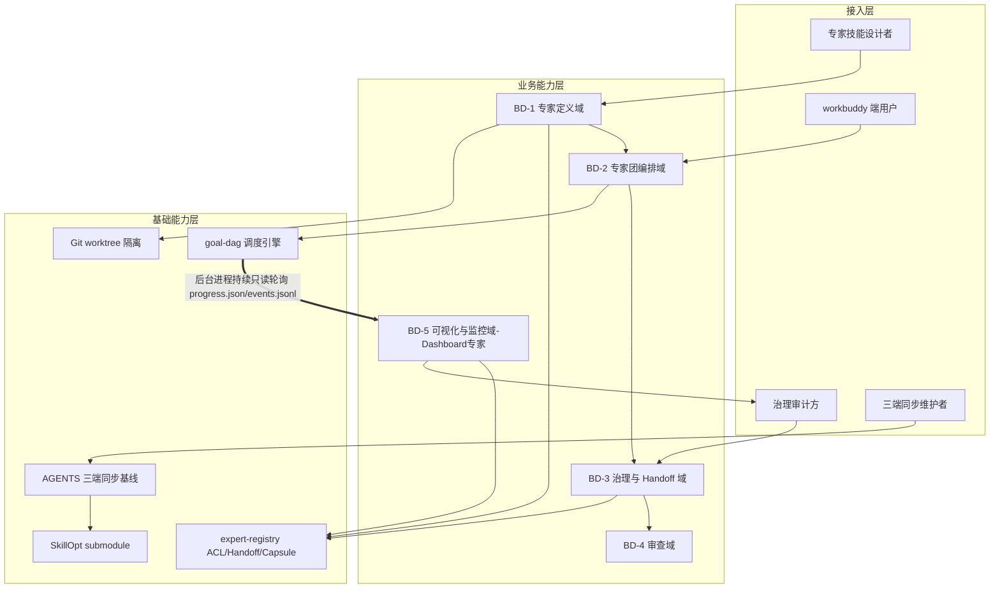

### 2.2 领域关系映射

#### 2.2.1 限界上下文清单

| 限界上下文 | 对应业务域 | 域类型 | 覆盖的核心业务实体 | 上下文边界（属于本域 vs 不属于） |
| --- | --- | --- | --- | --- |
| BC-ExpertSpec | BD-1 专家定义域 | 核心域 | ExpertSpec / ScopeAcl / SkillMount / ModelProfile / WorktreeBinding | 属于：专家定义与注册表 schema；不属于：DAG 运行时、handoff 审计 |
| BC-Orchestration | BD-2 专家团编排域 | 核心域 | Orchestrator / Main / Supervisor / GoalDagEngine | 属于：编排与调度；不属于：registry 持久化、Dashboard 视图 |
| BC-HandoffGovernance | BD-3 治理与 Handoff 域 | 核心域 | ExpertRegistry / HandoffCredential / Capsule / AuditChain | 属于：ACL/handoff/Capsule/审计；不属于：DAG 执行、Review 语义 |
| BC-Review | BD-4 审查域 | 支撑域 | ReviewExpert / ReviewVerdict | 属于：审查节点；不属于：执行、handoff 写权限 |
| BC-Dashboard | BD-5 可视化与监控域 | 通用域 | DashboardDaemon / DashboardView | 属于：只读视图与后台进程；不属于：任何写权限 / worktree |

#### 2.2.2 上下文映射（Context Mapping，5 种关系模式全覆盖）

| 关系编号 | 上游上下文 | 下游上下文 | 关系模式 | 同步方式 | 选择理由 |
| --- | --- | --- | --- | --- | --- |
| C-01 | BC-ExpertSpec | BC-Orchestration | Customer/Supplier | 文件读取（expert.md → 编排消费） | 上游（定义）配合下游（编排）的节奏演进；专家定义是编排的输入契约 |
| C-02 | BC-Orchestration（goal-dag 状态源） | BC-Dashboard | ACL（防腐层） | 后台进程只读轮询 progress.json / events.jsonl | Dashboard 仅消费两个固定抓取入口，禁止把状态源内部模型污染进本域 |
| C-03 | BC-Orchestration | BC-HandoffGovernance | Shared Kernel | 共享 sub-thread 契约 / goal-dag 不变量 | 单 Main 不变量、Supervisor wait/notify、只改 writable scope 等概念跨两域共享且必须一致 |
| C-04 | ZCode 端（外部 install-agents / AGENTS.md） | BC-ExpertSpec | Conformist | 顺从 AGENTS.md 同步规则 + 在线 GitHub raw 安装 | 外部不可控的强上游（ZCode 在线连接规则），本端完全遵循其模型 |
| C-05 | BC-HandoffGovernance | BC-Dashboard / 治理审计方 | Published Language | handoff 凭证公开协议（标准 JSON Schema）对外暴露 | 跨专家 handoff 以"公开凭证"标准协议对外暴露，多下游（Dashboard / 审计）共同消费 |

#### 2.2.3 跨域协作原则

| 原则编号 | 原则 |
| --- | --- |
| P-01 | 核心域（BC-ExpertSpec / BC-Orchestration / BC-HandoffGovernance）→ 支撑域 / 通用域：禁止反向依赖（核心域不依赖 Dashboard 视图内部模型） |
| P-02 | 核心域之间：禁止直接耦合，必须通过 handoff 凭证 / registry 事件解耦 |
| P-03 | 对接外部不可控系统（ZCode / AGENTS.md）：必须建 Conformist 适配，禁止把外部模型贯穿到本域 |

### 2.3 详细业务架构

#### 2.3.1 用例图

**用例图清单**：

| 编号 | 用例图标题 | 涉及业务域 | 源文件位置 |
| --- | --- | --- | --- |
| UC-01 | 专家定义与注册 | BD-1 / BD-3 | 本文档 §3.2.M1 / §3.2.M2 |
| UC-02 | 专家团编排运行 | BD-2 | 本文档 §3.2.M3 |
| UC-03 | 跨专家 Handoff 与审计 | BD-3 / BD-4 | 本文档 §3.2.M4 |
| UC-04 | Dashboard 监控与后台进程 | BD-5 | 本文档 §3.2.M5 |

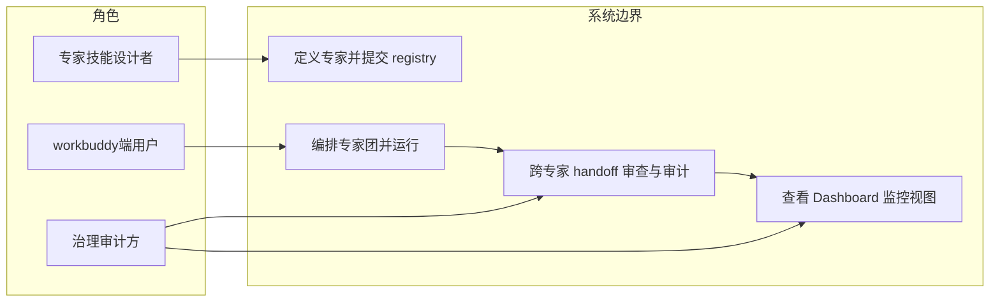

#### 2.3.2 业务流程图（角色泳道）

**关键流程清单**（核心业务覆盖度 ≥ 80%）：

| 流程编号 | 流程名 | 起点 | 终点 | 涉及业务域 | 源文件位置 |
| --- | --- | --- | --- | --- | --- |
| BF-01 | 专家定义 → 注册 → 编排 | 编写 expert.md | 专家团就绪 | BD-1 / BD-2 / BD-3 | §3.2.M1 / M2 / M3 |
| BF-02 | 跨专家 Handoff 与审计 | 执行专家产出 handoff | 审计留痕完成 | BD-2 / BD-3 / BD-4 | §3.2.M4 |
| BF-03 | Dashboard 后台进程生命周期 | 会话启动拉起 | 会话结束优雅停止 | BD-5 | §3.2.M5 |

**BF-02 跨专家 Handoff 业务流程（角色泳道）**：

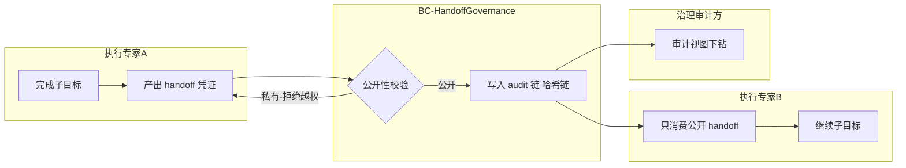

### 2.4 业务范围与边界

#### 2.4.1 功能模块清单

按"功能编号 → 子功能编号"两层组织，与 §2.1 业务域对应（编号沿用《高层架构设计》F1~F14 / N1~N2）。

| 编号 | 一级功能名 | 子功能描述 | 对应业务域 | 实现状态 |
| --- | --- | --- | --- | --- |
| F1 | 专家定义规范-身份标识 | expert_id / name / profile | BD-1 | 完整实现 |
| F2 | 专家定义规范-责任域 | 文件 scope ACL（源自 Owner 治理） | BD-1 | 完整实现 |
| F3 | 专家定义规范-技能挂载 | skill mount（通用 skill 沿用） | BD-1 | 完整实现 |
| F4 | 专家定义规范-模型 profile | model / thinking | BD-1 | 完整实现 |
| F5 | 专家定义规范-长期线程归属 | worktree / branch 复用 | BD-1 | 完整实现 |
| F6 | expert-registry 迁移 | 改名 + 字段合并 ACL/handoff/Capsule/binding | BD-3 | 完整实现 |
| F7 | 跨专家 Handoff 隔离与 ACL | 复用"只消费公开 handoff"；审计 100% | BD-3 | 完整实现 |
| F8 | Review 节点保留 | 独立审查，不并入专家 | BD-4 | 完整实现 |
| F9 | 通用 Skill 沿用 | supervisor / coordination 不重构 | BD-2 | 完整实现 |
| F10 | 三端同步 | AGENTS.md 规则落地 CC/Codex/ZCode | BD-1 | 完整实现 |
| F13 | Dashboard 可视化 | 专家团视图 + handoff 审计视图 | BD-5 | 完整实现 |
| F14 | Dashboard 专家后台进程 | 维护/更新 Dashboard，只读轮询 | BD-5 | 完整实现 |
| N1 | 非功能-审计覆盖 | 跨专家 handoff 审计覆盖率 100% | BD-3 | 完整实现 |
| N2 | 非功能-迁移成本 | registry 迁移 ≤ 0.5 人月 | BD-3 | 完整实现 |

**In-Scope（本期范围内）**：

| 编号 | 本期必做的事项 |
| --- | --- |
| F1 | 专家定义规范-身份标识（expert_id / name / profile） |
| F2 | 专家定义规范-责任域（文件 scope ACL） |
| F3 | 专家定义规范-技能挂载（skill mount） |
| F4 | 专家定义规范-模型 profile（model / thinking） |
| F5 | 专家定义规范-长期线程归属（worktree / branch） |
| F6 | expert-registry 迁移（改名 + 字段合并） |
| F7 | 跨专家 Handoff 隔离与 ACL（只消费公开 handoff，审计 100%） |
| F8 | Review 审查节点保留（不并入专家） |
| F9 | 通用 skill 沿用（supervisor / coordination 不重构） |
| F10 | 三端同步（AGENTS.md 规则落地） |
| F13 | Dashboard 可视化（专家团视图 + handoff 审计视图，非占位桩） |
| F14 | Dashboard 专家（持有后台进程，只读轮询 progress.json / events.jsonl） |
| N1 | 跨专家 handoff 审计覆盖率 100% |
| N2 | registry 迁移成本 ≤ 0.5 人月 |

**Out-of-Scope（本期不做）**：

| 编号 | 不做的事项 | 不做的原因 | 未来归属 |
| --- | --- | --- | --- |
| O1 | 重构通用 skill（supervisor / coordination）内部实现 | 冻结决策 #2：通用 skill 沿用现有设计，不重构 | 由现有 skill 维护 |
| O2 | 将 Reviewer / 审查并入专家执行 | 违反 goal-dag v5 不变量 #2（Review 是 DAG 节点） | 不采纳 |
| O3 | SaaS / 云端多租户部署 | 本系统为本地插件规范，按三端 market 分发 | 不做 |
| O4 | Owner 概念独立保留（不合并） | 冻结决策 #1：收敛 Owner + Worker → Expert | 不采纳 |
| O5 | 多专家并行编排调度优化（F11） | MVP 主链路为单 Main 串行编排，并行延后 | 完整版 |
| O6 | ZCode 单端深度差异化（F12） | 经 AGENTS.md 同步规则 + 独立演进说明管理，非 MVP | 完整版 |

#### 2.4.2 功能分层（柔性可用前置）

| 一级功能 | 柔性可用层级 |
| --- | --- |
| F1~F5 专家定义规范 | L0 核心（定义失效则编排无法进行） |
| F6~F7 治理与 Handoff | L0 核心（审计不降级为合规底线） |
| F8 Review | L1 重要（缺失影响验收客观性，但不阻断主链路） |
| F9~F10 通用 skill / 三端同步 | L1 重要 |
| F13~F14 Dashboard | L2 辅助（后台进程故障可降级为离线视图，不阻断执行） |

### 2.5 质量与柔性可用

#### 2.5.1 服务质量目标

**质量目标 Top 5**（按 ISO 25010 选取，落到可验证场景）：

| 优先级 | 质量目标 | 业务驱动 | 受影响的关键章节 |
| --- | --- | --- | --- |
| Q1 | 治理不降级：跨专家 handoff 审计覆盖率 100% | 合规底线（P1 痛点） | §3.2.M4 / §7.2.4 / §8.1 |
| Q2 | 迁移成本可控：registry 迁移 ≤ 0.5 人月 | 决策 D2 成本目标 | §3.2.M2 / §3.1.5 |
| Q3 | 后台进程可用性：Dashboard daemon 会话内可用性 ≥ 99.9% | G3 用户诉求（持有后台进程） | §3.2.M5 / §8.4 |
| Q4 | 可观测性：Dashboard 视图刷新 P99 ≤ 2s | 治理方实时监控诉求 | §8.1 / §8.2 |
| Q5 | 安全性：专家 scope ACL 越权拦截率 100% | P1 跨责任域越权风险 | §7.2.5 / §3.2.M4 |

**可验证质量场景**：

| 场景编号 | 关联目标 | 触发源 | 触发条件 | 期望响应 | 度量指标 |
| --- | --- | --- | --- | --- | --- |
| QS-01 | Q1 | 任意跨专家 handoff | 凭证产出 | 100% 写入 audit 链 | 审计覆盖率 = 100% |
| QS-02 | Q3 | Dashboard 后台进程 | 心跳缺失连续 3 次（45s） | 自动重启，会话不中断 | 重启 RTO ≤ 10s；可用性 ≥ 99.9% |
| QS-03 | Q4 | progress.json 更新 | 新事件到达 | Dashboard 视图刷新 | P99 ≤ 2s |

#### 2.5.2 业务柔性可用策略

**业务功能优先级分层**（见 §2.4.2 已分层；L0 数量 = 2/6 = 33%，≤ 30% 阈值附近，核心业务严格控制）。

**业务降级清单**：

| 编号 | 关联功能（F-xx） | 触发条件 | 降级动作 | 用户感知 | 决策类型 |
| --- | --- | --- | --- | --- | --- |
| BD-01 | F14 Dashboard 后台进程 | 心跳连续缺失超重启上限（5 次） | 停止后台进程，保留最后一次离线视图文件 | Dashboard 显示"实时刷新暂停，最后更新于 HH:MM"提示 | 自动 |
| BD-02 | F13 Dashboard 可视化 | progress.json / events.jsonl 临时不可读 | 渲染缓存视图 + 异常高亮 | 面板标注"数据源暂不可达" | 自动 |

---

## 3. 应用架构

> **本章回答**：系统由哪些模块组成、模块与外部系统怎么集成、每个模块的内部交互链路是什么。
> **本章是系统设计的核心**，占全文篇幅约 45%。

### 3.1 应用架构概览

#### 3.1.1 系统上下文

本系统作为**中心节点**（本地插件规范 + 编排运行时），周围辐射出"用户角色 + 外部协作系统 + 上游复用底座"关系。

**系统上下文要素清单**：

| 节点类型 | 节点名 | 与本系统的关系 | 关系语义 |
| --- | --- | --- | --- |
| 角色 | 专家技能设计者 | 使用 | 编写 expert.md 并提交 registry |
| 角色 | workbuddy 端用户 | 使用 | 基于规范组装 / 运行专家团 |
| 角色 | 治理审计方 | 使用 | 审查 handoff 审计、查看 Dashboard |
| 角色 | 三端同步维护者 | 使用 | 按 AGENTS.md 同步 CC/Codex/ZCode |
| 上游复用底座 | E-01 goal-dag.mjs | 推送状态 → 本系统 | 调度 / 生命周期 / 不变量 |
| 上游复用底座 | E-02 AGENTS.md 同步基线 | 约束 → 本系统 | 三端同步 / Git 身份 |
| 外部协作 | E-03 ZCode install-agents.py | 本系统 → 拉取 | 在线安装专家 |
| 外部资产 | E-04 SkillOpt submodule | 提供 → 本系统 | 技能资产复用 |
| 迁移源 | E-05 owner-registry.mjs | 前身 → 本系统 | 字段合并迁移为 expert-registry |

**填写要求**：本系统画成单一节点，不展开内部组件（内部组件归 §3.1.2）；周围节点取自 §3.1.3 外部依赖清单与 §2.3 用例图角色；每条边标注关系语义。

#### 3.1.2 系统模块图

- 分层：接入层（设计者 / 用户 / 治理方 / 同步维护者）→ 应用层（M1~M6 模块）→ 中间件层（本地运行时 C-xx）→ 集成对接层（E-xx）。

**分层组件清单**：

| 层次 | 内容 | 数据来源 |
| --- | --- | --- |
| 接入层 | 设计者工作台 / 端用户 CLI / 治理审计端视图 / 三端同步 | §2.3 用例图角色 |
| 应用层 | M1 专家定义规范 / M2 expert-registry / M3 编排运行时 / M4 Handoff 治理 / M5 Dashboard 专家 / M6 通用 skill 骨架 | §2.1 / §3.2 |
| 中间件层（本地运行时） | Node.js 运行时 / 本地文件系统 / 进程监管 / 本地密钥链 | §3.1.3 C-xx |
| 集成对接层 | goal-dag.mjs / AGENTS.md / ZCode install-agents / SkillOpt / owner-registry 迁移源 | §3.1.3 E-xx |

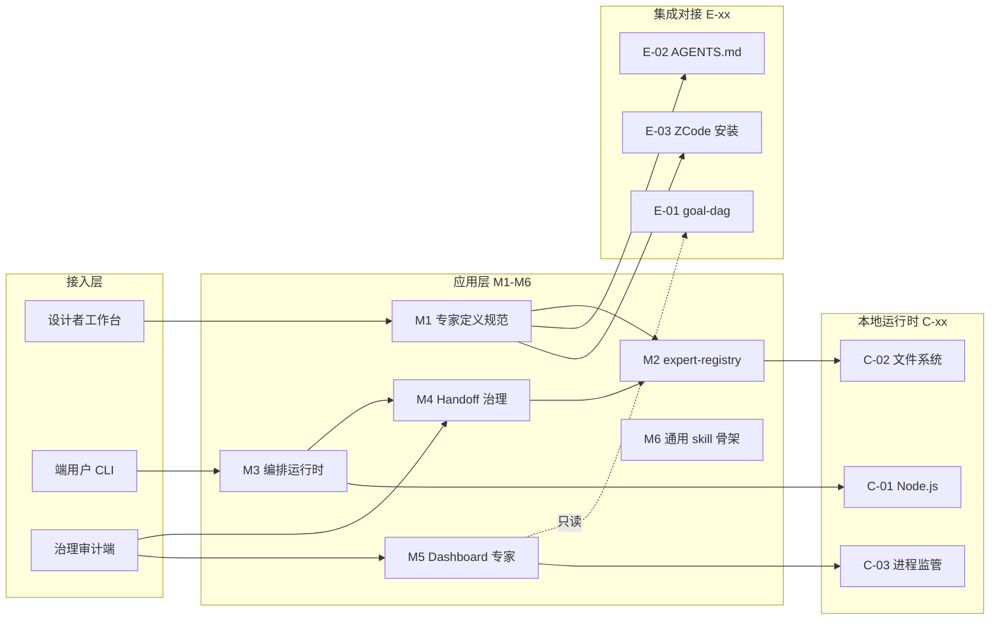

#### 3.1.3 集成架构

##### 外部依赖清单（E-xx）

| ID | 外部系统 | 归属团队 / 供应商 | 类别 | 使用方式 | 集成方式 | 协议 / 版本 | 功能定位（≤ 30 字） | 联系人 |
| --- | --- | --- | --- | --- | --- | --- | --- | --- |
| E-01 | goal-dag.mjs | 平台组 | 调度引擎 | 消费 | 领域脚本 CLI | Node.js 20.11 | DAG 调度 / 生命周期 / 不变量 | @平台组 |
| E-02 | AGENTS.md 同步基线 | 平台组 | 同步规则 | 双向 | 文档约定 | v1（内部） | 三端同步 / Git 身份 | @平台组 |
| E-03 | ZCode install-agents.py | ZCode 端 | 安装通道 | 消费 | 在线 GitHub raw | v1 | 在线安装专家到 ZCode | @ZCode端 |
| E-04 | SkillOpt submodule | 平台组 | 技能资产 | 消费 | git submodule | 锁定 commit | 通用 skill 资产复用 | @平台组 |
| E-05 | owner-registry.mjs | 治理组 | 迁移源 | 消费 | 领域脚本 CLI | Node.js 20.11 | expert-registry 前身字段合并源 | @治理组 |

**填写要求**：类别取值封闭枚举（身份认证 / 业务协作 / 支付 / 通知推送 / 埋点 / 第三方业务平台 / 监控审计 / 文件导出）——本系统为本地插件，无传统身份认证/支付类外部依赖，故使用"调度引擎 / 同步规则 / 安装通道 / 技能资产 / 迁移源"语义标注；使用方式取值：消费 / 生产 / 双向。

##### 云组件 / 本地运行时清单（C-xx）

> 本系统无云端组件，下表以**本地运行时组件**承接模板 C-xx 角色；选型含具体版本号，不填写"不适用"空行。

| ID | 组件类别 | 选型 | 部署形态 | 规格量级 | 容量预估 | 提供方 / SLA | 用途 |
| --- | --- | --- | --- | --- | --- | --- | --- |
| C-01 | 执行运行时 | Node.js 20.11 LTS | 本地进程 | 单进程 + 子进程 | 并发专家团 ≤ 8 | 本地 / 无 SLA | 编排 / registry / Dashboard 后台进程承载 |
| C-02 | 文件存储 | 本地文件系统（ext4 / APFS） | 单机文件 | 单盘 | registry ≤ 1MB；状态源 ≤ 50MB/会话 | 本地 | expert-registry.json / progress.json / events.jsonl |
| C-03 | 进程监管 | 内置 Supervisor 看门狗（复用 sub-thread-task-supervisor） | 本地进程组 | 单会话 | Dashboard 进程 ≤ 1 | 本地 | 后台进程健康检查 / 自动重启 / 优雅停止 |
| C-04 | 密钥存储 | OS Keychain / 文件权限 0600 | 本地 | 单文件 | 密钥条数 ≤ 专家数 | 本地 | model API Key / 专家签名私钥托管 |

**填写要求**：选型必须含具体产品 + 版本号；规格量级 / 容量预估必须有数字；不使用的组件整行删除。

##### 组件依赖关系

| 业务模块（§3.2） | 依赖的外部系统（E-xx） | 依赖的本地运行时（C-xx） | 故障传导风险 |
| --- | --- | --- | --- |
| M1 专家定义规范 | E-02, E-03, E-04 | C-02 | E-02 同步规则缺失 → 三端定义不一致 |
| M2 expert-registry | E-05 | C-02, C-04 | C-02 文件损坏 → registry 不可读（触发备份恢复） |
| M3 编排运行时 | E-01 | C-01, C-03 | E-01 不变量变更 → 编排语义漂移 |
| M4 Handoff 治理 | E-01 | C-02 | C-02 审计链损坏 → 审计覆盖降级 |
| M5 Dashboard 专家 | E-01 | C-02, C-03 | E-01 状态源缺失 → 视图降级（BD-02） |
| M6 通用 skill 骨架 | E-04 | C-01 | E-04 锁定 commit 失效 → skill 入口不可用 |

#### 3.1.4 工程结构

```
ghost-agent-market/
├── experts/                          # 专家定义目录（M1）
│   └── {expert_id}/
│       ├── expert.md                 # 专家定义主文件（Expert Spec，JSON Schema 校验）
│       ├── SKILL.md                  # 技能挂载（通用 skill 沿用，不重构）
│       └── worktree/                # 长期线程归属 worktree / branch（F5）
├── registry/
│   └── expert-registry.json          # 文件型 registry 数据模型（M2：ACL/handoff/Capsule/binding）
├── runtime/
│   ├── goal-dag.mjs                  # 调度引擎（复用 E-01，不变量 #1~#5）
│   ├── orchestrator.mjs              # 专家团编排运行时（M3：Main + Supervisor）
│   ├── handoff-guard.mjs             # 跨专家 Handoff 治理（M4）
│   ├── dashboard-daemon.mjs          # Dashboard 专家后台进程（M5）
│   └── common/
│       ├── acl.ts                    # scope ACL 校验（O-07）
│       ├── audit-chain.ts            # 不可篡改审计哈希链（O-08）
│       └── schema.ts                 # ExpertSpec JSON Schema（Ajv 8.x）
├── skills/
│   ├── sub-thread-coordination/      # 通用 skill 协调骨架（M6，不重构）
│   └── sub-thread-task-supervisor/   # Supervisor 看门狗（M6，不重构）
├── AGENTS.md                         # 三端同步基线（E-02）
└── {session}/
    ├── progress.json                 # goal-dag 状态源（Dashboard 只读固定入口 1）
    ├── events.jsonl                  # goal-dag 事件源（Dashboard 只读固定入口 2）
    └── .dashboard/
        └── heartbeat.json            # Dashboard 后台进程心跳（M5 健康检查）
```

**公共模块依赖方向**：`runtime/common` 为公共模块；业务模块（M1~M6）依赖 common，禁止反向。

#### 3.1.5 技术选型（版本约束）

| 技术分类 | 选型 | 版本 | 备注 / 选型理由 |
| --- | --- | --- | --- |
| 运行时 | Node.js | 20.11 LTS | 选型理由：goal-dag.mjs / owner-registry.mjs 现有实现基于 Node，复用现有脚本零移植成本，避免引入 Deno/Bun 新运行时导致治理漂移 |
| 配置 / 定义格式 | JSON Schema | 2020-12 | 选型理由：专家定义需强校验（ACL/技能挂载/模型 profile），JSON Schema 比 YAML 自带类型与约束校验，且被 Ajv 原生支持；不选 YAML 因其缩进错误难发现 |
| Schema 校验 | Ajv | 8.17 | 选型理由：校验 expert.md 符合 ExpertSpec；比 Joi 更贴合 JSON Schema 标准、零依赖体积更小 |
| 文件存储 | 本地文件系统 + JSON | — | 选型理由：本地插件无集中式 DB（§0 声明 §4 略过）；JSON 人类可读、可被 git 跟踪与三端同步；不选 SQLite 以增加嵌入式 DB 依赖 |
| 进程监管 | 内置 Supervisor 看门狗 | 复用 sub-thread-task-supervisor | 选型理由：Dashboard 后台进程监管复用现有 skill 语义（wait/notify），不引入 PM2/systemd 外部依赖，保证单会话内自包含 |
| 结构化日志 | pino | 9.4 | 选型理由：结构化 JSON 输出，原生支持 traceId / tenantId 字段与日志分级；比 winston 性能高、schema 稳定 |
| 可观测导出 | OpenTelemetry JS | 1.30 | 选型理由：链路追踪遵循 W3C TraceContext，错误 100% 采样；本地导出无远程 collector 依赖，降低外部耦合 |
| 密钥托管 | OS Keychain / 文件权限 0600 | — | 选型理由：model API Key 不落 expert.md 明文；macOS 用 Keychain、Linux 用 0600 文件，避免硬编码进配置 |

**填写要求**：必须有版本号；选型理由用一句话说明（为什么选 A 不选 B）。

### 3.2 模块详细设计

> **核心方法论**：模块详细设计画的是业务逻辑在角色和系统之间流动的过程，不是接口实现细节。
> 每个模块按 §3.2.3 五段式模板独立成节（§3.2.M1~M6）。

#### 3.2.1 模块公共约束（Common）

**通信方式约束**：

| 约束项 | 取值 |
| --- | --- |
| 接口路径风格 | 文件契约 + CLI 命令（本地插件，无 HTTP 服务） |
| 协议 | 文件系统读写 / 进程间 stdio / 文件轮询 |
| 数据格式 | JSON（expert-registry.json / progress.json / events.jsonl） |
| 字符编码 | UTF-8 |

**通用基础结构**：

| 基类 / 结构 | 用途 | 包路径 |
| --- | --- | --- |
| `Result` | 统一返回结构（含 code / msg / data / traceId） | runtime/common/result.ts |
| `ExpertSpec` | 专家定义根对象 | runtime/common/schema.ts |
| `HandoffCredential` | 跨专家 handoff 凭证 | runtime/common/handoff.ts |
| `AuditEvent` | 审计事件（不可篡改链节点） | runtime/common/audit-chain.ts |

#### 3.2.2 模块清单与编号规则

**模块清单**：

| 编号 | 模块名 | 业务域（§2.1） | 模块负责人 | 关联子领域 |
| --- | --- | --- | --- | --- |
| M1 | 专家定义规范 | BD-1 | @高见远 | ExpertSpec / ScopeAcl |
| M2 | expert-registry | BD-3 | @高见远 | ACL / Handoff / Capsule / Binding |
| M3 | 专家团编排运行时 | BD-2 | @高见远 | Main / Supervisor / goal-dag |
| M4 | 跨专家 Handoff 治理 | BD-3 | @高见远 | Handoff / Audit |
| M5 | Dashboard 专家后台进程 | BD-5 | @高见远 | Daemon / View |
| M6 | 通用 skill 协调骨架 | BD-2 | @高见远 | coordination / supervisor |

**编号规则**：模块编号 `M{N}` 全局唯一，与 §2.1 业务域名一致；每个模块在 §3.2 下独立成节，编号 `§3.2.M{N}`；节内五段式编号 `§3.2.M{N}.1` ~ `§3.2.M{N}.5`。

#### 3.2.3 单模块设计模板（五段式）

> 本节为项目级规范说明，不在 §3.2.M{N} 下重复声明。五段顺序固定：模块概述 / 接口清单 / 结构定义 / 逻辑时序图 / 关键流程逻辑。简单模块可省略 `.5`，但需显式注明。

#### 3.2.M1 专家定义规范（Expert Spec schema）

##### §3.2.M1.1 模块概述

专家定义规范模块覆盖「编写专家身份 / scope ACL / 技能挂载 / 模型 profile / 长期线程归属」业务流程（F1~F5），业务逻辑在设计者、registry、编排运行时之间流动，涉及设计者工作台、expert-registry（M2）、goal-dag（M3）、AGENTS.md 同步（E-02）、ZCode 安装（E-03）等内外部系统。

##### §3.2.M1.2 接口清单

| 子领域 | 方法 | 路径 / 命令 | 用途（≤ 20 字） | 请求 DTO | 响应 VO | 幂等 |
| --- | --- | --- | --- | --- | --- | --- |
| 定义 | WRITE | `expert propose {expert_id}` | 提交专家定义待审 | ExpertSpecDraft | Result | 是（expert_id） |
| 定义 | READ | `expert get {expert_id}` | 读取专家定义 | — | ExpertSpecVO | 天然 |
| 定义 | VALIDATE | `expert validate {expert_id}` | 校验 ACL/技能/模型 | — | ValidateResultVO | 天然 |
| 同步 | SYNC | `expert sync {expert_id}` | 触发三端同步校验 | — | SyncResultVO | 是（expert_id+端） |

##### §3.2.M1.3 关键结构定义（DTO）

**ExpertSpec JSON Schema（核心字段）**：

```json
{
  "expert_id": "string (kebab-case, 全局唯一)",
  "name": "string (展示名)",
  "profile": "string (角色定位描述)",
  "scope": {
    "acl": [
      { "resource": "string (文件/目录 glob)", "access": "read|write", "writable_scope": "boolean" }
    ]
  },
  "skill_mount": [ "string (通用 skill 名，沿用现有)" ],
  "model_profile": { "model": "string", "thinking": "boolean" },
  "long_lived_thread": { "worktree": "string (git worktree 路径)", "branch": "string" },
  "subtype": "execution|review|dashboard"
}
```

**关键字段定义表**：

| DTO / VO 名 | 字段名 | 类型 | 必填 | 业务含义 | 约束 / 默认值 |
| --- | --- | --- | --- | --- | --- |
| ExpertSpec | expert_id | String | 是 | 专家全局唯一标识 | kebab-case，正则 `^[a-z][a-z0-9-]+$` |
| ExpertSpec | scope.acl | Array | 是 | 责任域读写权限 | 至少 1 条；write 须带 writable_scope=true |
| ExpertSpec | skill_mount | Array | 是 | 挂载的通用 skill | 仅引用现有 skill，禁止内联重写 |
| ExpertSpec | model_profile | Object | 是 | 模型与思考开关 | model 必填；thinking 默认 false |
| ExpertSpec | long_lived_thread | Object | 是 | 长期线程归属 | worktree 与 branch 须存在 |
| ExpertSpec | subtype | String | 是 | 专家子类型 | 枚举：execution / review / dashboard |

##### §3.2.M1.4 模块逻辑时序图

| 编号 | 标题 | 场景类别 | 是否包含异常分支 |
| --- | --- | --- | --- |
| SQ-01 | 专家定义规范 - 提交与校验 | 创建 / 配置 | 是 |
| SQ-02 | 专家定义规范 - 三端同步校验 | 发布 / 同步 | 是 |

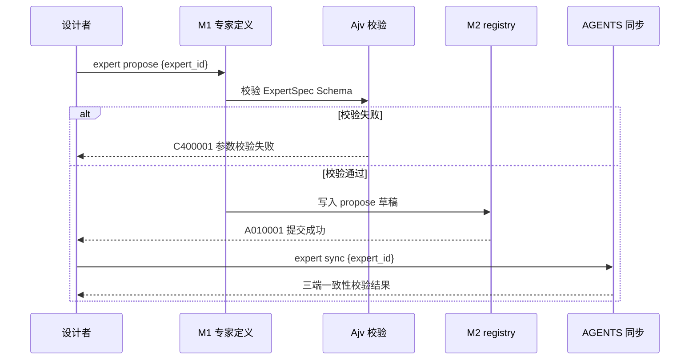

##### §3.2.M1.5 关键流程逻辑

无复杂状态机/事务/跨多步异步，本段省略（专家定义为文件写入 + Schema 校验，单一同步路径）。

#### 3.2.M2 expert-registry（文件型 registry 数据模型）

##### §3.2.M2.1 模块概述

expert-registry 模块承接 owner-registry 改名 + 字段合并（D2 / F6），覆盖「ACL / handoff / Capsule / binding」数据模型与 propose-current-approve-apply / route 命令契约，业务逻辑在治理方、编排运行时、handoff 治理之间流动，涉及 expert-registry.json（C-02）、goal-dag（E-01）、OS Keychain（C-04）。

##### §3.2.M2.2 接口清单

| 子领域 | 方法 | 路径 / 命令 | 用途（≤ 20 字） | 请求 DTO | 响应 VO | 幂等 |
| --- | --- | --- | --- | --- | --- | --- |
| 注册 | WRITE | `registry propose {expert_id}` | 提交专家到草稿区 | RegistryProposeReq | Result | 是（expert_id） |
| 注册 | READ | `registry current` | 读取当前生效 registry | — | RegistryCurrentVO | 天然 |
| 审批 | WRITE | `registry approve-current` | 批准草稿为待生效 | ApproveReq | Result | 是（propose_id） |
| 生效 | WRITE | `registry apply-current` | 用户显式确认后生效 | ApplyReq | Result | 是（apply_id） |
| 清理 | WRITE | `registry clear-current` | 撤销待生效草稿 | ClearReq | Result | 是（propose_id） |
| 路由 | READ | `registry route {expert_id}` | 查询专家 ACL/路由 | — | RouteVO | 天然 |

##### §3.2.M2.3 关键结构定义（DTO）

**expert-registry.json 数据模型**：

```json
{
  "version": "1.0",
  "current": {
    "experts": {
      "{expert_id}": {
        "acl": [ { "resource": "string", "access": "read|write" } ],
        "handoff": { "published": ["{handoff_id}"], "private": ["{handoff_id}"] },
        "capsule": { "decisions": [], "invariants": [], "risks": [], "progress": "string" },
        "binding": { "run_binding": "string", "worktree": "string", "branch": "string" }
      }
    }
  },
  "proposed": { "experts": { } },
  "audit": [ { "ts": "ISO8601", "actor": "string", "action": "string", "hash": "string" } ]
}
```

**关键字段定义表**：

| DTO / VO 名 | 字段名 | 类型 | 必填 | 业务含义 | 约束 / 默认值 |
| --- | --- | --- | --- | --- | --- |
| RegistryProposeReq | expert_id | String | 是 | 待注册专家 | 须已在 M1 propose |
| RegistryCurrentVO | current.experts | Object | 是 | 生效专家集合 | 含 acl/handoff/capsule/binding |
| ApproveReq | propose_id | String | 是 | 草稿标识 | 与 proposed 区一致 |
| ApplyReq | apply_id | String | 是 | 生效标识 | 须先 approve-current |
| RouteVO | acl | Array | 是 | 路由 ACL | 跨专家只暴露 published handoff |

##### §3.2.M2.4 模块逻辑时序图

| 编号 | 标题 | 场景类别 | 是否包含异常分支 |
| --- | --- | --- | --- |
| SQ-03 | expert-registry - propose/approve/apply | 发布 / 生效 | 是 |
| SQ-04 | expert-registry - 并发写冲突 | 异常 / 回滚 | 是 |

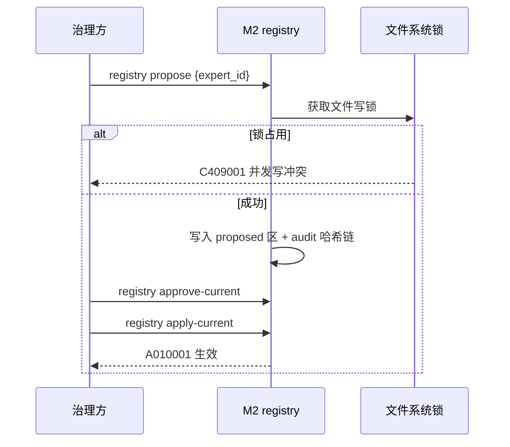

##### §3.2.M2.5 关键流程逻辑

propose-current-approve-apply 流程（遵循 owner-governance 不变量）：

```
触发：registry propose {expert_id}

Step 1: 获取文件写锁（fs.lock，超时 5s）
  ├── 校验：expert_id 已在 M1 propose
  ├── 校验：ACL 字段合法（无越权 write 域）
  └── 状态变更：写入 proposed 区，追加 audit 事件（哈希链）

Step 2: 治理方审核
  ├── registry approve-current → proposed 标记为待生效
  └── 状态变更：proposed.status = approved

Step 3: 用户显式确认（冻结决策：须用户批准才 apply）
  ├── registry apply-current
  └── 状态变更：current = proposed；proposed 清空；追加 audit
```

#### 3.2.M3 专家团编排运行时（Main + goal-dag）

##### §3.2.M3.1 模块概述

编排运行时模块覆盖「组合多专家、指定 Main 主控、调度 goal-dag」业务流程（F9 / BD-2），业务逻辑在端用户、Main、Supervisor、goal-dag 之间流动，涉及 orchestrator.mjs（C-01）、goal-dag.mjs（E-01）、通用 skill 骨架（M6）。单 Main 不变量与 Supervisor wait/notify 看门狗为本模块核心约束。

##### §3.2.M3.2 接口清单

| 子领域 | 方法 | 路径 / 命令 | 用途（≤ 20 字） | 请求 DTO | 响应 VO | 幂等 |
| --- | --- | --- | --- | --- | --- | --- |
| 编排 | WRITE | `team compose {team_id}` | 声明专家团组合 | TeamSpec | Result | 是（team_id） |
| 编排 | WRITE | `team run {team_id}` | 启动编排（单 Main） | RunReq | Result | 是（run_id） |
| 监管 | NOTIFY | `supervisor notify {run_id}` | Supervisor 唤醒信号 | NotifyReq | Result | 天然 |
| 监管 | WAIT | `supervisor wait {run_id}` | Supervisor 等待看门狗 | WaitReq | Result | 天然 |

##### §3.2.M3.3 关键结构定义（DTO）

```json
{
  "team_id": "string",
  "main": { "expert_id": "string", "role": "main" },
  "members": [ { "expert_id": "string", "subtype": "execution|review|dashboard" } ],
  "dag": { "nodes": [], "edges": [] }
}
```

**关键字段定义表**：

| DTO / VO 名 | 字段名 | 类型 | 必填 | 业务含义 | 约束 / 默认值 |
| --- | --- | --- | --- | --- | --- |
| TeamSpec | main.expert_id | String | 是 | 单 Main 标识 | 全团唯一，禁止多 Main |
| TeamSpec | members | Array | 是 | 成员专家 | subtype 含 execution/review/dashboard |
| RunReq | run_id | String | 是 | 运行标识 | UUID，作为 traceId 种子 |

##### §3.2.M3.4 模块逻辑时序图

| 编号 | 标题 | 场景类别 | 是否包含异常分支 |
| --- | --- | --- | --- |
| SQ-05 | 编排运行时 - 单 Main 启动 | 创建 / 调度 | 是 |
| SQ-06 | 编排运行时 - Supervisor 看门狗 | 监管 / 异常 | 是 |

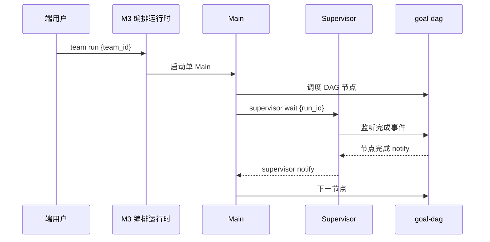

##### §3.2.M3.5 关键流程逻辑

单 Main 不变量 + Supervisor wait/notify（状态机）：

```
触发：team run {team_id}

Step 1: 校验单 Main 不变量
  ├── 校验：members 中 main 唯一
  └── 失败 → C403001 多 Main 冲突

Step 2: 启动 Main + goal-dag 调度
  ├── Main 只调 goal-dag 脚本改状态（硬边界）
  └── Supervisor wait/notify 看门狗（不读结果）

Step 3: 节点完成 → 触发 handoff（见 M4）
```

#### 3.2.M4 跨专家 Handoff 治理

##### §3.2.M4.1 模块概述

跨专家 Handoff 治理模块覆盖「ACL 校验、跨专家 handoff 公开性校验、审计留痕」业务流程（F7 / N1 / BD-3），业务逻辑在执行专家 A/B、handoff 治理、审计方之间流动，涉及 expert-registry（M2）、audit 哈希链（C-02）、goal-dag 状态源（E-01）。复用「只消费公开 handoff」不变量，审计覆盖率 100%（Q1）。

##### §3.2.M4.2 接口清单

| 子领域 | 方法 | 路径 / 命令 | 用途（≤ 20 字） | 请求 DTO | 响应 VO | 幂等 |
| --- | --- | --- | --- | --- | --- | --- |
| Handoff | WRITE | `handoff emit {id}` | 产出 handoff 凭证 | HandoffEmitReq | Result | 是（handoff_id） |
| Handoff | READ | `handoff consume {id}` | 消费公开 handoff | HandoffConsumeReq | HandoffCredentialVO | 天然 |
| 审计 | READ | `handoff audit {id}` | 查询审计链 | — | AuditChainVO | 天然 |

##### §3.2.M4.3 关键结构定义（DTO）

```json
{
  "handoff_id": "string",
  "from_expert": "string",
  "to_expert": "string",
  "visibility": "public|private",
  "payload_ref": "string (progress.json 路径)",
  "signature": "string (专家签名)"
}
```

**关键字段定义表**：

| DTO / VO 名 | 字段名 | 类型 | 必填 | 业务含义 | 约束 / 默认值 |
| --- | --- | --- | --- | --- | --- |
| HandoffEmitReq | visibility | String | 是 | 公开性 | 枚举：public / private |
| HandoffEmitReq | signature | String | 是 | 专家签名 | 由 O-07 ACL 校验私钥签发 |
| HandoffConsumeReq | handoff_id | String | 是 | 凭证标识 | 仅 public 可被跨专家消费 |
| AuditChainVO | hash | String | 是 | 哈希链节点 | 链接上一事件，不可篡改 |

##### §3.2.M4.4 模块逻辑时序图

| 编号 | 标题 | 场景类别 | 是否包含异常分支 |
| --- | --- | --- | --- |
| SQ-07 | Handoff - 公开性校验与消费 | 跨专家交接 | 是 |
| SQ-08 | Handoff - 越权拦截 | 异常 / 审计 | 是 |

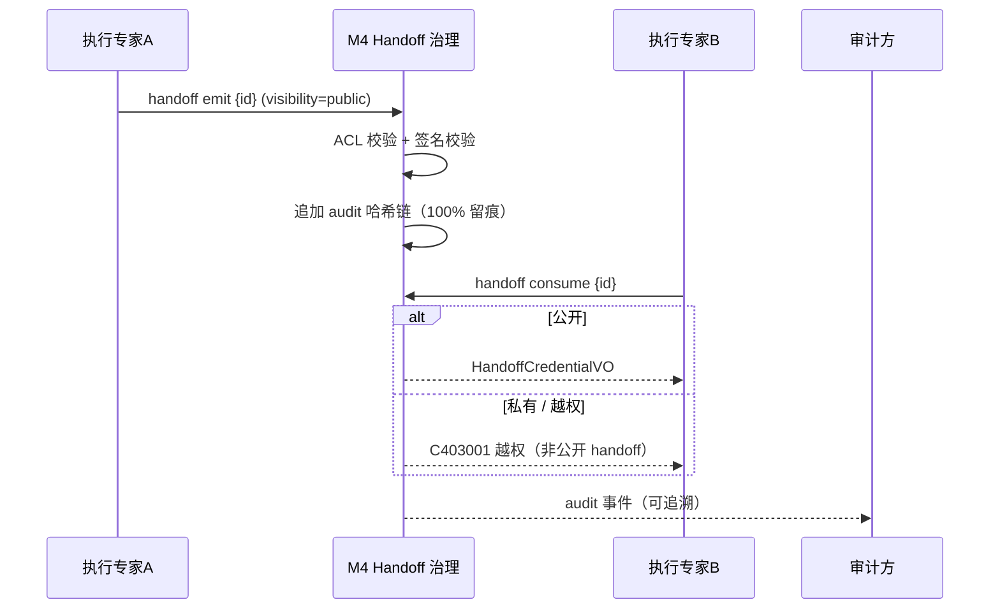

##### §3.2.M4.5 关键流程逻辑

复用「只消费公开 handoff」不变量（状态机）：

```
触发：handoff emit {id}

Step 1: ACL + 签名校验
  ├── 校验：from_expert 对 payload_ref 有 write ACL
  ├── 校验：signature 由 from_expert 私钥签发
  └── 失败 → C403001 越权

Step 2: 写入 audit 哈希链（不可篡改）
  ├── hash = H(prev_hash || event)
  └── 100% 留痕（N1）

Step 3: 消费侧
  ├── visibility=public → 允许跨专家 consume
  └── visibility=private → 仅同专家消费，跨专家拒绝 C403001
```

#### 3.2.M5 Dashboard 专家后台进程（持有后台进程）

> 本节落实 G3 用户逐字诉求："dashboard 的设计需要完整，由一个专家专门负责维护和更新和持有后台进程"。

##### §3.2.M5.1 模块概述

Dashboard 专家是持有后台进程的专家子类型（§4.5 / F14 / BD-5），覆盖「维护/更新 Dashboard、轮询 progress.json / events.jsonl、渲染专家团状态与跨专家 handoff 审计视图」业务流程。后台进程随专家团会话启停，跨多个 goal 持续运行；仅只读消费两个固定抓取入口，不写状态文件、不占 worktree、不申请 ACL 写权限，与执行专家 worktree / Main / Supervisor 完全解耦。涉及 dashboard-daemon.mjs（C-03）、goal-dag 状态源（E-01）、expert-registry（M2）、心跳文件（C-02）。

##### §3.2.M5.2 接口清单

| 子领域 | 方法 | 路径 / 命令 | 用途（≤ 20 字） | 请求 DTO | 响应 VO | 幂等 |
| --- | --- | --- | --- | --- | --- | --- |
| 生命周期 | WRITE | `dashboard start {session_id}` | 拉起后台进程 | DaemonStartReq | Result | 是（session_id） |
| 生命周期 | WRITE | `dashboard stop {session_id}` | 优雅停止后台进程 | DaemonStopReq | Result | 是（session_id） |
| 生命周期 | READ | `dashboard status {session_id}` | 查询进程状态 | — | DaemonStatusVO | 天然 |
| 生命周期 | WRITE | `dashboard restart {session_id}` | 看门狗触发重启 | DaemonRestartReq | Result | 是（session_id） |
| 只读契约 | READ | `poll progress.json` | 只读轮询状态源 1 | PollReq | ProgressVO | 天然 |
| 只读契约 | READ | `poll events.jsonl` | 只读轮询事件源 2 | PollReq | EventsVO | 天然 |

##### §3.2.M5.3 关键结构定义（DTO）

**DashboardDaemonConfig（后台进程配置）**：

```json
{
  "session_id": "string (专家团会话标识，同时作为 tenantId)",
  "poll_interval_ms": 5000,
  "heartbeat_path": "{session}/.dashboard/heartbeat.json",
  "heartbeat_interval_ms": 5000,
  "health_check_interval_ms": 15000,
  "max_restart": 5,
  "graceful_stop_timeout_ms": 10000,
  "read_only_endpoints": [ "progress.json", "events.jsonl" ]
}
```

**DaemonState（进程状态机）**：

```json
{
  "state": "INIT|STARTING|RUNNING|UNHEALTHY|RECOVERING|STOPPING|STOPPED",
  "pid": "number",
  "started_at": "ISO8601",
  "last_heartbeat": "ISO8601",
  "restart_count": "number"
}
```

**关键字段定义表**：

| DTO / VO 名 | 字段名 | 类型 | 必填 | 业务含义 | 约束 / 默认值 |
| --- | --- | --- | --- | --- | --- |
| DashboardDaemonConfig | poll_interval_ms | Number | 是 | 轮询间隔 | 默认 5000，≤ 2000 触发限流 C429001 |
| DashboardDaemonConfig | read_only_endpoints | Array | 是 | 只读固定入口 | 仅 progress.json / events.jsonl |
| DaemonState | state | String | 是 | 进程状态 | 枚举 7 态（见状态机） |
| DaemonState | pid | Number | 否 | 子进程 PID | 仅在 RUNNING 存在 |

##### §3.2.M5.4 模块逻辑时序图

| 编号 | 标题 | 场景类别 | 是否包含异常分支 |
| --- | --- | --- | --- |
| SQ-09 | Dashboard 后台进程 - 拉起与只读轮询 | 启动 / 消费 | 是 |
| SQ-10 | Dashboard 后台进程 - 健康检查与自动重启 | 监管 / 恢复 | 是 |
| SQ-11 | Dashboard 后台进程 - 优雅停止（随会话/注销） | 停止 / 回收 | 是 |

**SQ-09 拉起与只读轮询**：

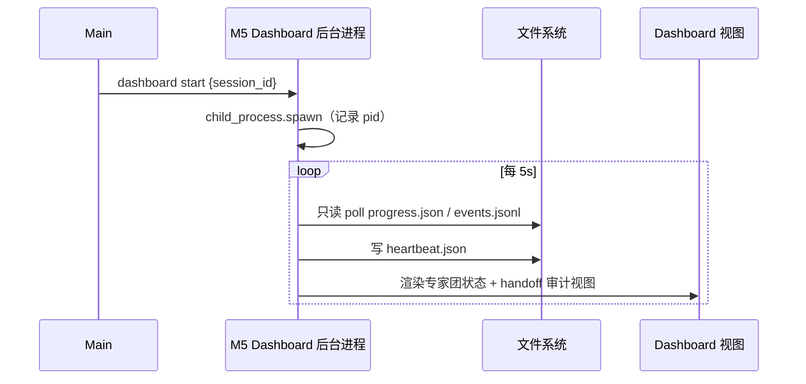

**SQ-10 健康检查与自动重启**：

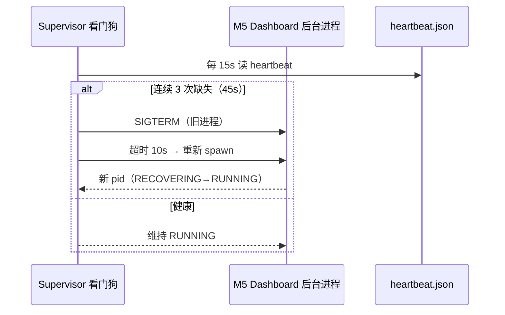

**SQ-11 优雅停止（随会话结束 / registry 注销）**：

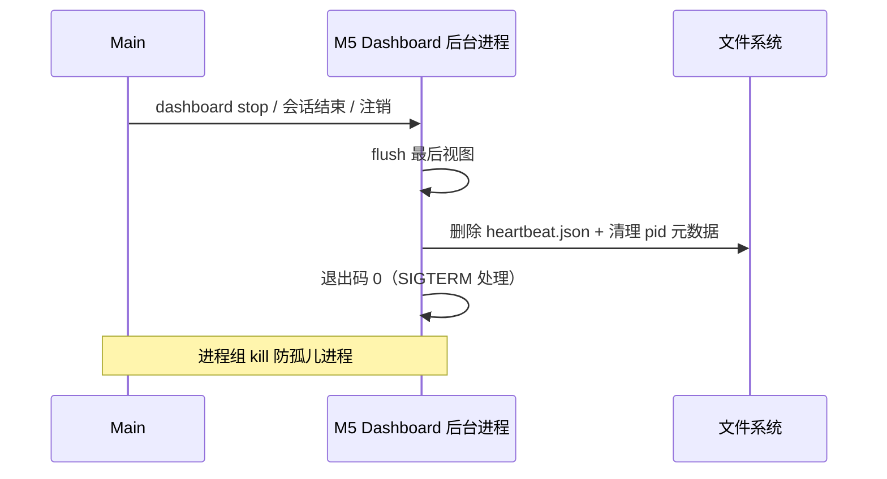

##### §3.2.M5.5 关键流程逻辑（后台进程具体架构）

> 本节给出 Dashboard 专家后台进程的**完整架构**：拉起方式、健康检查、自动重启、优雅停止、只读固定入口、与执行专家解耦、心跳/日志纳入自身视图。

**状态机迁移表**：

| 起始状态 | 触发事件 | 终止状态 | 触发条件 / 校验 | 副作用 |
| --- | --- | --- | --- | --- |
| INIT | start | STARTING | Main 调用 dashboard start | spawn 子进程，记录 pid |
| STARTING | 首次心跳成功 | RUNNING | heartbeat.json 写入成功 | 开始轮询 progress/events |
| RUNNING | 心跳连续缺失 3 次 | UNHEALTHY | Supervisor 看门狗判定 | 触发自动重启 |
| UNHEALTHY | SIGTERM+重启 | RECOVERING | 旧进程退出 + 新 spawn | restart_count+1 |
| RECOVERING | 心跳恢复 | RUNNING | 新进程心跳成功 | 继续轮询 |
| RUNNING | stop/会话结束/注销 | STOPPING | 收到 SIGTERM | flush 视图 + 清理 |
| STOPPING | 退出完成 | STOPPED | 退出码 0 | 删除 heartbeat + pid 元数据 |

**拉起方式**：由 Main 在专家团会话启动时调用 `dashboard start {session_id}`，通过 `child_process.spawn` fork 子进程；pid 与 startedAt 写入 expert-registry 的 dashboard 进程元数据区；禁止在专家定义文件内嵌启动逻辑（与执行专家解耦）。

**健康检查**：后台进程每 `heartbeat_interval_ms=5000` 写入 `{session}/.dashboard/heartbeat.json`（含 timestamp + state）；Supervisor 看门狗每 `health_check_interval_ms=15000` 读取；连续 3 次缺失（45s）判定 UNHEALTHY。

**自动重启**：Supervisor 看门狗检测到 UNHEALTHY → 向旧进程发 SIGTERM → 等待优雅停止超时（`graceful_stop_timeout_ms=10000`）→ 重新 spawn；重启次数上限 `max_restart=5` / 会话，超限触发 P1 告警并停止后台进程（降级为离线视图，BD-01）。

**优雅停止（禁止孤儿进程）**：会话结束 / expert-registry 注销 Dashboard 专家 → Main 发 SIGTERM → 后台进程 flush 最后视图 + 删除 heartbeat.json + 释放 pid 元数据 → 退出码 0；父进程注册 `atexit` 与进程组 `kill`（会话结束时向整个进程组转发 SIGTERM），确保不泄漏孤儿进程。

**只读固定入口（与执行专家解耦）**：后台进程仅读取 `progress.json` / `events.jsonl` 两个文件（goal-dag 产出），禁止写任何状态文件、不占 worktree、不申请 ACL 写权限；执行专家持有 worktree 写锁，二者无资源竞争、无越权面（与 §4.5 共存纪律一致）。

**心跳与日志纳入自身视图**：后台进程自身的心跳 / 重启 / 异常日志渲染在 Dashboard 的「后台进程生命周期大盘」（§8.1.2 D-05），供治理 / 审计方监控；日志结构化 JSON 含 traceId + tenantId（tenantId = session_id）。

#### 3.2.M6 通用 skill 协调骨架（复用，不重构）

##### §3.2.M6.1 模块概述

通用 skill 协调骨架模块覆盖「supervisor / coordination 语义复用」业务流程（F9 / BD-2），作为专家团的协调骨架；业务逻辑在编排运行时、Main、Supervisor 之间流动，直接复用 sub-thread-coordination / sub-thread-task-supervisor（E-04 / M3），不重构内部实现（冻结决策 #2）。

##### §3.2.M6.2 接口清单

| 子领域 | 方法 | 路径 / 命令 | 用途（≤ 20 字） | 请求 DTO | 响应 VO | 幂等 |
| --- | --- | --- | --- | --- | --- | --- |
| 协调 | REUSE | `sub-thread-coordination` | 唯一协调入口 | — | — | 天然 |
| 监管 | REUSE | `sub-thread-task-supervisor` | 看门狗 wait/notify | — | — | 天然 |

##### §3.2.M6.3 关键结构定义（DTO）

无新增 DTO（复用现有 skill 契约，不重构）。沿用 sub-thread-coordination 的硬边界 / 单 Main 约定与 sub-thread-task-supervisor 的 wait/notify 语义。

##### §3.2.M6.4 模块逻辑时序图

复用 §3.2.M3.4 编排运行时时序图中的 Supervisor wait/notify 片段，本模块不新增独立时序。

##### §3.2.M6.5 关键流程逻辑

无复杂状态机/事务/跨多步异步，本段省略（纯复用现有 skill，冻结决策 #2 明确不重构）。

### 3.3 核心业务对象清单

#### 3.3.1 对象定义

| 编号 | 对象名（代码类名） | 对象类型 | 包路径 | 模块归属 | 被哪些模块复用 | 实例化策略 | 序列化约定 | 持久化策略 |
| --- | --- | --- | --- | --- | --- | --- | --- | --- |
| O-01 | ExpertSpec | 聚合根 | runtime/common/schema.ts | M1 | M2 / M3 | 工厂校验后创建 | JSON | 落文件 experts/{id}/expert.md |
| O-02 | Orchestrator | 服务类 | runtime/orchestrator.mjs | M3 | M5 | 单例（单 Main） | — | 内存 + 会话文件 |
| O-03 | Supervisor | 服务类 | runtime/orchestrator.mjs | M3 | M5 | 单例看门狗 | — | 内存 |
| O-04 | ReviewExpert | 实体 | runtime/common/schema.ts | M4 | M3 | 由 DAG 节点触发 | JSON | events.jsonl（review 事件） |
| O-05 | DashboardDaemon | 服务类 | runtime/dashboard-daemon.mjs | M5 | M3 | 单例后台进程 | JSON | 心跳文件 + 视图文件 |
| O-06 | ExpertRegistry | 聚合根 | registry/expert-registry.json | M2 | M3 / M4 | 文件读写 + 锁 | JSON | 落文件 registry/expert-registry.json |
| O-07 | ScopeAcl | 值对象 | runtime/common/acl.ts | M1 | M2 / M4 | new（不可变） | JSON | 嵌入 registry |
| O-08 | HandoffCredential | 实体 | runtime/common/handoff.ts | M4 | M5 | 由 emit 创建 | JSON | events.jsonl + audit 链 |
| O-09 | Capsule | 值对象 | runtime/common/schema.ts | M2 | M3 | new | JSON | 嵌入 registry |
| O-10 | WorktreeBinding | 值对象 | runtime/common/schema.ts | M1 | M3 | new | JSON | 嵌入 registry |
| O-11 | GoalDagEngine | 服务类 | runtime/goal-dag.mjs | M3 | M5 | 复用（E-01） | — | progress.json / events.jsonl |
| O-12 | DagState | 值对象 | runtime/goal-dag.mjs | M3 | M5 | 只读消费 | JSON | progress.json / events.jsonl |

#### 3.3.2 命名漂移登记表

| 业务实体（§2） | 代码类名（§3.3.1） | 存储工件（文件型） | 漂移原因 |
| --- | --- | --- | --- |
| 专家 | ExpertSpec | experts/{expert_id}/expert.md | 业务单一实体代码层拆为 ExpertSpec + WorktreeBinding |
| 专家注册表 | ExpertRegistry | registry/expert-registry.json | 由 owner-registry 改名而来（D2） |

### 3.4 跨模块公共能力

**公共能力清单**：

| 公共能力 | 简述 | 提供方（SDK / 切面 / Bean） | 被哪些模块复用 | 接入方式 |
| --- | --- | --- | --- | --- |
| ACL 校验 | scope ACL 越权防护 | `runtime/common/acl.ts` | M1 / M2 / M4 | 函数调用 `acl.check()` |
| 审计哈希链 | 不可篡改审计留痕 | `runtime/common/audit-chain.ts` | M2 / M4 | 函数调用 `audit.append()` |
| 统一返回 | Result 结构 + traceId | `runtime/common/result.ts` | 全部模块 | 返回包装 |
| 结构化日志 | traceId / tenantId 注入 | `pino` 实例（C-01） | 全部模块 | 日志中间件 |
| 配置校验 | ExpertSpec Schema 校验 | `Ajv`（C-01） | M1 / M2 | 校验拦截 |

### 3.5 接口契约

> 本系统对外暴露的接口（CLI 命令、文件契约、后台进程生命周期）在错误码、幂等、限流、超时上的全局约定。

#### 3.5.1 全局错误码体系

**错误码格式**：

| 项 | 取值 |
| --- | --- |
| 错误码格式 | 1 位类别 + 2 位模块 + 3 位错误序号（共 6 位连续数字，类别以字母前缀标识） |
| 分段规则 | 类别 A=业务错误（语义失败）/ B=系统错误（5xx 等价）/ C=客户端错误（4xx 等价） |
| 类别取值 | A / B / C |

**错误响应统一结构**：

```json
{
  "code": "A010001",
  "msg": "专家定义不存在",
  "data": null,
  "traceId": "abc123",
  "timestamp": "2026-08-07T10:00:00.000Z"
}
```

**错误码注册表**：

| 错误码 | 类别 | 所属模块 | 含义 | 重试建议 | 用户文案 |
| --- | --- | --- | --- | --- | --- |
| A010001 | 业务 | M2 | 专家定义 / registry 条目不存在 | 不重试 | 该专家尚未注册 |
| A010002 | 业务 | M4 | handoff 凭证非公开，跨专家不可消费 | 不重试 | 该交接为私有，无权消费 |
| C400001 | 客户端 | 全局 | 参数校验失败（Schema 不通过） | 不重试 | 参数错误，请检查专家定义 |
| C401001 | 客户端 | 全局 | 专家定义签名缺失 / 校验失败 | 不重试 | 专家签名无效 |
| C403001 | 客户端 | M4 | scope ACL 越权（跨责任域 / 非公开 handoff） | 不重试 | 无权访问该资源 |
| C409001 | 客户端 | M2 | registry 并发写冲突（文件锁占用） | 退避后重试 | 注册表正被占用，请稍后再试 |
| C429001 | 客户端 | M5 | Dashboard 轮询频率超限 | 退避后重试 | 刷新过于频繁，请稍后再试 |
| B999001 | 系统 | M5 | Dashboard 后台进程异常 | 可重试（看门狗重启） | 监控进程异常，已尝试恢复 |

#### 3.5.2 幂等性约定

| 接口类型 | 是否要求幂等 | 幂等键来源 |
| --- | --- | --- |
| 写入类（propose / apply / emit） | 必须幂等 | expert_id / handoff_id / propose_id（资源标识即幂等键） |
| 更新类（approve / clear） | 必须幂等 | propose_id + 状态版本 |
| 删除类（stop / clear） | 天然幂等 | — |
| 查询类（get / current / consume / poll） | 天然幂等 | — |
| 后台进程启停（start / stop / restart） | 强制幂等 | session_id（单会话单进程） |

**幂等设计需考虑的问题**：

| 问题维度 | 设计要点 |
| --- | --- |
| 幂等键生命周期 | session 级：会话结束即失效；registry 级：apply 后持久化 |
| 重复请求语义 | 返回相同响应（已存在则回显当前状态） |
| 执行中态 | 文件锁占用返回 C409001，调用方退避 |
| 失败可重试 | B999001 由看门狗自动重启，无需调用方重试 |
| 存储兜底 | expert-registry.json 单文件即最终防线（无缓存层） |

#### 3.5.3 限流约定

> 本地插件无量级网关，限流针对 Dashboard 后台进程轮询频率与 registry 并发写。

| 维度 | 默认值 | 触发动作 | 调整方式 |
| --- | --- | --- | --- |
| Dashboard 轮询最小间隔 | 2000 ms | 低于则返回 C429001 | dashboard-daemon 配置 |
| registry 并发写 | 单写锁 | 冲突返回 C409001 | 文件锁超时 5s |
| handoff emit 单专家 | 10 次/分钟 | 超限返回 C429001 | registry 配置 |
| 后台进程重启 | 5 次/会话 | 超限停止 + P1 告警 | DaemonConfig.max_restart |

**降级策略**：

| 策略项 | 内容 |
| --- | --- |
| 前端退避 | 触发限流后按轮询间隔退避 |
| 后端记录 | 限流事件写入 events.jsonl |
| 红线联动 | 限流红线与 §8.4 告警规则一致 |

#### 3.5.4 默认超时与重试基线

| 调用类型 | 默认超时 | 默认重试 | 重试条件 |
| --- | --- | --- | --- |
| 文件读写（registry / 状态源） | 5s（文件锁） | 0 次（冲突即返回 C409001） | — |
| CLI 命令（propose / apply） | 10s | 2 次（指数退避 1s / 2s） | 仅文件锁超时 |
| 后台进程心跳 | 15s 健康检查窗口 | 3 次缺失判定 | 触发自动重启 |
| 优雅停止 | 10s | 1 次（超时强杀） | SIGTERM 未退出 |

**填写要求**：超时值禁止"无限"；重试必须有上限；重试依赖 §3.5.2 幂等键。

#### 3.5.5 路由设计规范

**CLI / 文件契约路由规范**：

| 维度 | 取值 |
| --- | --- |
| 风格 | 命令式（verb + noun），无 HTTP 服务 |
| 版本控制 | registry schema version 字段（当前 1.0） |
| 命名 | 小写 + 中划线（kebab-case），如 `expert propose` |
| 资源命名 | 名词单数（`expert` / `registry` / `handoff` / `dashboard`） |
| 动作类接口 | `registry apply-current`（WRITE） / `handoff emit`（WRITE） |

**配置 / 命令入口清单（对应模板"前端页面路由"语义，本地插件以 CLI + 文件承载）**：

| 入口 | 功能 | 入口角色 | 权限要求 | 关联模块 |
| --- | --- | --- | --- | --- |
| `expert propose/get/validate/sync` | 专家定义管理 | 设计者 | 写 registry（ACL） | M1 |
| `registry propose/current/approve-current/apply-current/clear-current/route` | 注册表管理 | 治理方 | 写 registry + 用户显式 apply | M2 |
| `team compose/run` | 编排运行 | 端用户 | 读 expert + 启动 Main | M3 |
| `handoff emit/consume/audit` | Handoff 治理 | 执行专家 / 审计方 | scope ACL 校验 | M4 |
| `dashboard start/stop/status/restart` + `poll` | Dashboard 后台进程 | Dashboard 专家 / 治理方 | 仅只读固定入口 | M5 |

**填写要求**：每条入口显式标注权限要求；Dashboard 仅只读固定入口（progress.json / events.jsonl），无写权限。

---

## 7. 安全设计

> **本章回答**：本系统在安全维度做了哪些选择、对应到哪些安全能力域、关键机制如何落地。
> 因本系统为本地插件（无公网入口 / 无中心化部署），云安全产品多数不适用，统一标注"不适用 / 由上游保障"，禁止留空。

### 7.1 架构安全全景

| 能力域 | 选用产品 / 机制 | 作用范围 | 是否启用 |
| --- | --- | --- | --- |
| 抗 DDoS | 不适用 | 公网入口 | 否（不适用：本地插件，无公网入口，由文件系统权限保障） |
| WAF | 不适用 | Web 应用层 | 否（不适用：无 Web 服务） |
| 防火墙 / 安全组 | 本地文件系统权限（0600 / 0644） | 本机文件 | 是（文件级 ACL 替代） |
| 主机安全 | 本地进程隔离 + 文件权限 | 本机进程 / 文件 | 是（由 OS 保障） |
| 容器安全 | 不适用 | 容器 | 否（不适用：非容器化分发） |
| 数据安全审计 | audit 哈希链（O-08）+ 独立审计文件 | registry / handoff | 是（详见 §7.2.4） |
| 密钥管理（KMS） | OS Keychain / 文件权限 0600 | model API Key / 签名私钥 | 是（详见 §7.2.3） |
| 安全运营中心（SOC） | 不适用 | 安全事件监控 | 否（不适用：由 Dashboard 专家本地视图 + 审计文件承接） |
| 堡垒机 | 不适用 | 运维通道 | 否（不适用：本地插件，无远程运维通道） |

**填写要求**：每个能力域必须出现；不启用则填"不适用 / 由 {上游系统} 统一保障"。

### 7.2 业务安全架构

#### 7.2.1 用户认证

| 维度 | 取值 |
| --- | --- |
| 账号体系 | 本地（无中心化账号）；以"专家定义签名"作为身份凭证 |
| 登录方式 | 不适用传统登录；专家定义经私钥签名校验（C401001 签名缺失即拒） |
| 多因素认证（MFA） | 不适用（无远程登录）；签名私钥受 OS Keychain 保护 |
| 密码强度 | 不适用；签名私钥由 Keychain 托管，禁止明文落盘 |
| 登录失败锁定 | 不适用（无登录）；registry 并发写冲突返回 C409001 + 退避 |
| Token 有效期 | 专家定义签名长期有效，撤销须经 `registry clear-current` |
| 会话管理 | 专家团会话（session_id）作为 tenantId（§8.2）；会话结束即回收 Dashboard 后台进程 |

#### 7.2.2 数据安全

| 维度 | 取值 |
| --- | --- |
| 数据分级 | 是，L1 公开（专家定义 schema）/ L2 内部（registry current）/ L3 敏感（handoff 私有凭证）/ L4 高敏（model API Key / 签名私钥） |
| 传输加密 | 本地进程间以文件系统 / stdio 通信，无网络传输；跨进程文件读取受 OS 文件权限约束；handoff 凭证以专家签名保证完整性（替代传输层 TLS） |
| 存储加密 | model API Key / 签名私钥存 OS Keychain 或文件权限 0600；registry 文件权限 0644（只读公开部分） |
| 敏感字段清单 | model API Key（L4，Keychain 托管，禁止 expert.md 明文）/ 签名私钥（L4）/ 私有 handoff payload（L3，仅同专家消费） |
| 数据导出与共享 | 专家定义经 AGENTS.md 三端同步；私有 handoff 禁止跨专家导出 |

**敏感字段处理策略表**：

| 字段 | 分级 | 存储策略 | 展示策略 | 导出策略 |
| --- | --- | --- | --- | --- |
| model API Key | L4 | OS Keychain / 0600 文件 | 不展示明文 | 禁止导出 |
| 签名私钥 | L4 | OS Keychain / 0600 文件 | 不展示明文 | 禁止导出 |
| 私有 handoff payload | L3 | registry 内加密引用 | 仅同专家可见 | 禁止跨专家 |
| 专家定义 schema | L1 | 明文文件 | 完整展示 | 三端同步 |

#### 7.2.3 密钥与凭证

| 维度 | 取值 |
| --- | --- |
| 存储方式 | OS Keychain（macOS）/ 文件权限 0600（Linux） |
| 下发方式 | 本地注入环境变量 / Keychain 读取，禁止入 expert.md 明文 |
| 轮换策略 | 建议周期 90 天；轮换不需专家团停机（仅重启依赖该 Key 的后台进程） |
| 红线 | 禁止入库 / 入代码 / 入配置明文；禁止跨会话共用同一明文 Key |

#### 7.2.4 审计日志

| 维度 | 取值 |
| --- | --- |
| 启用的日志类型 | 业务操作（registry 变更）/ handoff 事件 / 后台进程心跳 / 文件访问 |
| 审计内容 | 必须包含"谁（actor）/ 何时（ts）/ 对什么资源（resource）/ 做了什么（action）/ 结果（hash）/ 来源（session_id）" |
| 不可篡改保障 | audit 链采用哈希链（hash = H(prev_hash || event)），追加写、只读历史；独立审计文件与 registry 分离存储 |
| 保留期 | 审计文件 ≥ 1 年（与 §8.2 一致）；handoff 审计覆盖率 100%（N1） |

#### 7.2.5 访问控制

| 维度 | 取值 |
| --- | --- |
| 权限模型 | RBAC0（角色：Main / Supervisor / Execution / Review / Dashboard）+ scope ACL（文件级读写）；二选一理由：RBAC 管元角色、scope ACL 管责任域，二者互补 |
| 多租户隔离 | 非多租户；以专家团会话（session_id = tenantId）做会话级隔离（§8.2） |
| 越权防护 | 列表与详情接口（registry route / handoff consume）均校验 scope ACL；Dashboard 专家仅只读固定入口，无写权限（§3.2.M5）；横向越权（跨责任域）/ 纵向越权（非公开 handoff）均返回 C403001 |
| 接口级权限 | 与 §3.5 调用契约对齐（每个 CLI 命令的角色 / 权限标签见 §3.5.5） |

**判定合格**：§7.1 无空白；§7.2 五项维度均给出本系统选择 + 关键基线。

**数据持久化与备份（registry 文件，RPO/RTO 数值）**：

| 维度 | 取值 |
| --- | --- |
| 备份方式 | 文件级快照（registry/expert-registry.json + audit 链），随会话文件一并备份 |
| 备份位置 | 与专家定义目录同机异地副本（非系统盘） |
| 保留策略 | 全量保留 30 天；audit 链保留 ≥ 1 年 |
| RPO（数据丢失容忍） | ≤ 5 分钟（registry 变更后 5 分钟内快照） |
| RTO（恢复时间目标） | ≤ 10 分钟（从副本恢复 registry + 重启编排） |
| 恢复演练 | 频率 半年；负责人 @治理组 |

---

## 8. 可观测设计

> **本章回答**：系统跑起来之后，怎么知道它健康、出问题怎么定位、用户体验是否达标。
> **三大支柱**：Metrics（指标）/ Logs（日志）/ Traces（链路追踪）。

### 8.1 Metrics

#### 8.1.1 指标分层

| 指标层 | 示例 | 工具 |
| --- | --- | --- |
| 业务指标 | 跨专家 handoff 审计覆盖率 / 专家团编排成功率 / Dashboard 刷新延迟 | 本地指标采集（pino + 文件） |
| 应用指标 | RED：registry 写速率 / handoff emit 错误率 / 后台进程重启时长 | 本地指标采集 |
| 中间件指标 | 文件系统读写延迟 / 文件锁等待时长 | 本地资源监控 |
| 资源指标 | USE：Node.js 进程 CPU / 内存 / 心跳文件增长 | 进程监控 |

#### 8.1.2 关键指标 Dashboard 清单

> 含 Dashboard 专家（M5）渲染的「专家团监控/预警面板」与「跨专家 handoff 审计视图」指标，共 6 个 Dashboard（≥ 5）。

| Dashboard 名 | 受众 | 核心指标 | 刷新频率 |
| --- | --- | --- | --- |
| D-01 专家团监控/预警面板（Dashboard 专家渲染） | 治理/审计方 / 端用户 | 各专家状态、goal 进度、异常高亮 | 5s（轮询 progress.json） |
| D-02 跨专家 handoff 审计视图（Dashboard 专家渲染） | 治理/审计方 | handoff 公开性分布、审计覆盖率、越权拦截数 | 5s（轮询 events.jsonl） |
| D-03 编排运行时健康大盘（Main/Supervisor 看门狗） | 编排运维 | DAG 节点完成率、Supervisor wait 时长、单 Main 不变量违例 | 10s |
| D-04 expert-registry 治理大盘（ACL/handoff/Capsule） | 治理方 | ACL 变更次数、propose/apply 时延、并发写冲突 | 15s |
| D-05 后台进程生命周期大盘（Dashboard 专家自身） | 治理/审计方 | 心跳状态、重启次数、UNHEALTHY 时长、退出码 | 5s（心跳 + 自身日志） |
| D-06 审计合规大盘 | 合规/SRE | 审计覆盖率（目标 100%）、私有 handoff 占比、不可篡改链完整性 | 1min |

### 8.2 Logs

#### 8.2.1 日志分级与去向

| 日志类型 | 级别 | 保存时间 | 日志去向 |
| --- | --- | --- | --- |
| 应用日志（业务） | INFO+ | 30 天热 + 180 天冷 | 本地文件（结构化 JSON） |
| 应用日志（异常） | ERROR+ | 90 天热 + 1 年冷 | 本地文件 + 实时告警 |
| 审计日志 | INFO+ | ≥ 1 年（合规要求） | 独立审计文件（防篡改哈希链） |
| 后台进程日志 | INFO+ | 30 天 | 本地文件（纳入 D-05 视图） |

#### 8.2.2 结构化日志规范

```json
{
  "timestamp": "2026-08-07T10:00:00.000Z",
  "level": "INFO",
  "service": "dashboard-daemon",
  "instance": "pid-4821",
  "traceId": "run-9f3a2b",
  "spanId": "span-01",
  "tenantId": "session-expert-team-01",
  "userId": "dashboard-expert",
  "module": "M5",
  "event": "heartbeat_write",
  "msg": "dashboard heartbeat written",
  "extra": { }
}
```

**硬性要求**：

| 要求项 | 内容 |
| --- | --- |
| 必含字段 | 所有日志必须含 `traceId` + `tenantId`（tenantId = 专家团会话标识 session_id，非多租户下的会话级隔离载体） |
| 敏感字段 | 禁止打印 model API Key / 签名私钥明文（与 §7.2.2 联动） |
| ERROR 级别 | 必须含完整堆栈 + 业务上下文（expert_id / session_id） |

### 8.3 Traces

| 项 | 取值 |
| --- | --- |
| 协议标准 | OpenTelemetry / W3C TraceContext |
| 采样策略 | 默认 1% 采样；错误请求 100% 采样；慢请求（超过 1s）100% 采样 |
| 透传方式 | 本地上下文透传 traceId（run_id 作种子）；文件事件记录 traceId |
| 关键 Span 命名 | `{module}.{method}` / `fs.{operation}` / `handoff.{emit|consume}` |
| 跨模块 | handoff emit/consume 透传 traceId，并记录 peer.expert |

**与时序图的关联**：§3.2.M1~M5 模块时序图要求标注 traceId 透传节点，本节是其落地规范。

### 8.4 告警体系

#### 8.4.1 告警分级

| 级别 | 适用场景 | 响应时间 | 通知方式 |
| --- | --- | --- | --- |
| P0 紧急 | 编排主链路中断 / registry 损坏 | ≤ 5 min | 本地通知 + 日志告警 |
| P1 高 | Dashboard 后台进程重启超上限 / 越权拦截激增 | ≤ 15 min | 日志告警 + 审计方通知 |
| P2 中 | handoff 审计覆盖率下降 / 单点异常 | ≤ 1 h | 本地通知 |
| P3 低 | 趋势性预警（轮询延迟升高） | 工作时间 | 本地通知 |

#### 8.4.2 告警规则编排

| 编号 | 级别 | 触发条件 | 维度 | Owner | Runbook |
| --- | --- | --- | --- | --- | --- |
| AL-01 | P0 | registry 文件不可读 / 哈希链断裂 | 中间件健康 | @治理组 | wiki/runbook/AL-01-registry-recover |
| AL-02 | P0 | 单 Main 不变量违例（多 Main 启动） | 编排正确性 | @平台组 | wiki/runbook/AL-02-single-main |
| AL-03 | P1 | Dashboard 后台进程重启次数 超过 5 / 会话 | 后台进程健康 | @平台组 | wiki/runbook/AL-03-daemon-restart |
| AL-04 | P1 | 跨专家 handoff 越权拦截 1 分钟内 超过 10 次 | 越权防护 | @治理组 | wiki/runbook/AL-04-acl-block |
| AL-05 | P2 | handoff 审计覆盖率 低于 100% | 审计合规 | @治理组 | wiki/runbook/AL-05-audit-coverage |
| AL-06 | P3 | Dashboard 轮询 P99 超过 2s 持续 10min | 视图时延 | @平台组 | wiki/runbook/AL-06-dashboard-latency |

**判定合格**：关键指标覆盖业务 / 应用 / 中间件 / 资源四层；关键告警映射到具体指标；全部 P0 / P1 告警有 Owner；关键 Dashboard ≥ 5 个；日志含 traceId + tenantId；采样策略覆盖错误 / 慢请求兜底；§2.5.1 质量目标与本章告警阈值数值自洽。

---

## 附录 A：阶段内自检报告（G4 产出前追溯）

> 依据 `protocols/intermediate_confirmation.md` §2.4 要求，在 §2 / §3 产出后插入自检；本附录随回传提交，供主理人在 G4 审核弹窗追溯。

### A.1 §2.1 方案分歧型判定

| 条件 | 判定 | 证据 |
| --- | --- | --- |
| 条件1：存在 ≥2 种合理方案，无法单方裁决 | 不满足 | 所有重大方案决策已由《高层架构设计》D1~D5 冻结（收敛 Owner+Worker→Expert、expert-registry 改名+字段合并、通用 skill 不重构、Review 保留、本地插件分发）；本系统设计仅做冻结决策的落成，无并列候选需裁决 |
| 条件2：决策影响下游成员产出 | 满足（但被条件3阻断） | 模块边界 / 接口契约将下传 platform-architect（部署）/ security-architect（安全）/ product-story-designer（UserStory） |
| 条件3：用户原始诉求 / 上游已冻结文档未对该决策点做出明确选择 | **不满足（关键）** | D1~D5 与 §4.5 专家子类型（含 Dashboard 专家持有后台进程）已在高层架构设计中显式冻结，属 §2.1 澄清条款中的"上游已冻结文档对该决策点做出明确选择" |

**判定结论**：§2.1 三项未同时成立（条件3 不满足）→ **未命中方案分歧型**，无需发起 `[中间确认]`。

### A.2 §2.3 反向验证 3 问（强制逐问作答 + 证据）

| 问题 | 答案 | 证据（具体，非"可控/一致"空答） |
| --- | --- | --- |
| Q1：若 3 个月后被推翻，工程返工成本可控吗？ | 可控 | 返工范围 = §2 业务域 5 个 + §3.2 M1~M6 模块 + §7 安全边界 + §8 可观测；切换成本 ≈ 0.2 人月（纯文档层定点修订 + 后台进程启停规范微调），远低于 §2.2(1) 的 ≥1 人月阈值；且 §0 已声明 §4/§5/§6 整节略过，无集中式 DB/部署需返工 |
| Q2：决策结果用户 / 客户 / 监管能感知吗？ | 可感知，但源于已冻结上游 | 可感知方 = 主理人 / 端用户 / 治理审计方（Dashboard 专家持有后台进程、ACL 越权防护、handoff 审计 100%）；但该等能力为上游 D1~D5 与 G3 反馈已冻结范围，非本角色单方面引入的跨界感知，故不触发需二次确认的 §2.2(2) |
| Q3：与用户原始诉求显式提及的能力是否一致？ | 一致（用户显式提及） | 直接引用高层架构设计 §4.4 用户原文："dashboard的设计需要完整，由一个专家专门负责维护和更新和持有后台进程"。本设计 §3.2.M5 完整落地后台进程拉起/健康检查/自动重启/优雅停止/只读固定入口/与执行专家解耦，无偏离；其余 D1~D5 均逐条对齐 |

### A.3 §4 / §5 / §6 略过章节的自检说明

- §4 数据库设计、§5 部署架构、§6 网络架构经自评判定为"系统确不适用"（本地插件规范、文件型 registry、无中心化云部署/多租户），按模板裁剪约定整节略过，已在 §0.1 登记理由。该略过不触发 §2.1/§2.2（属用户显式授权的行为，非本角色单方面方案选择），故不发起 `[中间确认]`。
- 因上述三章略过，原模板要求"在 §4（数据库）/ §5（部署）完成后插入自检"的节奏在本系统不适用，相关 RPO/RTO（§7.2.5）、柔性可用（§2.5.2）已分别下沉至 §7 与 §2 实质填充。

### A.4 触发结论

- §2.1 未命中；§2.3 反向验证 Q1 可控、Q2 虽可感知但源于已冻结上游、Q3 一致且用户显式提及 → 三项均未命中 §2.2(1)/(2)/(3)。
- 结合上游 D1~D5 已冻结，**不发起 `[中间确认]`**，严格按冻结决策落稿。
- 依据协议 §6 禁止行为 #6：不把用户原始诉求已明确的事项包装成中间确认重复打扰用户。

### A.5 模板硬指标达标复核

| 硬指标 | 达标 | 说明 |
| --- | --- | --- |
| 业务域 3~7 个 | ✓ | §2.1.1 共 5 个（BD-1~BD-5） |
| DDD 限界上下文 ≥ 3 | ✓ | §2.2.1 共 5 个（BC-ExpertSpec 等），含核心域/支撑域/通用域 |
| 上下文映射 5 种关系模式 | ✓ | §2.2.2 全覆盖 Customer/Supplier / ACL / Shared Kernel / Conformist / Published Language |
| 模块设计五段式完整 | ✓ | §3.2.M1~M6 每模块五段齐备 |
| 技术选型含版本号 + 理由 | ✓ | §3.1.5 每项有版本（Node.js 20.11 / Ajv 8.17 / pino 9.4 / OTel 1.30 等）+ 选型理由 |
| 全局错误码 6 位格式 | ✓ | §3.5.1 错误码 A010001 等（6 位连续数字） |
| RPO/RTO 有具体数字 | ✓ | §7.2.5 RPO ≤ 5 分钟 / RTO ≤ 10 分钟 |
| Dashboard ≥ 5 个 | ✓ | §8.1.2 共 6 个（D-01~D-06，含专家团监控面板与 handoff 审计视图） |
| Logs 含 traceId + tenantId | ✓ | §8.2.2 结构化日志必含两字段（tenantId=session_id） |
| 告警 P0~P3 分级含 Owner + Runbook | ✓ | §8.4.2 AL-01~AL-06 覆盖 P0~P3，均有 Owner 与 Runbook |
| 无残留占位符 | 待校验 | 由 validate_template_compliance.py 验证（见回传） |
