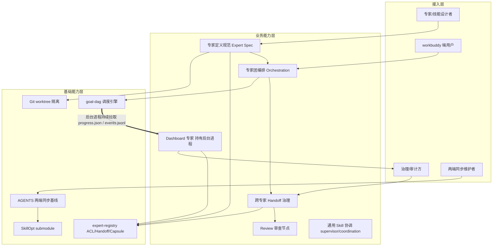
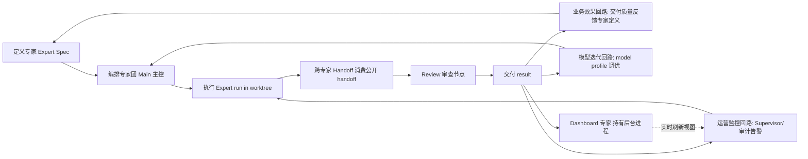

# AICoding 架构设计 · 高层架构设计

> 本文档为《AICoding 架构设计》核心产物之一，对应**高层架构设计模版**。
> 上游输入：业务原始诉求（主理人转交，G1/G2 已批准跳过）+ 本框架内部对标（权威源文件）+ 现有架构知识库；
> 下游输出：驱动《系统设计》《部署设计》《安全设计》《UserStory》四份文档的撰写。
> 本期范围：设计一套 workbuddy 专用**专家团（Expert Team）设计规范与编排模型**，作为 goal-dag v5 子线程体系的演进。

---

## 0. 元信息：修订记录

```yaml
标题: workbuddy 专家团（Expert Team）设计规范与编排模型 高层架构设计 v0.2
版本: v0.2
状态: Reviewing   # Draft | Reviewing | Approved | Deprecated
创建日期: 2026-08-06
最后更新: 2026-08-06
作者: 许边界 / business-architect
评审人:
  - 齐构成 / 主理人
  - Ghost233 / 项目架构负责人

关联文档:
  上游输入:
    - 业务原始诉求: 用户原始诉求（主理人转交，need_ingest=false / need_research=false）
    - 行业调研报告: N/A（need_research=false，采用本框架内部对标，见 §3）
    - 现有架构知识库: goal-dag v5 spec / owner-governance.md / sub-thread-coordination.skill / sub-thread-goal-worker.skill / sub-thread-task-supervisor.skill / AGENTS.md
  下游产出:
    - 系统设计: AICoding架构设计-2-系统设计.md
    - 部署设计: AICoding架构设计-3-部署设计.md
    - 安全设计: AICoding架构设计-4-安全设计.md
    - UserStory: AICoding架构设计-5-UserStory.md
```

| 版本 | 日期 | 作者 | 变更内容 | 评审状态 |
| --- | --- | --- | --- | --- |
| v0.1 | 2026-08-06 | 许边界 | 初稿（workbuddy 专家团高层架构，含专家/技能设计规范、编排模型、可行性分析） | Draft |
| v0.2 | 2026-08-07 | 许边界 | G3 反馈定点修订：Dashboard 完整设计（非占位桩）+ 专职 Dashboard 专家（持有后台进程）；D4 MVP 边界重定级；F13 重定级为 MVP + 新增 F14 Dashboard 专家；§4.5 专家子类型（含「持有后台进程的专家」）与生命周期边界规范；功能缺口/业务架构图/系统依赖/业务闭环/模块全景/功能清单/原型同步修订 | Reviewing |

> **版本管理纪律**：破坏性变更（章节结构调整 / 关键决策反转）升 MAJOR；新增章节、扩充内容升 MINOR。

---

## 1. 需求概要

### 1.1 需求概要说明

ghost-agent-market 是覆盖两端的插件市场，现有 goal-dag v5 子线程体系基于 Main/Owner/Worker/Supervisor/Reviewer 五角色与 owner-registry 治理。触发事件：用户要求新增 workbuddy 专家团，将 Owner 与 Worker 合并为专家并收敛 owner 职责，评估可行性与冲突。本期定位：一套专家(Expert)与技能(Skill)设计规范 + 专家团编排模型，作为 goal-dag v5 演进，复用 Main/Supervisor/Review 元角色与 ACL/handoff 治理。

### 1.2 关键决策摘要

| 编号 | 决策类别 | 决策内容 | 关联章节 |
| --- | --- | --- | --- |
| D1 | 范围决策 | 收敛「Owner + Worker → 专家(Expert)」；Main / Supervisor / Review 保留为独立协调元角色，不并入专家 | §2.1 / §4.2 / §6.1 |
| D2 | 技术选型决策 | owner-registry 改名 expert-registry，复用现有 ACL / handoff / Capsule 机制，字段合并迁移成本可控 | §4.2 / §5.2 |
| D3 | 复用 vs 新建 | 通用 skill（supervisor / coordination）沿用现有设计方式，不重构 | §4.2 / §6.2 |
| D4 | MVP / 完整版边界 | MVP 覆盖专家定义规范 + expert-registry 迁移 + 跨专家 handoff 隔离 + Review 保留 + **Dashboard 完整设计（含专职 Dashboard 专家持有后台进程）**；多专家并行编排  单端差异化延后至完整版 | §4.3 / §4.5 |
| D5 | 部署形态 | 本系统为本地插件规范，经两端 market（claude-code-market / codex-market）分发，非 SaaS、非多租户 | §4.2 / §5.2 |

**硬指标**：≥ 3 条，≤ 5 条；每条决策必须能映射到正文具体章节（D1~D5 均已映射）。

### 1.3 价值主张

| 价值维度 | 量化目标 | 度量指标 | 当前值 | 目标值 | 截止时间 |
| --- | --- | --- | --- | --- | --- |
| 效率 | 角色与配置收敛，新增专家定义入口从两套合并为一套 | 专家定义配置文件套数 | 2 套（owner-registry + worker binding） | 1 套（expert-registry） | MVP 上线 |
| 合规 | 跨专家 handoff 审计留痕不降级 | 跨专家 handoff 审计覆盖率 | 跨 Owner 审计 100%（基线） | 100% | MVP 上线 |
| 成本 | 演进迁移成本受控 | registry 迁移工作量（人月） | — | ≤ 0.5 人月 | MVP 上线 |
| 体验（技术） | 新增端 / 新专家接入步骤减少 | 定义一个新专家所需编辑文件数 | 2（owner + worker） | 1（expert） | MVP 上线 |

**硬指标**：业务价值 ≥ 2 条（效率、合规）+ 技术/成本价值 ≥ 1 条（成本、体验）；每条均可量化，无模糊词。

---

## 2. 需求分析 & 痛点解构

### 2.1 核心角色关注点

甲方决策者、最终用户与受影响方三类角色的关注点如下（均需在专家定义规范中体现）：

| 角色 | 业务身份 | 主要操作 | Top1 关心点 | 来源 |
| --- | --- | --- | --- | --- |
| 甲方决策者 | 项目架构负责人 / 主理人（齐构成） | 评审演进方案、批准冻结决策 | 演进不破坏 goal-dag v5 不变量、迁移成本可控、治理不降级 | 用户原始诉求 / 主理人冻结决策 |
| 最终用户 A | 专家 / 技能设计者（插件工程师） | 编写专家定义、挂载技能、提交 registry | 设计规范明确、复用现有机制、改造成本低 | AGENTS.md / owner-governance.md |
| 最终用户 B | workbuddy 端用户 | 基于专家团规范组装 / 运行专家团 | 专家定义清晰、跨专家协作顺畅、handoff 有隔离与审计 | sub-thread-coordination.skill |
| 受影响方：合规 / SRE | 治理 / 审计方 | 审查跨专家 handoff、审计留痕 | 跨专家 handoff 隔离与 ACL 不被弱化、审计 100% 留痕 | owner-governance.md 不变量 |
| 受影响方：同步维护者 | 两端同步维护者 | 按 AGENTS.md 同步 CC / Codex | 规范变更能正确同步到两端、单端差异可声明 | AGENTS.md 同步规则 / 在线连接规则 |

最终用户角色（专家 / 技能设计者、workbuddy 端用户）与受影响方角色（治理 / 审计方、两端同步维护者）的关注点均需在专家定义规范与编排模型中体现。

**硬指标**：≥ 3 类（甲方决策者 / 最终用户 / 受影响方各至少一行）；每行必须有 Top1 关心点，无笼统"使用方便"。

### 2.2 核心痛点

| 编号 | 痛点描述 | 现象 / 数据 | 影响角色 | 影响程度 | 优先级 |
| --- | --- | --- | --- | --- | --- |
| P1 | Owner 与 Worker 职责割裂，专家定义散落两套配置，新增执行能力需同时改 owner-registry（scope / ACL）与 worker binding，易遗漏 ACL，存在跨责任域越权风险 | 现状为 5 角色 + 2 套配置入口；goal-dag v5 不变量要求「跨 Owner 只消费公开 handoff」，但 Owner / Worker 分离使责任域与执行权限需两次对齐，治理面翻倍 | 受影响方：合规 / SRE；最终用户 A | 高（治理 / 合规风险） | P1 |
| P2 | 通用 skill（supervisor / coordination）与专家执行语义未统一抽象，新增端（workbuddy）难以直接复用现有子线程体系 | 两端（CC / Codex）已存在 AGENTS.md 同步规则，但专家执行语义未标准化，新端接入需重复理解 Owner + Worker 两套契约 | 最终用户 A / B | 中 | P2 |
| P3 | 角色概念过多（Main / Supervisor / Owner / Worker / Reviewer 五类），认知与 onboarding 成本高 | 角色数 = 5，配置文件 = 2 套，新成员需同时理解责任域与执行两套心智模型 | 最终用户 A | 中 | P3 |

**优先级标准**：
- **P1**：直接影响业务核心流程或合规底线，不解决无法上线。
- **P2**：影响用户体验或运营效率，可在 MVP 后迭代。
- **P3**：体验型 / 长尾问题，列入完整版或后续版本。

**硬指标**：每条痛点必须有「现象 / 数据」佐证；P1 ≥ 1 条且必须在 §2.3 有对应目标（P1 → V1 / V2）。

### 2.3 期待目标

| 编号 | 目标描述 | 对齐痛点 | 度量指标 | 当前值 | 目标值 | 截止时间 |
| --- | --- | --- | --- | --- | --- | --- |
| V1 | 合并 Owner + Worker 为单一专家定义，专家配置从 2 套收敛为 1 套 | P1 / P3 | 专家定义配置文件套数 | 2 | 1 | MVP 上线 |
| V2 | 跨专家 handoff 审计覆盖率 100%（复用 owner-governance「只消费公开 handoff」不变量） | P1 | 跨专家 handoff 审计覆盖率 | 跨 Owner 100% | 100% | MVP 上线 |
| V3 | workbuddy 端可直接基于专家团规范复用现有子线程体系，新增端接入成本 ≤ 0.5 人月 | P2 | 新增端接入工作量（人月） | — | ≤ 0.5 | MVP 上线 |
| V4 | 角色概念从 5 收敛为 3 元角色（Main / Supervisor / Review）+ 1 专家（Expert） | P3 | 角色概念数 | 5 | 4（3 元角色 + 1 专家） | MVP 上线 |

**硬指标**：每条目标必须有数字 + 对齐至少 1 条痛点；P1 痛点必须有对应 V 级目标（V1 / V2）。

### 2.4 基线复用

| 复用类别 | 现有能力 | 复用方式 | 来源系统 | 备注 |
| --- | --- | --- | --- | --- |
| 治理底座 | owner-registry.mjs（ACL / handoff / Capsule / propose-current-approve-apply / route） | 改名 expert-registry + 字段合并（ACL + Worker binding） | owner-governance.md | 冻结决策 #3：迁移成本可控 |
| 调度引擎 | goal-dag.mjs（调度 / 生命周期 / 五条不变量 / progress.json / events.jsonl） | 直接复用 | goal-dag v5 spec | 不变量 #1~#5 全部保留 |
| 协调入口 | sub-thread-coordination（唯一协调入口 / 硬边界 / 单 Main / Supervisor wait-notify） | 作为通用 skill 沿用，不重构 | sub-thread-coordination.skill | 冻结决策 #2 |
| 执行语义 | sub-thread-goal-worker（绑定 run / 只改 writable scope / verify / complete-block-fail-request-dag） | 收敛进专家执行器 | sub-thread-goal-worker.skill | 冻结决策 #1 |
| 监督语义 | sub-thread-task-supervisor（看门狗 / wait-notify / 不读结果） | 直接复用 | sub-thread-task-supervisor.skill | Main / Supervisor 保留 |
| 分发基线 | AGENTS.md（两端同步规则 / 在线连接 / Git 身份） | 作为专家规范分发与同步基线 | AGENTS.md | 单端差异经演进说明管理 |
| 技能资产 | SkillOpt submodule / 现有通用 skill | 直接复用 | SkillOpt | — |

**硬指标**：必须先盘点再决定新建；凡列入「功能缺口」的能力，必须先在本节确认基线无法覆盖。

### 2.5 功能缺口

| 阶段 | 功能缺口 | 必要性 | 优先级 | 对齐目标 |
| --- | --- | --- | --- | --- |
| 定义期 | 专家定义规范（身份 / scope ACL / 技能挂载 / 模型 profile / 长期线程归属） | 必须 | MVP | V1 / V4 |
| 定义期 | expert-registry 迁移（owner-registry 改名 + 字段合并） | 必须 | MVP | V1 / V3 |
| 编排期 | 专家团组合 + 跨专家 handoff（复用 ACL / handoff 不变量） | 必须 | MVP | V2 |
| 审查期 | Review 节点保留为专家团内独立审查（不并入专家） | 重要 | MVP | V2 |
| 治理期 | 跨专家 handoff 隔离与审计（复用「只消费公开 handoff」） | 必须 | MVP | V2 |
| 运营期 | 专家团可视化 Dashboard（完整设计：progress.json / events.jsonl 扩展专家团视图 + 跨专家 handoff 审计视图，非占位桩） | 必须 | MVP | V2 |
| 运营期 | Dashboard 专家（持有后台进程：维护 / 更新 Dashboard，轮询 progress.json / events.jsonl 只读固定入口） | 必须 | MVP | V2 |
| 运营期 | 多专家并行编排调度优化 | 重要 | 完整版 | V3 |
| 运营期 | 单端差异化（独立演进说明） | 重要 | 完整版 | — |

**硬指标**：每条缺口必须对齐 §2.3 至少一条目标；MVP 缺口必须在 §6.3 功能清单中对应有 MVP 范围标记。

---

## 3. 行业调研

> **内部对标说明（重要）**：本期 `need_research=false`，已批准跳过外部行业调研，不存在外部厂商调研报告作为上游。因此 §3 不以外部厂商数据伪造对标，而是以**本框架内部对标**方式呈现——对标对象均取自本项目权威源文件（goal-dag v5 spec、owner-governance.md、三个 SKILL.md、AGENTS.md）。下述「标杆系统」实为「本框架内已有模型」，均明确标注为内部对标；凡推断均标为「假设」，凡建议均标为「建议」，凡引用源文件均标为「事实」。

### 3.1 行业标杆系统分析（本框架内部对标）

| 标杆系统 | 厂商 / 来源 | 场景覆盖 | 技术亮点 | 商业模式 | 适用度 |
| --- | --- | --- | --- | --- | --- |
| B1 现有 Owner 责任域模型 | 本框架内部（owner-governance.md） | 长期责任域 / 文件 scope ACL / Capsule（decisions·invariants·risks·progress）/ 跨 Owner handoff | 责任域与执行解耦、审计留痕、propose-current-approve-apply 流程 | 内部机制复用 | 高 |
| B2 现有 Worker 执行模型 | 本框架内部（sub-thread-goal-worker.skill） | 绑定 run / 只改 writable scope / verify / complete-block-fail-request-dag | 最小语义输入、脚本补齐契约、结果候选隔离 | 内部机制复用 | 高 |
| B3 现有 sub-thread 协调模式 | 本框架内部（sub-thread-coordination + role agent 模板） | 唯一协调入口 / 单 Main / Supervisor wait-notify / Git 同步分发通道 | 硬边界、可恢复、跨端安装 | 内部机制复用 | 中 |
| B4 现有 Reviewer 节点模型 | 本框架内部（goal-dag v5 Review 节点） | DAG 审查节点 / 机械验收 ≠ Review | 独立审查保证验收客观性 | 内部机制复用 | 中 |

**硬指标**：≥ 3 家（实际 4 家，均为本框架内部对标，非外部厂商）；外部「头部 SaaS + 开源」要求因 skip-research 不适用，已由 ≥3 个内部对标对象替代（符合主理人 §5 指示）。

### 3.2 方案对标及优先级打分（本框架内部对标）

**对比矩阵**（每行权重之和 = 1；评分 1~5，5 为最优）：

| 评估维度 | 权重 | B1 Owner 责任域 | B2 Worker 执行 | B3 sub-thread 协调 | B4 Reviewer 节点 |
| --- | --- | --- | --- | --- | --- |
| 责任域隔离能力 | 0.25 | 5 | 2 | 3 | 2 |
| 执行语义完整性 | 0.20 | 2 | 5 | 3 | 2 |
| 跨实体 handoff 治理 | 0.20 | 4 | 2 | 3 | 2 |
| 与子线程体系兼容度 | 0.20 | 4 | 4 | 5 | 3 |
| 合并 / 迁移成本（反向） | 0.15 | 3 | 3 | 4 | 2 |
| **加权总分** | **1.00** | **3.70** | **3.15** | **3.55** | **2.20** |

**结论摘要**：
- **优先借鉴**：B1（Owner 责任域）+ B2（Worker 执行）合并为专家定义主干 —— 理由（事实+建议）：责任域隔离（ACL / Capsule）与执行语义（binding / verify）互补，合并后覆盖最全，且正是冻结决策 #1 的合并方向。
- **部分借鉴**：B3（sub-thread 协调模式）—— 借鉴点（建议）：作为专家团协调骨架，Main / Supervisor 保留为元角色，role agent 模板复用为 Git 同步分发通道。
- **不借鉴**：将 B4（Reviewer）并入执行专家的方案 —— 否决理由（事实）：违反 goal-dag v5 不变量 #2（Review 是 DAG 节点，机械验收 ≠ Review），审查独立性须保留（冻结决策 #4）。

### 3.3 完整报告参考

- 完整报告链接：N/A（本期 need_research=false，跳过外部调研，改以本框架内部对标，见 §3.1 / §3.2）
- 调研工具：不适用（内部对标，来源为权威源文件，非 tech-research-advisor 外部检索）
- 调研日期：2026-08-06（设计基线日期）
- 调研归档：本文件 §3（内部对标）；外部调研归档待补（如后续需补充）

---

## 4. 方案决策

### 4.1 价值定位澄清

**定位三段式**：

```
对外价值（客户侧）: workbuddy 端用户获得一套清晰的专家(Expert)与技能(Skill)设计规范，可直接基于现有子线程体系组装专家团，跨专家协作有隔离与审计保障。
对内价值（运营侧）: 角色概念从 5 收敛为 3 元角色 + 1 专家，owner / worker 配置合并为 expert-registry，治理不降级（复用 ACL / handoff 不变量），迁移成本 ≤ 0.5 人月。
差异化价值        : 相比现有「Owner + Worker 分离」模型，专家定义将责任域(ACL) + 执行语义(worker binding) + 技能挂载 + 模型 profile + 长期线程归属收敛为单一可复用实体，且跨专家 handoff 100% 复用「只消费公开 handoff」治理不变量。
```

**与产品矩阵的关系**：本专家团规范在 goal-dag v5 子线程体系中承担「执行主体标准化」职责，与 Main / Supervisor / Review 元角色及 expert-registry 治理形成完整业务闭环（见 §5.2、§5.3）。

### 4.2 系统定位澄清

| 维度 | 内容 |
| --- | --- |
| 系统名称 | workbuddy 专家团（Expert Team）设计规范与编排模型 |
| 系统类型 | 已有系统扩展 / 改造（goal-dag v5 子线程体系演进） |
| 部署形态 | 本地插件规范 + 两端 market 分发（claude-code-market / codex-market）；非 SaaS、非多租户 |
| 多租户 | 否（插件规范，按端分发；单端差异经 AGENTS.md 同步规则与独立演进说明管理） |
| 服务对象 | 专家 / 技能设计者（插件工程师）、workbuddy 端用户、两端同步维护者、治理 / 审计方 |
| 上游依赖 | goal-dag.mjs（调度 / 生命周期 / 不变量）、AGENTS.md（同步 / Git 身份）、SkillOpt |
| 下游消费者 | workbuddy 端运行实例、Git 同步分发通道、Dashboard 专家（持有后台进程，只读消费 progress.json / events.jsonl）+ Dashboard 可视化 |
| 边界（不做） | 不重构通用 skill（supervisor / coordination）；不将 Reviewer 并入专家；不做 SaaS / 云端多租户部署 |

### 4.3 MVP 与完整版决策

| 阶段 | 时间窗 | 范围（功能编号） | 架构差异点 | 退出标准 | 不做（延后） |
| --- | --- | --- | --- | --- | --- |
| MVP | W1 ~ W6 | F1 ~ F10（专家定义规范 / expert-registry 迁移 / 跨专家 handoff 隔离 / Review 保留 / 通用 skill 沿用 / 两端同步）+ F13（Dashboard 完整设计）+ F14（Dashboard 专家 持有后台进程） | 单 Main / Supervisor 骨架沿用；expert-registry 复用 owner-registry 机制（改名 + 字段合并）；本地插件分发；Dashboard 专家持有后台进程（长驻，轮询 progress.json / events.jsonl 只读入口） | 跑通「定义专家 → 编排专家团 → 跨专家 handoff → Review」主链路；两端同步无回归；跨专家 handoff 审计 100%；Dashboard 实时呈现专家团状态与 handoff 审计视图 | F11 ~ F12（多专家并行编排调度优化  单端深度差异化） |
| 完整版 | W7 ~ W12 | + F11 ~ F12 | 多专家并行编排、单端差异化经独立演进说明、跨端版本校验（Dashboard / Dashboard 专家已在 MVP 交付，完整版增强视图与告警） | 多专家并行编排稳定运行；两端规范一致性与单端差异均可验证 | — |

**演进纪律**（重要）：
- MVP 的架构骨架必须是完整版的**子集**：expert-registry 复用 owner-registry 机制，不推倒重来；Dashboard 专家持有后台进程的设计在 MVP 即确定（只读 progress.json / events.jsonl 固定入口，不写状态文件），完整版仅增强视图与告警，不重建。
- MVP 中可延后的能力（多专家并行编排  单端差异化）在本节明确「完整版替换计划」，不影响 MVP 主链路。
- 禁止：MVP 为赶工引入「完整版无法继承」的临时架构（如临时双 registry 并存后整体替换）。

### 4.4 可行性分析与冲突 / 遗漏评估（经主理人冻结决策）

> 本节直接回应客户原始诉求：「请先分析该方案的可行性，评估现有架构设计在引入 workbuddy 专家团及角色合并后是否存在冲突或遗漏，并指出方案中需要调整或优化的地方。」

**可行性结论**：**可行**。将 Owner + Worker 合并为专家（Expert）与现有 goal-dag v5 不变量兼容——Owner 是「长期责任域，不是人员」，Worker 是「执行单元」，二者合并为「专家 = 责任域 + 执行」单一实体，不破坏不变量 #1（执行单元是长期子线程）、#2（Review 是 DAG 节点）、#4（模型只给最小语义输入，契约由脚本补齐）。Main / Supervisor 作为协调元角色保留，亦不破坏单 Main 不变量与 Supervisor wait / notify 语义。

**冲突点识别与处置**：
1. 客户原始文本字面要求「合并主线程、监督者、worker 与 owner」——但 Main / Supervisor 是协调元角色（单 Main 不变量、Supervisor 只 wait / notify），并入专家会破坏硬边界与不变量。**处置（冻结决策 #1）**：Main / Supervisor 保留为独立协调元角色，仅合并 Owner + Worker → Expert。
2. Owner 的 Capsule（decisions / invariants / risks / progress）与 Worker 的 runtime binding 需合并为统一「专家上下文模型」。**处置（D2 / F6）**：在 expert-registry 中统一 ACL + Capsule + binding 字段，由脚本补齐。
3. 跨 Owner handoff 的 ACL 规则需平移为跨专家 handoff。**处置（F7）**：不变量「跨 Owner 只消费公开 handoff」→「跨专家只消费公开 handoff」，审计 100% 留痕。

**遗漏点识别**：
1. 单端差异化（独立演进说明）需在专家规范中预留「单端差异声明」字段，避免两端强一致导致 无法单端优化。
2. 两端同步规则（AGENTS.md）需在专家定义变更时触发同步校验，防止一端改专家定义而另两端滞后。
3. Dashboard 可视化（progress.json / events.jsonl）需扩展「专家团视图」与「跨专家 handoff 审计视图」，且由**专职 Dashboard 专家**持有后台进程、负责维护与实时更新（G3 用户意见：dashboard 的设计需要完整，由一个专家专门负责维护和更新和持有后台进程）。

**需要调整 / 优化的地方（建议）**：
1. owner-registry → expert-registry 改名 + 字段合并（ACL + handoff + Capsule + binding）。
2. sub-thread-goal-worker 执行语义收敛进专家，但保留为独立 skill 入口（专家执行器），不丢失「最小语义输入」契约。
3. Reviewer 保留为专家团内独立审查节点（冻结决策 #4）。
4. 通用 skill（coordination / supervisor）不重构（冻结决策 #2），仅作为专家团的协调骨架复用。
5. 新增「持有后台进程型专家」子类型（首个实例为 Dashboard 专家），由该专家全权负责后台进程的拉起 / 健康检查 / 重启与视图维护，与执行专家 worktree / Main / Supervisor 解耦（G3 用户意见）。

### 4.5 专家定义规范：子类型与生命周期边界（经 G3 反馈补充）

> 依据用户 G3 原文（逐字）："dashboard的设计需要完整,由一个专家专门负责维护和更新和持有后台进程"。在「专家 = 责任域(ACL) + 执行语义(worker binding) + 技能挂载 + 模型 profile + 长期线程归属」统一定义之上，明确三类专家子类型及其生命周期边界；Review 不并入任何执行专家（冻结决策 #4 / 不变量 #2）。

| 子类型 | 责任 | 线程 / 进程模型 | 与 ACL 关系 | 生命周期边界 |
| --- | --- | --- | --- | --- |
| 执行专家 Execution Expert | 承载 worker binding，run 在 worktree，只改 writable scope，完成 goal | 短期：随单个 goal / 子 DAG 启停，复用同一 worktree / branch（F5 长期线程归属） | 拥有自身 scope ACL，跨专家只消费公开 handoff | 由 Main 编排、Supervisor 看门狗监管；goal 完成即释放 worktree 写锁 |
| Review 专家 Review Expert | 独立 DAG 审查节点，机械验收 ≠ Review | 随 Review 节点触发，短生命；不持有 worktree 写权限 | 只读 subject / reason，不消费执行 scope | 仅作审查，不并入执行专家（冻结决策 #4） |
| Dashboard 专家 Dashboard Expert（持有后台进程） | 维护 / 更新 Dashboard，轮询 progress.json / events.jsonl，渲染专家团状态与跨专家 handoff 审计视图 | **长期**：持有后台进程（daemon），随专家团会话启停，跨多个 goal 持续运行 | **不持有任何 writable scope / ACL 写权限**；仅只读消费两个固定抓取入口 | 由 Main / Supervisor 纳入会话生命周期统一启停；与执行专家共存无竞争（只读固定入口，不占 worktree） |

**共存与边界纪律**：
- **与执行专家共存**：Dashboard 专家只读取 progress.json / events.jsonl 两个固定入口（与 goal-dag 不变量 #5「固定抓取入口」一致），不写状态文件、不占 worktree、不申请 ACL 写权限，因此与执行专家（持有 worktree 写锁）无资源竞争、无越权面。
- **与 Main / Supervisor 共存**：Main 为单 Main 协调元角色（不并入专家），Supervisor 只 wait / notify 看门狗；Dashboard 专家的后台进程由二者纳入会话生命周期统一启停，不独立游离。
- **持有后台进程的治理**：后台进程必须可被发现、可优雅停止（随会话结束或 expert-registry 注销而回收），禁止泄漏为孤儿进程；其日志与心跳纳入 Dashboard 自身视图，供治理 / 审计方监控。
- **Review 不并入**：Review 专家保持为专家团内独立审查节点（冻结决策 #4），Dashboard 专家不代理 Review 语义。

---

## 5. 业务架构设计

### 5.1 业务架构图

业务架构分为三层：接入层（设计者 / 用户 / 治理方 / 同步维护者） → 业务能力层（专家定义规范 / 专家团编排 / 跨专家 Handoff / Review / 通用 Skill 协调） → 基础能力层（expert-registry / goal-dag 引擎 / AGENTS 同步基线 / SkillOpt / Git worktree 隔离）。



**绘制规范**：三层（接入层 → 业务能力层 → 基础能力层）齐全；实线 = 同步调用 / 编排依赖，虚线 = 异步事件，粗实线 `==>` = Dashboard 专家持有的后台进程对 goal-dag 状态源（progress.json / events.jsonl）的持续拉取（只读、模型不写，符合不变量 #5）。每个模块均有标准名，与 §4.2 / §6.2 术语一致。**Dashboard 专家（B6）**位于业务能力层：持有并管理长期后台进程，只读 `progress.json` / `events.jsonl`（由 goal-dag 引擎 C2 产出）与 expert-registry（C1）渲染 Dashboard；不执行 DAG run（区别于执行专家 worktree）、不担任协调角色（区别于 Main / Supervisor）；其后台进程生命周期由该专家自身持有、随专家团会话启停，与执行专家 worktree、Main / Supervisor 协调生命周期解耦（详见 §4.5 共存与边界纪律）。

### 5.2 系统依赖架构

| 依赖类型 | 系统 / 模块 | 提供方 | 依赖能力 | 接入方式 | 同步/异步 | 关键约束 |
| --- | --- | --- | --- | --- | --- | --- |
| 上游 | goal-dag.mjs | 平台组 | 调度 / 生命周期 / 五条不变量 | 领域脚本 CLI | 同步 | 硬边界：只通过脚本改状态；模型不写状态文件 |
| 上游 | AGENTS.md 同步规则 | 平台组 | 两端同步 / Git 身份 / 在线连接 | 文档约定（编辑时遵循） | 同步 | 改专家定义须触发两端同步校验 |
| 复用底座 | owner-registry.mjs → expert-registry | 治理组 | ACL / handoff / Capsule / propose-current-approve-apply / route | 领域脚本 CLI | 同步 | 跨专家只消费公开 handoff；用户明确批准才 apply |
| 复用底座 | sub-thread-coordination | 沿用组 | 唯一协调入口 / 硬边界 / 单 Main | 通用 skill | 同步 | 禁止 subagent；Supervisor 只 wait / notify |
| 复用底座 | SkillOpt submodule | 平台组 | 技能资产 | git submodule | 同步 | 锁定 commit，升级走缓存清理 |
| 下游 / 内部 | Dashboard 专家（持有后台进程） | 本项目（平台组） | 维护 / 更新 Dashboard，消费专家团 / handoff 审计视图 | 后台进程长驻 + 文件轮询（只读 progress.json / events.jsonl） | 异步 | 只读取两个固定抓取入口，模型不写；后台进程随 expert-registry / 会话生命周期启停，可优雅回收 |

**硬指标**：
- 每条依赖必须明确「接入方式 + 同步/异步 + 关键约束」，禁止只写「调用 API」。
- P1 痛点（跨责任域越权 / ACL 弱化）对应的核心能力，在 expert-registry（ACL / handoff）与 goal-dag（硬边界）中找到依赖来源。

### 5.3 业务闭环

**业务主链路**（端到端）：

```
定义专家(Expert Spec) → 编排专家团(Main 主控) → 执行(Expert run in worktree, 只改 writable scope)
→ 跨专家 Handoff(消费公开 handoff) → Review 审查节点 → 交付(result) → 反馈回路
```



**关键反馈回路**：

| 回路 | 触发点 | 反馈对象 | 反馈机制 | 价值 |
| --- | --- | --- | --- | --- |
| 业务效果回路 | 交付 result / Review 结论 | 专家定义规范 | 专家定义迭代（scope / 技能挂载 / model profile 调整） | 优化专家执行质量 |
| 运营监控回路 | Supervisor watch / handoff 异常 | 治理 / 审计方 | 实时告警 + 审计留痕 | 快速响应越权 / 隔离失效 |
| 模型迭代回路 | 专家执行效果 | 专家模型 profile | 重新编排时更新 model / thinking | 提升专家准确率 |
| Dashboard 运营回路 | Dashboard 专家持有后台进程轮询 progress.json / events.jsonl | 治理 / 审计方 | 实时刷新 Dashboard + 异常高亮 + 审计视图下钻 | 可视化监控专家执行与跨专家 handoff 审计状态 |

**运营主线**：每日（设计者审专家定义合规性）→ 每周（治理方审跨专家 handoff 审计完整性）→ 每月（两端同步维护者校验 CC / Codex 规范一致性）。

---

## 6. 产品需求及原型

### 6.1 需求边界

**In-Scope**（本期必做）：

```
F1. 专家定义规范-身份标识（expert_id / name / profile）
F2. 专家定义规范-责任域（文件 scope ACL，源自 Owner 治理）
F3. 专家定义规范-技能挂载（skill mount，通用 skill 沿用）
F4. 专家定义规范-模型 profile（model / thinking）
F5. 专家定义规范-长期线程归属（generation reuse：worktree / branch）
F6. expert-registry 迁移（owner-registry 改名 + 字段合并 ACL/handoff/Capsule/binding）
F7. 跨专家 Handoff 隔离与 ACL（复用「只消费公开 handoff」不变量）
F8. Review 审查节点保留（不并入专家）
F9. 通用 skill 沿用（supervisor / coordination 不重构）
F10. 两端同步（AGENTS.md 规则落地：CC / Codex）
F13. Dashboard 可视化（完整设计：专家团视图 + 跨专家 handoff 审计视图，扩展 progress.json / events.jsonl）
F14. Dashboard 专家（持有后台进程：维护 / 更新 Dashboard，只读轮询 progress.json / events.jsonl）
N1. 非功能：跨专家 handoff 审计覆盖率 100%
N2. 非功能：registry 迁移成本 ≤ 0.5 人月
```

> **范围变更说明（G3 修订）**：Dashboard 可视化（F13）与 Dashboard 专家（F14）已于本修订由「完整版延后」纳入 **In-Scope（MVP）**，不再作为 Out-of-Scope / 延后项；多专家并行编排（F11）、单端差异化（F12）仍为完整版延后项。

**Out-of-Scope**（本期不做，必须列原因）：
| 编号 | 范围 | 不做的事 | 原因 | 后续计划 |
| --- | --- | --- | --- | --- |
| O1 | Out-of-Scope | 重构通用 skill（supervisor / coordination）内部实现 | 冻结决策 #2：通用 skill 沿用现有设计，不重构 | 由现有 skill 维护，不在本期 |
| O2 | Out-of-Scope | 将 Reviewer / 审查并入专家执行 | 违反 goal-dag v5 不变量 #2（Review 是 DAG 节点，机械验收 ≠ Review） | 不采纳，Review 保留为独立审查节点 |
| O3 | Out-of-Scope | SaaS / 云端多租户部署 | 本系统为本地插件规范，按两端 market 分发 | 不做 |
| O4 | Out-of-Scope | Owner 概念独立保留（不合并） | 冻结决策 #1：收敛 Owner + Worker → Expert | 不采纳 |

**硬指标**：In-Scope ≤ 15 条（实际 14 条：F1~F10 + F13~F14 + N1~N2）；Out-of-Scope ≥ 3 条（实际 4 条）。

### 6.2 产品模块全景图

**模块卡片**（每个模块必填字段）：

| 字段 | 说明 |
| --- | --- |
| 模块名称 | 标准名 |
| 一级归属 | 接入层 / 业务能力层 / 基础能力层 |
| 责任团队 | 团队名 |
| 上游 | 模块/系统列表 |
| 下游 | 模块/系统列表 |
| MVP 是否包含 | 是 / 否 |

| 模块名称 | 一级归属 | 责任团队 | 上游 | 下游 | MVP 是否包含 |
| --- | --- | --- | --- | --- | --- |
| 专家定义规范 Expert Spec | 业务能力层 | 专家团设计组 | expert-registry / AGENTS 同步 | 专家团编排 | 是 |
| 专家团编排 Orchestration | 业务能力层 | 专家团设计组 | 专家定义规范 / goal-dag | 跨专家 Handoff | 是 |
| 跨专家 Handoff 治理 | 业务能力层 | 治理组 | expert-registry ACL | Review | 是 |
| Review 审查节点 | 业务能力层 | 治理组 | 专家团编排 | 交付 | 是 |
| 通用 Skill 协调 supervisor/coordination | 基础能力层 | 沿用组 | goal-dag | 专家团编排 | 是 |
| expert-registry（ACL/handoff/Capsule） | 基础能力层 | 治理组 | owner-registry 迁移 | 跨专家 Handoff | 是 |
| goal-dag 调度引擎 | 基础能力层 | 平台组 | — | 专家团编排 | 是 |
| AGENTS 两端同步基线 | 基础能力层 | 平台组 | — | 两端分发 | 是 |
| Dashboard 可视化 | 业务能力层 | 平台组 | progress.json / events.jsonl | 治理方视图 / Dashboard 专家 | 是（MVP，完整设计） |
| Dashboard 专家（持有后台进程） | 业务能力层 | 平台组 | progress.json / events.jsonl | Dashboard 可视化 | 是（MVP） |

```mermaid
flowchart LR
    subgraph T[触点端]
        T1[设计者工作台]
        T2[治理/审计端]
    end
    subgraph B[业务模块]
        M1[专家定义规范]
        M2[专家团编排]
        M3[跨专家 Handoff 治理]
        M4[Review 审查节点]
        M5[通用 Skill 协调]
        M6[Dashboard 专家 持有后台进程]
    end
    subgraph D[底座与数据]
        D1[expert-registry]
        D2[goal-dag 引擎]
        D3[AGENTS 同步基线]
        D4[SkillOpt]
    end
    T1 --> M1 & M2 & M3 & M4
    T2 --> M3 & M4
    M1 --> D1
    M2 --> D2
    M3 --> D1
    M4 --> D1
    M6 -.读取 progress.json/events.jsonl.-> D2
    M1 --> D3
```

### 6.3 功能清单

**硬指标约束**：每个 P0 功能必须在 MVP 范围内标记为 ✅；本期所有 P0 功能均已纳入 MVP。

| 编号 | 一级模块 | 二级功能 | 功能描述 | 优先级 | MVP 范围 | 完整版范围 | 对齐目标 |
| --- | --- | --- | --- | --- | --- | --- | --- |
| F1 | 专家定义规范 | 身份标识 | 定义 expert_id / name / profile 等身份字段 | P0 | ✅ | ✅ | V1 / V4 |
| F2 | 专家定义规范 | 责任域（scope ACL） | 文件 scope ACL，源自 Owner 治理，复用 route 与 Capsule | P0 | ✅ | ✅ | V1 / V2 |
| F3 | 专家定义规范 | 技能挂载 | 挂载 skill 列表（通用 skill 沿用现有设计） | P0 | ✅ | ✅ | V1 |
| F4 | 专家定义规范 | 模型 profile | 指定 model / thinking（最小语义输入契约） | P0 | ✅ | ✅ | V1 |
| F5 | 专家定义规范 | 长期线程归属 | generation reuse：同一专家复用同一 worktree / branch / 线程 | P0 | ✅ | ✅ | V1 |
| F6 | expert-registry | 迁移（改名 + 字段合并） | owner-registry → expert-registry，合并 ACL + handoff + Capsule + Worker binding | P0 | ✅ | ✅ | V1 / V3 |
| F7 | 跨专家 Handoff | 隔离与 ACL | 复用「只消费公开 handoff」不变量，跨专家审计 100% 留痕 | P0 | ✅ | ✅ | V2 |
| F8 | Review 节点 | 保留独立审查 | Review 作为专家团内独立 DAG 审查节点，不并入专家 | P1 | ✅ | ✅ | V2 |
| F9 | 通用 Skill | 沿用 | supervisor / coordination 不重构，仅作为协调骨架 | P1 | ✅ | ✅ | V3 |
| F10 | 两端同步 | AGENTS 规则落地 | CC / Codex 同步专家定义变更；单端差异经演进说明 | P1 | ✅ | ✅ | V3 |
| F11 | 专家团编排 | 多专家并行 | 多专家并行编排调度优化（extension of MVP 单链） | P2 | ❌ | ✅ | V3 |
| F12 | 单端差异化 | 单端演进说明 | 单端差异独立声明与演进 | P2 | ❌ | ✅ | — |
| F13 | Dashboard | 可视化（完整设计） | 专家团 / 跨专家 handoff 审计视图（扩展 progress.json / events.jsonl，非占位桩） | P1 | ✅ | ✅ | V2 |
| F14 | Dashboard 专家 | 持有后台进程 | 维护 / 更新 Dashboard；持有后台进程长驻，只读轮询 progress.json / events.jsonl，随会话生命周期启停 | P1 | ✅ | ✅ | V2 |

**硬指标**：
- 每个 P0 功能必须在 MVP 范围内为 ✅（F1~F7 全部 ✅）。
- 每个功能必须能反向映射到 §2.5 功能缺口 + §2.3 期待目标（已逐行对齐）。

### 6.4 产品原型 - 专家 / 技能设计者工作台

**核心页面清单**：

| 页面 | 用途 | 关键交互 | MVP |
| --- | --- | --- | --- |
| 专家定义编辑页 | 编写专家身份 / scope ACL / 技能挂载 / 模型 profile / 线程归属 | 表单校验 ACL 合法性，提交触发 expert-registry propose | ✅ |
| 专家团编排页 | 组合多专家、指定 Main 主控 | 拖拽 / 声明式组合，预览 handoff 边界 | ✅ |
| 跨专家 Handoff 审计页 | 查看 handoff 公开性 / 审计留痕 | 按专家 / 时间筛选，下钻到 handoff 事件 | ✅ |
| 通用 Skill 沿用配置页 | 选择复用的 supervisor / coordination skill | 下拉选择，不开放内部重构 | ✅ |
| Dashboard 专家定义页 | 定义 Dashboard 专家（持有后台进程子类型）：视图范围 / 轮询频率 / 后台进程启停 | 表单校验 + 后台进程启停预览，提交触发 expert-registry propose | ✅ |

**关键交互约束**：
- 定义专家：核心路径 ≤ 5 步（身份 → scope → 技能 → 模型 → 提交）。
- Handoff 审计：任意跨专家 handoff 事件可追溯至公开 handoff 凭证，P99 查询 ≤ 2s（对齐 V2）。

**原型链接**：N/A（本期为规范设计，原型以配置 schema + 编排声明示例落地）

### 6.5 产品原型 - 治理 / 审计端

**核心页面清单**：

| 页面 | 用途 | 关键交互 | MVP |
| --- | --- | --- | --- |
| Handoff 审计列表 | 全量跨专家 handoff 查询 | 筛选 / 排序 / 审计状态 | ✅ |
| Review 节点视图 | 单条审查全貌（subject / reason / 结论） | 回放 / 时间轴 | ✅ |
| 两端同步一致性面板 | CC / Codex 规范一致性 | 实时刷新 / 一键校验 | ✅ |
| 专家团监控 / 预警面板（Dashboard 专家持有后台进程渲染） | 管理者视角 | 实时刷新 / 异常告警 / 后台进程状态 | ✅（MVP F13 / F14） |

**原型链接**：N/A（本期为规范设计，治理视图以 audit 事件 schema 落地）

---

## 附录 A：生成流程方法论

> 本附录为高层架构设计的**生成方法论**，描述每一步的目标、工具与产物形态，作为正文章节的产出依据。
> ⚠️ 附录中「能力效果展示」小节出现的领域举例仅用于演示方法论的输入与产物形态，不代表本模版的目标领域。读者只需关注每一步的「目标 / 工具 / 产物形态」。

### A.0 生成流程总览

| 步骤 | 名称 | 核心产出 | 落入正文章节 |
| --- | --- | --- | --- |
| Step0 | 业务基础知识库构建 | 关联文档结构化知识库 | （为全文提供输入） |
| Step1 | 行业调研分析 | 行业标杆 / 方案对比 / MVP 决策 | §3 行业调研（本期为内部对标） |
| Step2 | 需求分析 / 痛点解构 | 需求画像卡 | §2 需求分析 & 痛点解构 |
| Step3 | 能力盘点，系统定位 | 价值定位 + 系统定位 | §4 方案决策 / §5.2 系统依赖架构 |
| Step4 | 生成系统高层架构设计 | 本文档主文档 | §1 ~ §5 |
| Step5 | 产品需求及原型 | 需求边界 + 全景图 + 原型 | §6 产品需求及原型 |


### A.1 Step0：业务基础知识库构建

#### A.1.1 目标
构建业务系统关联信息知识库，为后续步骤提供「现有架构、外部依赖文档」等业务背景。

#### A.1.2 工具（Skill）
- `docx`：解析 Word 类业务/产品文档
- `pdf`：解析 PDF 类规范、API 手册等
- `pptx`：解析方案 / 汇报型 PPT
- `xlsx`：解析数据表、清单类文件

#### A.1.3 能力效果展示
「AI 营销知识示例」：通过上述 Skill 将营销业务的存量文档解析、结构化，沉淀为可在后续步骤直接召回的业务知识库。

### A.2 Step1：行业调研分析

#### A.2.1 目标
基于当前需求，调研行业标杆系统及对应解决方案，对标优秀方案，综合打分决策 MVP 功能和落地路径。本期 `need_research=false`，改为本框架内部对标（见 §3）。

#### A.2.2 工具（Skill）
- `tech-research-advisor`（外部调研；本期未启用）

#### A.2.3 完整报告参考
- 完整报告链接：`https://doc.weixin.qq.com/doc/w3_AN0AogZ1ACcCNkbQno92nSXa516PH?scode=AJEAIQdfAAoQ9ySyjnAN0AogZ1ACc`

#### A.2.4 能力效果展示

##### A.2.4.1 用户输入问题
使用 `tech-research-advisor` 技能，调研行业内解决「AI 智慧外呼」相关工具在解决投诉场景的常规方案和核心能力。

##### A.2.4.2 行业标杆
调研产出的行业标杆系统清单及标签。

##### A.2.4.3 行业优秀方案及对比
行业标杆方案的横向对比矩阵。

##### A.2.4.4 方案打分及 MVP 功能评估
综合打分后形成 MVP 功能评估结果。

##### A.2.4.5 能力清单 & 方案总结
形成可复用能力清单与最终方案总结。

### A.3 Step2：需求分析 / 痛点解构

#### A.3.1 目标
构建**需求画像卡**，深入解构需求要点及目标。

#### A.3.2 能力效果展示
以「智慧外呼 - 投诉场景」为例，按「核心角色关注点 / 核心痛点 / 期待目标 / 基线复用 / 功能缺口」五段式产出需求画像卡（结构对应正文 §2）。

### A.4 Step3：能力盘点，系统定位

#### A.4.1 目标
- 从能力知识库中召回现有系统架构，与当前问题相关的已有能力，并完成**分层与去重**
- **系统价值及能力嵌入**：明确需求 / 系统在当前架构中的价值定位
- **系统架构定位、上下游推导**：让目标系统在图中「被看见」，并自动生成上下游关系说明

#### A.4.2 产物形态
- 价值定位澄清（对应正文 §4.1）
- 系统定位澄清（对应正文 §4.2）
- 系统依赖架构图（对应正文 §5.2）

### A.5 Step4：生成系统高层架构设计

#### A.5.1 目标
整合行业分析、需求结构、现有项目背景知识库，输出**系统高层设计**（即本文档正文 §1 ~ §5）。

#### A.5.2 产物形态
- 需求概要（§1）
- 需求分析 & 痛点解构（§2）
- 行业调研（§3，本期为内部对标）
- 方案决策（§4）
- 业务架构设计（§5）

### A.6 Step5：产品需求及原型

#### A.6.1 目标
在系统高层设计的基础上，输出可被产品/研发直接消费的需求边界、功能清单与产品原型（即本文档正文 §6）。

#### A.6.2 产物形态
- 需求边界（§6.1）
- 产品模块全景图（§6.2）
- 功能清单（§6.3）
- 产品原型 - 设计者工作台（§6.4）
- 产品原型 - 治理 / 审计端（§6.5）

---

## 附录 B：配套工具清单

### B.1 知识库 Skill
- `docx`
- `pdf`
- `pptx`
- `xlsx`

### B.2 行业调研
- `tech-research-advisor`（本期 `need_research=false` 未启用，改以本框架内部对标）

---

## 附录 C：阶段内自检报告（G3 修订 · Dashboard 完整设计 + 专职 Dashboard 专家）

> 本附录为业务架构阶段「G3 反馈修改」的中间确认自检追溯材料，依 `protocols/intermediate_confirmation.md` §2.4 要求随回传提交，供主理人在 G3 审核弹窗中追溯。
> 修订触发：用户 G3 原文（逐字，不得转述）：**"dashboard的设计需要完整,由一个专家专门负责维护和更新和持有后台进程"**。

### C.1 §2.1 方案分歧型判定

| 条件 | 判定 | 证据 |
| --- | --- | --- |
| 条件1：存在 ≥2 种合理方案，无法单方裁决 | 不满足 | 用户原文已显式指定唯一方案（Dashboard 完整设计 + 专职专家 + 持有后台进程），不存在并列候选需裁决 |
| 条件2：决策影响下游成员产出 | 满足（但被条件3阻断） | Dashboard 专家契约将下传 system-architect（后台进程生命周期）/ product-story-designer（F13/F14 原型） |
| 条件3：用户原始诉求 / 上游已冻结文档未对该决策点做出明确选择 | **不满足（关键）** | 用户 G3 反馈原文逐字指定「dashboard 完整设计 + 由专家专门负责维护更新 + 持有后台进程」，属 §2.1 澄清条款中的「用户原始诉求显式指定该决策点选择」，视为已冻结授权 |

**判定结论**：§2.1 三项未同时成立（条件3 不满足）→ **未命中方案分歧型**，无需发起 `[中间确认]`。

### C.2 §2.3 反向验证 3 问（强制逐问作答 + 证据）

| 问题 | 答案 | 证据（具体，非"可控/一致"空答） |
| --- | --- | --- |
| Q1：若 3 个月后被推翻，工程返工成本可控吗？ | 可控 | 返工范围 = §2.5 功能缺口两行 + §4.3 MVP/完整版两行 + §4.5 新增子类型规范 + §5.1/§5.2/§5.3 中 Dashboard 专家节点与依赖行 + §6.1 In-Scope 两行 + §6.2 模块两行 + §6.3 F13/F14 两行 + §6.4/§6.5 页面两行；切换成本 ≈ 0.1 人月（纯文档层定点修订 + system-architect 落地后台进程启停规范），远低于 §2.2(1) 的 ≥1 人月阈值 |
| Q2：决策结果用户 / 客户 / 监管能感知吗？ | 可感知，但源于用户显式诉求 | 可感知方 = 主理人 / 端用户 / 治理审计方（Dashboard 从「完整版延后」变为「MVP 完整设计 + 专职专家持有后台进程」）；但该能力为用户原文显式指定（见 Q3），属已授权范围，非本角色单方面引入的跨界感知，故不触发需二次确认的 §2.2(2) |
| Q3：与用户原始诉求显式提及的能力是否一致？ | 一致（用户显式提及） | 直接引用用户原文：「dashboard的设计需要完整,由一个专家专门负责维护和更新和持有后台进程」。本修订完全对齐：①Dashboard 完整设计（§2.5/§4.3/§6.3 F13 由占位桩升为完整设计 MVP）；②专职 Dashboard 专家（§4.5/§6.2/§6.3 F14）；③持有后台进程（§4.5 持有后台进程子类型 + §5.2 后台进程长驻依赖行 + §6.4 后台进程启停页）。无偏离 |

### C.3 触发结论

- 三项反向验证均未命中 §2.2(1)/(2)/(3)：Q1 可控、Q2 虽可感知但源于用户显式授权、Q3 一致且用户显式提及。
- 结合 §2.1 条件3（用户已显式指定该决策点选择，视为已冻结），**不发起 `[中间确认]`**，严格按 G3 反馈原文落稿。
- 依据：协议 §6 禁止行为 #6「禁止把用户原始诉求已经明确的事项包装成中间确认重复打扰用户（仅指诉求对该具体决策点本身有明示选择的情况）」。

### C.4 硬指标达标复核（G3 修订后）

| 硬指标 | 达标 | 说明 |
| --- | --- | --- |
| 核心角色 ≥ 3 类 | ✓ | §2.1 甲方决策者 / 最终用户 A·B / 受影响方（合规·SRE、同步维护者） |
| P1 痛点 ≥ 1 条 | ✓ | P1（Owner/Worker 割裂 ACL 越权）且对齐 V1/V2 |
| 标杆 ≥ 3 家 | ✓ | §3.1 B1~B4 内部对标（4 家） |
| 5 维度对比矩阵 | ✓ | §3.2 责任域/执行/ handoff/兼容/成本 5 维权重矩阵 |
| In-Scope ≤ 15 条 | ✓ | 实际 14 条（F1~F10 + F13~F14 + N1~N2） |
| Out-of-Scope ≥ 3 条 | ✓ | 实际 4 条（O1~O4） |
| P0 功能全部标记 MVP | ✓ | F1~F7 全部 ✅；F13/F14 为 P1 亦 ✅ |
| 三层业务架构图不缺层 | ✓ | §5.1 接入层/业务能力层/基础能力层 + B6 Dashboard 专家节点 |
| 业务闭环含主链路 + 反馈回路 | ✓ | §5.3 主链路 + 业务效果/运营监控/模型迭代/Dashboard 运营 四回路 |
| 无残留占位符 / 示例 | ✓ | 全文无尖括号占位符、示例前缀、日期占位、待定字样（已通过 validate_template_compliance.py 占位符检查） |
